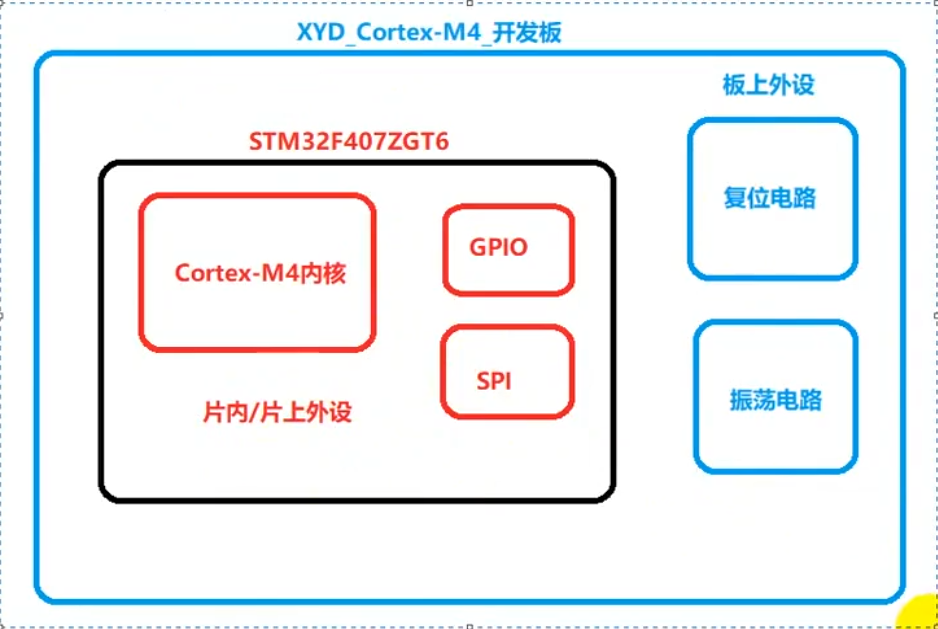
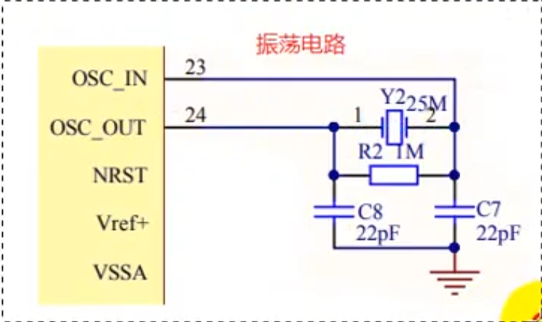
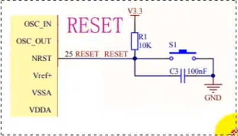
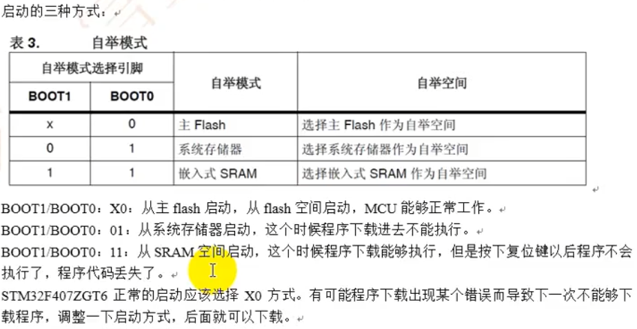

### Cortex-M系列芯片分类：

Cortex-M0：主频48M，一般用于低功耗。

Cortex-M3：主频72M，一般用于工控（市场上最主流的芯片之一）。

Cortex-M4：主频168M，一般用于电源管理。

Cortex-M7：主频300M~400M，一般用于电源管理。

### STM32F40x系列的命名规则

芯片型号：STM32F407ZGT6

1.ST：芯片厂商意法半导体公司的简称

2.M：Cortex-M系列

3.32：32位处理器

4.F：通用型产品------------------除F外，还有L系列（低功耗系列的芯片）

5.407：芯片系列型号     4系列的芯片

6.Z：芯片管脚数量（144Pin）

7.G：内存ROM容量（1024K字节）（flash）------------ E（512字节）

8.T：芯片封装形状（四面表贴封装）-----------------L形式     

9.6：芯片工作温度（-40~+85℃）

### STM32F407ZGT6芯片内部资源

**flash：1024K字节**

**RAM：192K字节**

定时器：14个（12个16位的定时器、2个32位的定时器）

WDG（看门狗）：2个

RTC

24位递减计数器（系统滴答定时器）

ADC：24个12位的模数转换器

DAC：2个12位的数模转换器

IO接口：114个

SPI总线接口：3个

IIS总线接口：2个

IIC总线接口：3个

UART：6个

USBOTG（USB高速接口）：2个

CAN2.0B：3个

SDIO（SD卡接口）：1个

带以太网接口：

## STM32F40x最小系统

### 1.最小系统：

最小系统指的是：能够让MCU工作的最小组成单元。

结构：片内/片上 外设、板上外设

### 2.STM32F40x最小系统组成

1.电源部分

​	当前使用的芯片采用的是COMS电平（3.3V供电）。

2.振荡电路

​	让MCU工作心跳节拍产生电路。振荡电路有很多种：RC振荡器、晶振、表面声波式振荡器等。综合考虑，振荡电路在这是使用的是晶振。晶振大小位25MHz。晶振（有源晶振、**无源晶振**）

3.复位电路

​	复位电路：让MCU重新从main函数开始执行电路。

​	复位电路有很多种：硬件复位、软件复位、看门狗复位

​	硬件复位电路：板上设计能够让MCU复位的电路。

​	硬件复位有：高电平复位与低电平复位之分。

​	高电平复位：高电平能够让MCU复位称为高电平复位。

​	低电平复位：低电平能够让MCU复位称为低电平复位。

**STM32F407ZGT6为低电平复位**

51单片机复位方式是：高电平复位

4.启动方式

​	STM32F407ZGT6启动的地方有很多种，需要进行选择。

