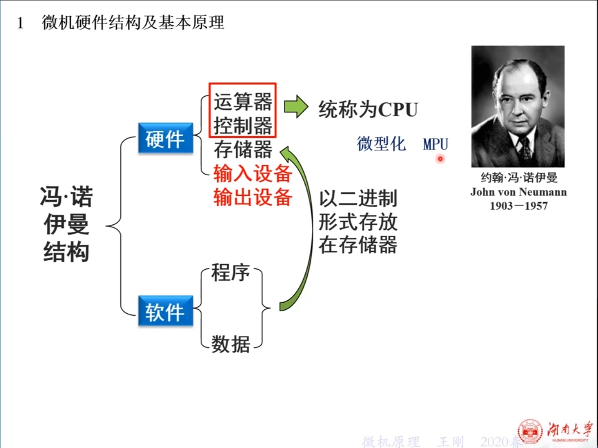
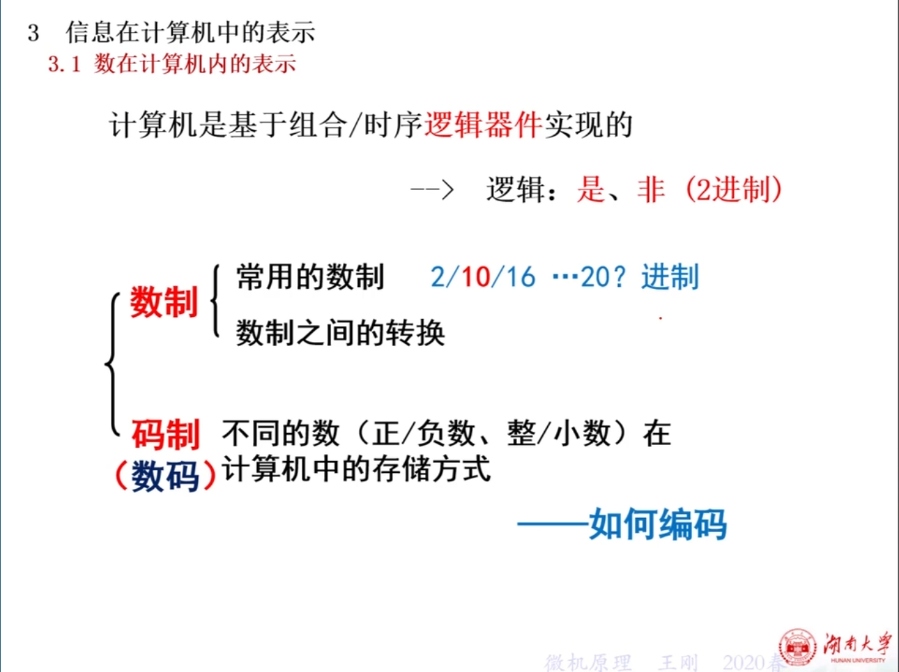

**微机原理**

## 1.微机硬件结构及基本原理

**冯诺依曼架构：**

 


**运算器和控制器**统称为**CPU**，微型化之后的CPU通常被称为**MPU（Micro Processor Unit）**。

**MCU**‌（Micro Controller Unit）：集成MPU、存储器和外设的控制器，功能更专一。

**输入设备、输出设备**其实也是一种**存储器**。



**进一步总结：**


### 延申01：总线的工作原理：

RAM：随机访问存储器。一掉电就没有了，存储程序运行中的数据。

ROM：只读存储器。掉电之后，数据不丢失（现在用的更多的是Flash、闪存盘，这两个是可以些的，我们只是把ROM这个符号引用至今。）。存储程序。

I/O接口：体现是一种存储器


#### 01总线的基本组成与功能：

微机系统总线由**数据总线（DB）、地址总线（AB）和控制总线（CB）**三类功能总线构成：

**1.数据总线（DB）**

- **双向传输**：支持CPU与内存、I/O设备之间的数据交互，例如CPU向内存写入数据或从外设读取数据。
- **位宽决定吞吐量**：数据总线宽度与CPU字长一致（如16位CPU对应16位数据总线），直接影响单次数据传输量。
- **广义数据内容**：传输的不仅是用户数据，还包括指令代码、状态信息等。

**2.地址总线（AB）**

- 单向传输：仅由CPU发出地址信息，用于指定内存单元或I/O设备的物理位置。
- 寻址能力：地址总线位数决定最大可寻址空间。例如，16位地址总线支持64KB寻址（2^16=65536地址）。

**3.控制总线（CB）**

- 双向协调：传递时序和控制信号，如读/写信号（Read/Write）、中断请求（IRQ）、时钟同步（Clock）等。
- **动态调整**：控制信号的方向和内容由具体操作需求决定，例如CPU向内存发送写信号，或外设向CPU发送中断请求。

#### 02总线的工作流程

总线操作分为四个阶段，以内存读取为例：

**1.总线申请与仲裁**

- CPU作为主模块申请总线使用权，总线仲裁器（如北桥芯片）根据优先级分配总线控制权。

**2.地址传送**

- CPU通过地址总线发送目标内存地址（如0x1234），内存控制器锁定该地址对应的存储单元。

**3.控制信号触发**

- CPU通过控制总线发送**读信号（Read）**，通知内存执行数据输出操作。

**4.数据传输**

- 内存将目标地址的数据通过数据总线传送至CPU，完成一次读取周期。

#### 03总线的定时与协调机制

总线通过以下方式实现设备间的时序同步：

**1.同步传输**

- 所有操作由统一时钟信号驱动，适用于高速设备（如CPU与高速缓存），但对设备响应速度要求严格。

**2.异步传输**

- 通过握手信号（如Request/Acknowledge）协调主从设备，适用于速度差异较大的设备（如CPU与低速外设）。

**3.半同步传输**

- 结合时钟信号和握手信号，允许操作间隔为时钟周期的整数倍，兼顾灵活性与效率（如PCI总线）。

#### 04总线性能的关键参数

**1.带宽（传输速率）**

- 计算公式：带宽 = 总线频率 × 数据位宽 / 8。例如，33MHz的32位PCI总线带宽为133MB/s。

**2.位宽与频率**

- 位宽决定单次传输数据量，频率决定每秒传输次数。两者共同影响总线的实际吞吐能力。

**3.扩展性与兼容性**

- 总线标准（如ISA、PCI、USB）定义了物理接口和协议规范，确保不同厂商设备的互操作性。

#### 总结

微机系统总线通过**地址定位、数据交互、控制协调**三大功能实现各部件的高效通信。其工作原理融合了硬件设计（如三态门电路）、时序控制（同步/异步机制）和协议标准（如PCIe 4.0），是计算机体系结构的核心基础之一。现代计算机通过分层总线（如前端总线+外设总线）进一步优化性能，适应不同场景的传输需求。

## 1.续微机硬件结构及基本原理

**哈佛架构：**

ALU：运算器。算数运算逻辑单元。

Instruction memory：指令存储器

I/O：输入输出设备

Data memory：数据存储器。

Control unit：控制器。控制芯片


### **1.微机系统的三个层次：**


#### 1.1 微处理器CPU

**运算器：**

主要的结构就是：算术逻辑单元（ALU），这里边最主要的就是一个加法器


**控制总线：**


**控制器：**


#### 1.2存储器：


#### 1.3I/O接口及设备

没有不需要I/O接口或设备的计算机。

I/O接口会连接所有总线。


**I/O接口可以完成三大总线的转换和连接任务。**

##### I/O接口的结构图


##### 控制I/O设备的方法

**通过对I/O接口的操作，完成对I/O设备的操作。实际是对I/O寄存器的操作。**


### 2.微机工作原理演示


```assembly
ORG 1000H ; 伪指令，它并非 CPU 直接执行的机器指令，而是对汇编器的指示，影响程序在内存中的布局。
```

**作用**：`ORG`（Origin 的缩写）指令告诉汇编器将后续的代码或数据从指定的内存地址开始存放。 表示后续代码从内存地址 `1000H` 开始存储。


1：把数据5CH存到A寄存器里。（A寄存器：加法寄存器）

2：把数据2EH累加到A寄存器。

3：判断跳转指令。判断语句，判断前一次计算是否有溢出，如果有溢出就跳转到100AH地址对应的代码去执行。如果没有溢出就继续执行。100AH地址存放的就是5：HLT，溢出就跳到5。程序结束。

4：把A寄存器里的数据拷贝一份到地址为（0200H）的内存空间里。

5：HLT程序结束。

**HLT**（Halt）是计算机体系结构中的一条指令，全称为“停机指令”，其核心功能是 **暂停CPU的执行并进入低功耗状态**，直到外部中断或复位信号将其唤醒。


## 2.单片机的概念、特点及应用


### 单片机的主要特点：


### 单片机的分类


### 单片机的应用


## 3.信息在计算机中的表示

### 3.1 数在计算机内的表示




### 3.2字符在计算机内的表示

数据都是用补码存的。为了消除+0和-0有两种表示方法的问题。