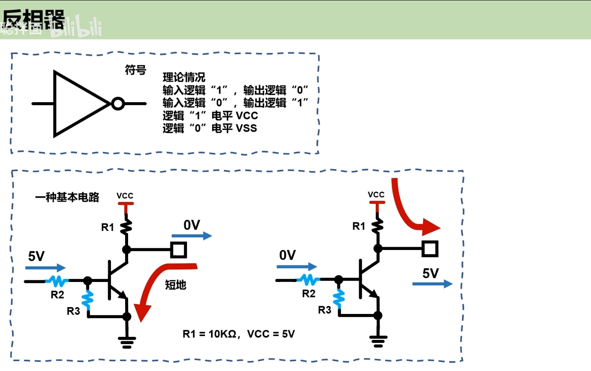
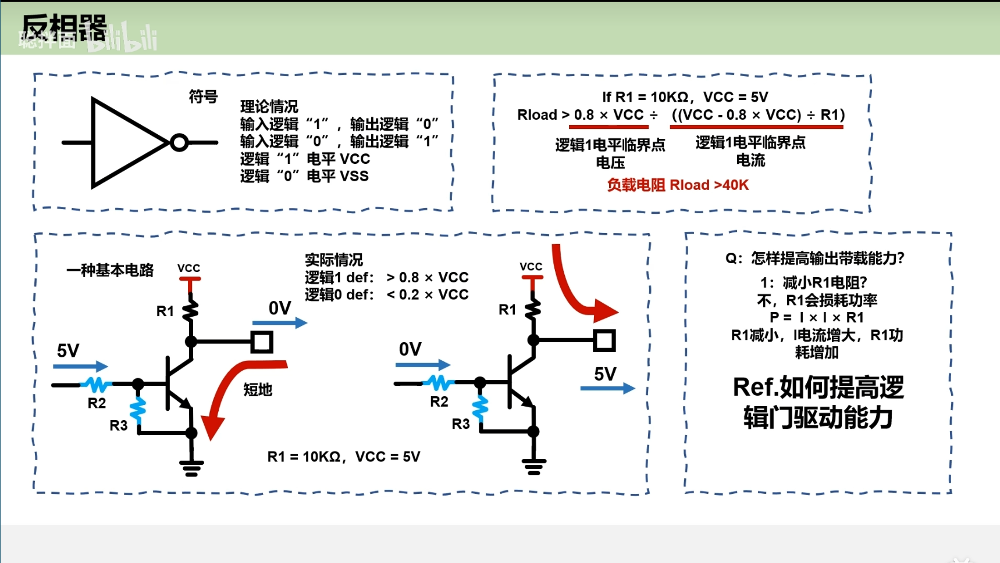
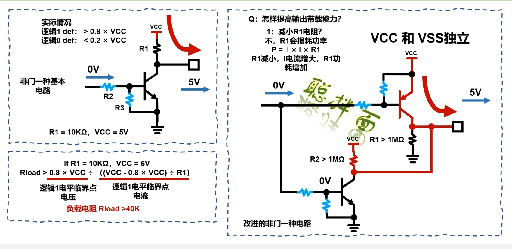
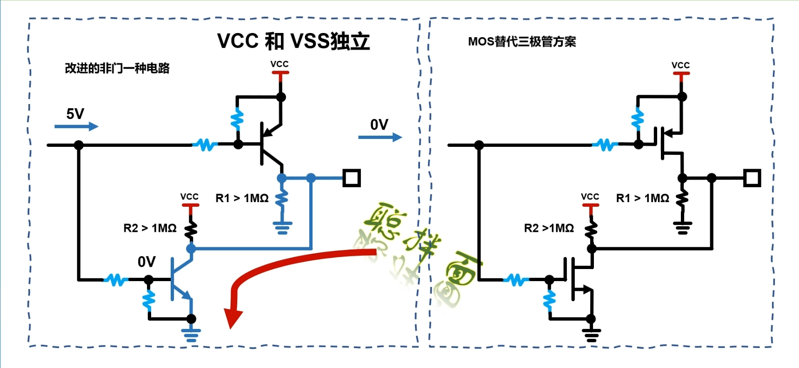
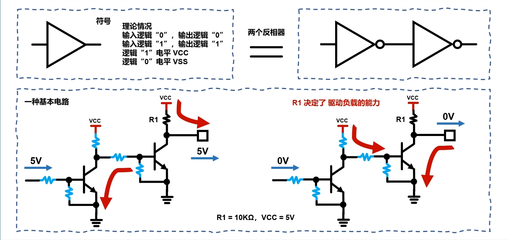
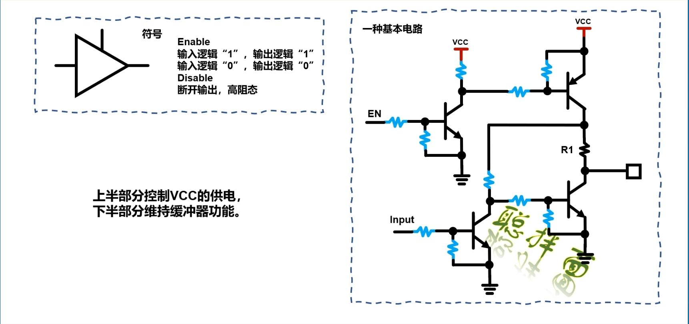
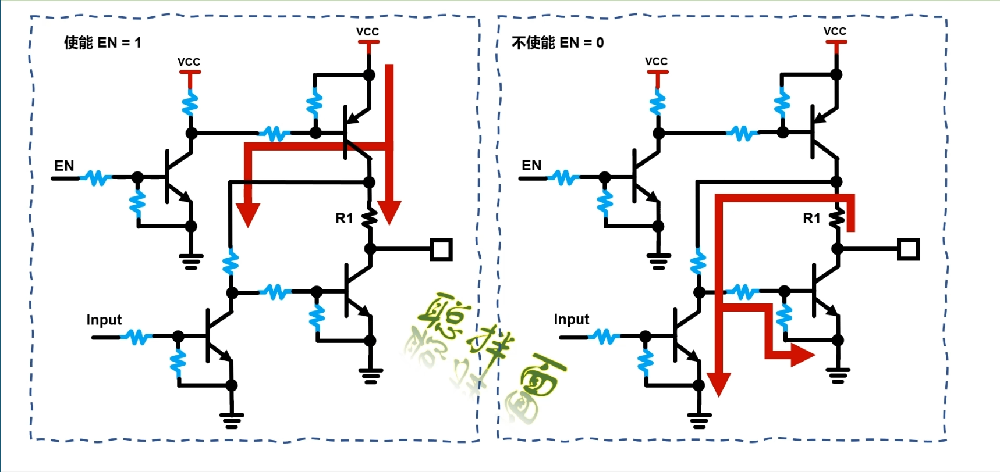

# 1.反相器

使用NPN三极管，构成反相器。

左侧输入逻辑1，三极管导通，右侧输出端与地短路。

左侧输入逻辑0，三极管截至，右侧输出端与地开路，输出电平等于VCC。

上图计算可知，当R1为10千欧时，驱动电流仅仅为0.1mA。要提高逻辑门的驱动能力：

- 方案1：减小R1电阻
  - **导通状态功耗**：当三极管导通时，电流流经上拉电阻和三极管，功耗主要由 *P*=*I**C*2⋅*R*（上拉电阻损耗）和 *P*=*I**C*⋅*V**CE*(sat)（三极管损耗）组成。减小 *R* 会显著增加 *I**C*，导致总功耗上升。
- 方案2：改进反相器电路

## 改进后反相器两种工作模式：

1.上图所示：

​	输入为逻辑0时，PNP三极管导通，右侧输出端与VCC短路。

​	逻辑门电路的负载为R1.

2.下图所示：

​	输入为逻辑1时，NPN三极管导通，右侧输出端与地短路。

​	逻辑门电路的负载为R2.

**一般使用MOS管代替三极管，因为MOS管的内阻比三极管内阻更小。可以进一步提高效率和降低内部的功率损耗。**

# 2.缓冲器

## 2.1 带使能功能的缓冲器

EN使能和不使能时，电路分析：

当EN=0时，

Input = 1时，此时对外会有两个回路，一是经由两个电阻和三极管到地的回路，二是经过四个电阻到地的回路。这两个回路上的电阻都会**选择比较大的电阻**，

目的：1.可以降低电路自身的功耗。

​	2.可以在不使能时，对外提供高阻。**这样外部的电平就不会收到该电阻的影响。**