# STM32课程介绍

一系列单片机的统称

32为微控制器（MCU）

ST（意法半导体）公司设计开发

以ARM Cortex-M 为核心


**课程内容：**


# 一：STM32概述

## 1.1关于ARM内核

STM32的处理器架构是ARM处理器架构：精简指令集计算机（RISC）


## 1.2 什么是STM32


## 1.3 STM32 应用场景

物联网（IoT）internet of things

工业自动化

汽车电子

消费电子

医疗设备


## 1.4 STM32系列MCU命名规则


## 1.5 STM32 开发方式

**1.基于寄存器开发**

优点：代码执行效率高，对硬件理解深入，有利于新手学习STM32知识，更换其他芯片上手快。

缺点：开发效率低，代码移植不方便

**2.基于标准库函数开发**

优点：相比寄存器开发效率提高，相比寄存器开发难度降低，相比寄存器开发移植容易。

缺点：屏蔽一些硬件信息，不利于新手学习知识，官方已经停止对标准库的更新，新的芯片已经不提供标准库。

**3.基于HAL库函数开发**

优点：ST主推，支持力度大，开发工具持续更新，开发难度相比前面两种大大降低，移植极其容易。

缺点：屏蔽几乎所有硬件信息，不利于新手学习知识，只学HAL，学完之后基础知识不够牢固。当迁移到其他MCU设备时，一切都要重新学习。

**学习过程中：基于寄存器开发 + 基于HAL库函数开发**

## 1.6 STM32 开发工具

1. Keil MDK


2. IAR


3. STM32CubeIDE（ST官方推出）


4. Clion（工具新星）


# 二：开发板简介

## STM32 最小系统

STM32单片机能工作的最小外围电路叫**最小系统**。

最小系统通常包括：STM32芯片、电源、时钟、下载调试和复位5部分组成。

### 2.电源


### 3.时钟


​	芯片内部可以有时钟，但是由于晶振没法集成到芯片里去，所有**芯片里的时钟一般是RC振荡电路**，这种时钟不够稳定，而外部接晶振这种方式，**它的时钟完全由物理特性决定的**，所有芯片一般都会接外部晶振。

### 4.复位


### 5.下载调试


# 三：点亮LED灯案例

## 3.1 需求描述

快速体验STM32开发：点亮LED1。

## 3.2硬件电路设计


说明：

（1）LED1连接的时端口PA0

（2）只要让PA0引脚输出低电平就可以点亮LED1。

## 3.3创建项目工程

### （1）创建需要的目录


### （2）准备启动文件

### （3）创建项目工程

#### 3.3.1 创建工程准备

#### 3.3.2 工程配置

#### 3.3.3 编译配置

## 3.4软件设计

### 3.4.1 时钟配置

虽然系统时钟已经有了，但是还需要对各自模块的时钟做配置。 

PA端口时钟启动。

配置外设时钟使能寄存器（PCC_APB2ENR）


### 3.4.2 GPIO工作模式配置

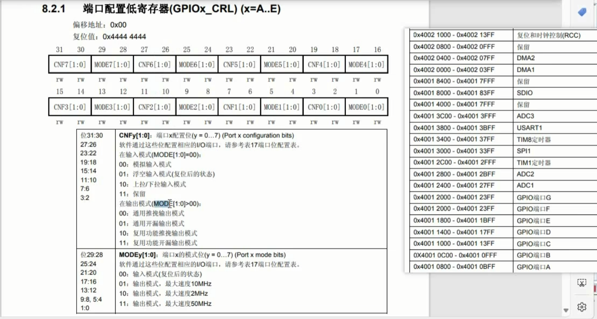


PA端口配置低寄存器  PA1为 **通用推挽输出**

### 3.4.3 PA0输出低电平


**配置PA的输出数据寄存器**

### 3.4.4 用死循环保持状态

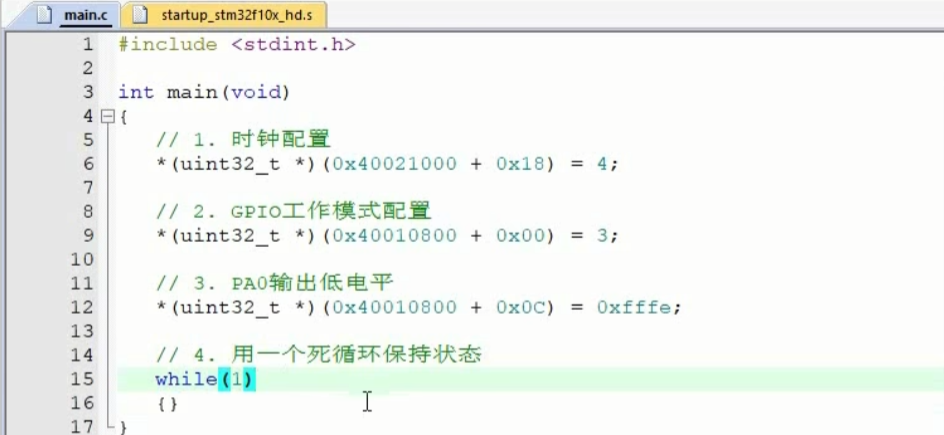

## 3.5 使用标准库完成点灯程序

代码可读性会更高。


## 3.6 操作寄存器方式的进化

  /*

​    把某位置 1  (0 位 1位 ...)

​      比如把 num 的第 2 位置 1

​        1. 得到一个数第 2 位是 1 其他都为 0

​          a =  0000 0100  是由 1<<2 得到

​        2. 让 num | a

   */

  /*

​    把某位置 0  (0位 1位 ...)

​      比如把 num 的第 2 位置 0

​        1. 得到一个数第 2 位是 0 其他都为 1

​          a =  1111 1011  是由 ~(1<<2) 得到

​        2. 让 num & a

   */

```c
int main(void)
// 第一次进化
{
	// 1. 配置时钟
    RCC->APB2ENR |= (1 << 2);
    // 2. GPIO工作模式配置  GPIOA->CRL = 0x03;
    GPIOA->CRL &= ~(1<<3); 
    GPIOA->CRL &= ~(1<<2); 
    GPIOA->CRL |= (1<<1); 
    GPIOA->CRL |= (1<<0);
    // 3. PA0输出低电平 GPIOA->ODR最低位为0
    GPIOA->ODR &= (1<<0);
}
```

```c
int main(void)
//第二次进化
{
	// 1. 配置时钟
    RCC->APB2ENR |= (1 << 2);
    
    // 2. GPIO工作模式配置  GPIOA->CRL = 0x03;
    GPIOA->CRL &= ~（(1<<3)|(1<<2)）; 
    GPIOA->CRL |= （(1<<1)|(1<<0)）;
    
    // 3. PA0输出低电平 GPIOA->ODR最低位为0
    GPIOA->ODR &= (1<<0);
}
```

```c
int main(void)
//第三次进化
{
	// 1. 配置时钟
    RCC->APB2ENR |= RCC_APB2ENR_IOPAEN;
    // 2. GPIO工作模式配置  GPIOA->CRL = 0x03;
    GPIOA->CRL &= ~GPIO_CRL_CNF0; // CNF0
    GPIOA->CRL |= GPIO_CRL_MODE0; // MODE0
    
    // 3. PA0输出低电平 GPIOA->ODR最低位为0
    GPIOA->ODR &= ~GPIO_ODR_ODR0;
}
```

点亮三个灯

```c
int main(void)
//第三次进化
{
	// 1. 配置时钟
    RCC->APB2ENR |= RCC_APB2ENR_IOPAEN;
    // 2. GPIO工作模式配置  GPIOA->CRL = 0x03;
    GPIOA->CRL &= ~GPIO_CRL_CNF0; // CNF0
    GPIOA->CRL |= GPIO_CRL_MODE0; // MODE0
    
    GPIOA->CRL &= ~GPIO_CRL_CNF1; 
    GPIOA->CRL |= GPIO_CRL_MODE1; 
    
    GPIOA->CRH &= ~GPIO_CRH_CNF8; 
    GPIOA->CRH |= GPIO_CRH_MODE8; 
    
    // 3. PA0输出低电平 GPIOA->ODR最低位为0
    GPIOA->ODR &= ~GPIO_ODR_ODR0;
    GPIOA->ODR &= ~GPIO_ODR_ODR1;
    GPIOA->ODR &= ~GPIO_ODR_ODR8;
}
```

# 四：GPIO外设（片上外设）

片上外设：就在32单片机的这个芯片上。

## 4.1 GPIO概述

​	GPIO（General-purpose input/output），通用型输入输出。简单理解就是我们可以**控制输入输出**的STM32引脚，统称为GPIO。

​	GPIO存在的意义就是**用程序控制或读取**它们的**输出或输入**。

### 4.1.1 GPIO总体说明

​	STM32有多组GPIO，比如我们使用的芯片：STM32F103ZET6共有7组GPIO端口，他们分别是GPIOx（x从A-G），**每组控制16个引脚，**共有112个GPIO引脚。

​	每个引脚的电平是0-3.3V，部分引脚最高可以兼容到5V。


### 4.1.2 GPIO的主要特点

（1）不同型号，IO口的数量可能不一样。

（2）快速翻转。最快可以达到每2个时钟周期翻转一次。（翻转指高低电平变换）（STM32F1系列最快可以达到50MHz的翻转速度）。

（3）每个IO都可以作为外部中断。

（4）支持8种工作模式。

### 4.1.3 GPIO的8种工作模式

GPIO端口的每个位（引脚）可以由 **软件** 分别 **配置** 成8种模式，当然对同一个引脚同一时间只能处于某一种模式中。

（1）输入浮空（Input floating）

（2）输入上拉（Input pull-up）

（3）输入下拉（Input-pull-down）

（4）模拟输入（Analog）

（5）通用开漏输出（Output open-drain）

（6）通用推挽式输出（Output push-pull）

（7）推挽式复用功能（Alternate function push-pull）

（8）开漏复用功能（Alternate function open-drain）

每个I/O端口位可以自由编程，然而I/O端口寄存器必须按 **32位字** 被访问。

**输出模式**  下可以 **控制端口输出** 高电平低电平，用于驱动LED，蜂鸣器等，如果是大功率器件（比如电机），还需要加上驱动器（小电流控制大电流）。

**输入模式** 下可以 **读取端口** 的高低电平，用于读取外接按键，外接模拟信号的输入，ADC电压采集，模拟通信协议接受数据等。

## 4.2 GPIO工作模式

### 4.2.1 GPIO每位的具体电路结构


### 4.2.2 每种模式详解

#### 4.2.2.1 输出模式

##### 通用推挽输出：

一推一拉，输出1的时候，将VDD电流推出去；输出为0的时候，将外部的电流拉进来。

##### 推挽输出总结：

​	1.向设置/清除寄存器对应的设置位或清除位写1。

​	2.或者直接向输出寄存器对应位写1或0。

​	3.也可以从输入寄存器读取引脚状态。

​	4.工作时两个MOS管交替工作来驱动负载。输出1时，上部晶体管导通将电流推向负载；输出0时，下部晶体管导通，将电流拉回地线。所以叫推挽输出。

##### 通用开漏输出：

P-MOS管永远关闭，不生效。


**输出0时**，与**推挽**状态一致，下部晶体管导通，将电流拉回地线，**对外表现输出0**。


想输出1时，由于·**两个晶体管都不导通**，**对外表现为高阻态**。

这时想输出1，**需要加一个上拉电阻**，才能输出1.


##### 开漏输出总结：

​	1.上部晶体管永远关闭。

​	2.可以输出0

​	3.如果要输出1必须接上拉电阻

##### 推挽输出和开漏输出的选择


#### 4.2.2.2 复用输出模式

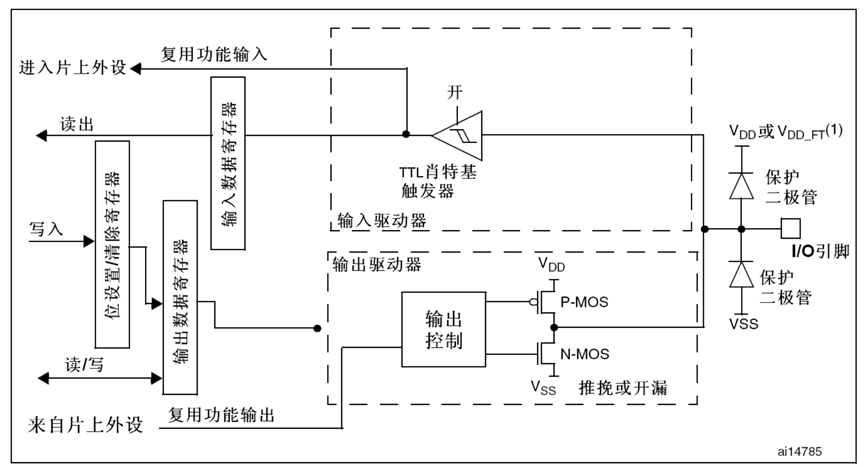

#### 4.2.2.3 GPIO输入流程


1.上图是输入电路，圈住部分为**钳位电路**，用于控制I/O口的输入电压，保护电路。

2.当外边·没有任何输入的时候，IO引脚悬空，对芯片内部来说呈现高阻态，这样的话电平是0还是1就不确定。

如果我们需要引脚不接电路时，**默认是1**的话，我们就**闭合上拉电阻开关**。

如果我们需要引脚不接电路时，**默认是0**的话，我们就**闭合下拉电阻开关**。

**施密特触发器整流规则**


​	（1）2个保护二极管的作用是保护我们的芯片不会由于电压过高或过低而烧毁。

​	VDD是接电源（3.3V），VSS接地（0V）。如果IO引脚的输入电压**高于VDD**的值到一定程度，**上方**保护二极管导通，则引脚电压被**拉低到VDD**。如果IO引脚的输入电压（负电压）**低于VSS**到一定程度，则**下方**保护二极管导通，电压被**拉高到VSS**。

​	（2）2个**开关**控制引脚在没有输入的时候是上拉，下拉还是浮空。当上面的开关闭合的时候，输入被拉高到高电平。当下面的开关闭合的时候，输入被拉低到低电平。如果两个都不闭合，输入就是悬空状态。两个同时闭合，就是费电了，不会这么做的。

​                                   

​	（3）施密特（图中翻译成肖特基触发器应该是翻译错误，英文版手册是TTL Schmitt trigger）触发器是包含正反馈的比较器电路。可以对信号进行波形整形。

​     


​     

从施密特触发起出来的数据，进入到输入数据寄存器中，我们就可以从中读取数据了。

#### 4.2.2.4 模拟输入模式


片上外设=ADC（模数转换）

当配置为模拟输入时：

（1）输出部分被禁止。

（2）**禁止施密特触发输入**，实现了每个模拟I/O引脚上的零消耗。施密特触发输出值被强置为0。

（3）弱上拉和下拉电阻被禁止。

（4）读取输入数据寄存器时数值永远为0。

## 4.3 与GPIO相关的7个寄存器（重要）

每个GPIO端口有7个相关的寄存器：

Ø 2个32位配置寄存器（GPIOx_CRL，GPIOx_CRH）。configuration register：配置寄存器

Ø 2个32位数据寄存器（GPIOx_IDR和GPIOx_ODR）。input data register 、output data register

Ø 1个32位置位/复位寄存器（GPIOx_BSRR）。bit set/reset register

Ø 1个16位复位寄存器（GPIOx_BRR）。bit reset register

Ø 1个32位锁定寄存器（GPIOx_LCKR）。configuration lock register 锁定GPIO配置寄存器

### 4.3.1  GPIOx_CRL（端口配置低寄存器）

GPIOx_CRL（Port configuration register low），x可以是A-G。


该寄存器配置的每个GPIO的 0-7 这个8个位，所以叫低寄存器。

1）MODE：每个端口有2个MODE位进行控制。

00：输入模式（复位后的状态）

01：输出模式，最大速度10MHz 

10：输出模式，最大速度2MHz 

11：输出模式，最大速度50MHz

1）CNF：每个端口有2个CNF位进行控制。

（1）当MODE是00 （输入模式）

00：模拟输入模式 

01：浮空输入模式(复位后的状态) 

10：上拉/下拉输入模式 

11：保留 

（2）当MODE>00（输出模式）

00：通用推挽输出模式 

01：通用开漏输出模式 

10：复用功能推挽输出模式 

11：复用功能开漏输出模式

### 4.3.2  GPIOx_CRH（端口配置高寄存器）

GPIOx_CRH（Port configuration register high）。

该寄存器配置的是每个端口的 8-15引脚，配置方式和低位寄存器完全一样。

### 4.3.3 GPIOx_IDR（端口输入数据寄存器）

Port input data register


保留位始终读为0。剩下的分别对应每个引脚的输入值。

### 4.3.4 GPIOx_ODR（端口输出数据寄存器）

Port output data register


保留位始终读为0。剩下的分别对应每个引脚的输出值。

### 4.3.5 GPIOx_BSRR（端口位设置/清除寄存器）

Port bit set/reset register

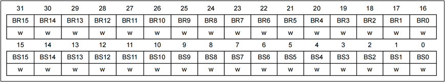


（1）BRy高16位是用清除对应的数据输出寄存器的位（0-15）的值：设置为0不影响，设置为1会清除ODR对应的位的值（置为0）。

（2）BSy低16位是用设置对应的数据输出寄存器的位（0-15）的值：设置为0不影响，设置为1会设置ODR对应的位的值（置为1）。

**（3）如果同时设置BRy和BSy的对应位，BSy位起作用。**

### 4.3.6GPIOx_BRR（端口位清除寄存器）

这个寄存器具有了**GPIOx_BSRR****一半的功能：清除**。


### 4.3.7 GPIOx_LCKR（端口配置锁定寄存器）

Port configuration lock register


该寄存器用来**锁定端口位的配置**，针对CRL和CRH。位[15:0]用于锁定GPIO端口的配置。


位[16]LCKK：锁键（LOCK key）

该位可随时读出，它只可通过锁键写入序列修改

​	0：端口配置锁键位[15:0]激活。

​	1：端口配置锁键位被激活，至下次系统复位前GPIOx_LCKR寄存器被锁住。

第16位用来激活锁定寄存器，必须按照规定的时序来操作才行: 写1 -> 写0 -> 写1 -> 读0 -> 读1。

最后一位读操作可以省略，但可以用来确认锁键是否已经被激活。

在规定的写入操作期间，不能改变LCKR[15:0]。当对相应的端口位执行了LOCK序列后，在下次系统复位之前将不能再更改端口位的配置。


位[15:0]：

每个锁定位锁定控制寄存器（CRL，CRH）中相应的4个位（CNF2位和MODE2位）。

对0-15位：

​	0：不锁定对应端口的配置。

​	1：锁定对应端口的配置。

## 4.4 GPIO案例：流水灯

### 4.4.1 需求描述

​	在3个LED上实现流水灯效果。

### 4.4.2 硬件电路设计

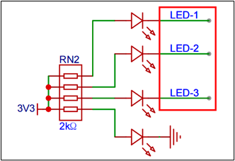


### 4.4.3 软件设计（寄存器）

#### 4.5.3.1 配置

1）配置启动文件


#####  1.**stm32f10x.h（设备头文件）**

- 作用：
  - **寄存器映射**：定义STM32外设（如GPIO、USART、SPI等）的寄存器地址和位字段，通过结构体提供访问接口。
  - **设备配置**：根据目标芯片型号（如STM32F10X_HD）启用对应的宏，区分不同内存密度的设备。
  - **时钟配置**：设置外部晶振频率（`HSE_VALUE`），影响系统时钟初始化。
- 重要性：
  - 提供硬件抽象层，使开发者无需直接操作内存地址，而是通过结构体成员访问外设寄存器。
  - 确保代码可移植性，适配不同STM32型号。

------

##### **2. system_stm32f10x.c/h（系统初始化文件）**

- 作用：
  - **系统时钟初始化**：`SystemInit()`函数配置PLL、时钟源（HSI/HSE）、总线分频（AHB/APB），设置Flash延迟以适应高频时钟。
  - **时钟动态更新**：`SystemCoreClockUpdate()`根据当前时钟源更新`SystemCoreClock`变量，反映实际HCLK频率。
- 重要性：
  - 确保CPU和所有外设以正确的时钟频率运行。
  - 影响系统性能和功耗，高频需更高Flash等待周期以避免访问错误。

------

##### **3. core_cm3.c/h（CMSIS核心文件）**

- 作用：
  - **内核寄存器访问**：定义SCB、SysTick、NVIC等内核外设的寄存器结构体及位操作宏。
  - **内联函数**：提供原子操作（如`__LDREXW`/`__STREXW`）、字节序转换（`__REV`）等底层功能。
  - **编译器适配**：通过不同编译器的内联汇编实现跨平台兼容。
- 重要性：
  - 标准化Cortex-M3内核操作接口，确保代码在不同工具链（如Keil、IAR、GCC）下行为一致。
  - 支持中断控制和系统级功能（如休眠模式）。

------

##### **4. 启动文件（如startup_stm32f10x_hd.s）**

- 作用：
  - **堆栈初始化**：设置主堆栈指针（MSP）和进程堆栈指针（PSP）。
  - **向量表配置**：定义中断服务例程（ISR）的入口地址，复位后跳转到`SystemInit`和`main`函数。
  - **硬件初始化**：调用`SystemInit`配置系统时钟，初始化.data（已初始化变量）和.bss（未初始化变量）段。
- 重要性：
  - 确保芯片上电后正确初始化运行环境，避免未定义行为。
  - 中断向量表的位置需与链接脚本匹配，否则无法响应中断。

------

##### **5. 链接脚本（.ld/.sct文件）**

- 作用：
  - 定义内存布局（Flash/RAM的起始地址和大小）。
  - 分配代码、数据、堆栈等段的位置。
- 重要性：
  - 确保程序正确烧录到目标设备的存储区域。
  - 影响代码执行效率和内存利用率。

------

##### **配置步骤与注意事项**

1. **选择设备型号**：
   在`stm32f10x.h`中启用对应的宏（如`STM32F10X_HD`），匹配目标芯片的内存密度。
2. **配置时钟源**：
   - 修改`HSE_VALUE`以匹配外部晶振频率（如8MHz或25MHz）。
   - 在`system_stm32f10x.c`中选择系统时钟频率（如`SYSCLK_FREQ_72MHz`），影响PLL倍频参数。
3. **启动文件适配**：
   - 根据芯片型号选择正确的启动文件（如`startup_stm32f10x_hd.s`对应高密度设备）。
   - 确认向量表偏移（`VECT_TAB_OFFSET`）与应用程序地址一致（如启用Bootloader时需调整）。
4. **标准外设库启用**：
   若使用ST标准库函数，需定义`USE_STDPERIPH_DRIVER`宏，否则需直接操作寄存器。
5. **链接脚本调整**：
   根据实际Flash和RAM大小调整链接脚本，避免内存溢出。

### 4.4.4 main.c代码基本实现

```c
#include "stm32f10x.h"
void Delay_us(uint16_t us);
void Delay_ms(uint16_t ms);
int main(void)
{
    // 1. 时钟配置
    RCC->APB2ENR |= RCC_APB2ENR_IOPAEN; // 使能GPIOA时钟

    // 2. GPIO工作模式配置：推挽输出模式
    GPIOA->CRL &= ~GPIO_CRL_CNF0; 
    GPIOA->CRL &= ~GPIO_CRL_MODE0; 

    GPIOA->CRL &= ~GPIO_CRL_CNF1; 
    GPIOA->CRL &= ~GPIO_CRL_MODE1; 

    GPIOA->CRH &= ~GPIO_CRH_CNF8; 
    GPIOA->CRH &= ~GPIO_CRH_MODE8; 

    // 3. PA0,PA1,PA8输出高电平
    GPIOA->ODR |= GPIO_ODR_ODR0; // PA0输出高电平
    GPIOA->ODR |= GPIO_ODR_ODR1; //PA1输出高电平 
    GPIOA->ODR |= GPIO_ODR_ODR8; // PA8输出高电平

    // 4.循环执行流水灯
    while(1)
    {
        // 4.1 LED1
        GPIOA->ODR &= ~GPIO_ODR_ODR0; // PA0输出低电平
        Delay_ms(500); // 延时500ms
        GPIOA->ODR |= GPIO_ODR_ODR0; // PA0输出高电平
        // 4.2 LED2
        GPIOA->ODR &= ~GPIO_ODR_ODR1; // PA1输出低电平
        Delay_ms(500); // 延时500ms
        GPIOA->ODR |= GPIO_ODR_ODR1; // PA1输出高电平
        // 4.3 LED3
        GPIOA->ODR &= ~GPIO_ODR_ODR8; // PA8输出低电平
        Delay_ms(500); // 延时500ms
        GPIOA->ODR |= GPIO_ODR_ODR8; // PA1输出高电平
    }
}

// 延时函数,微妙作为单位，利用系统嘀嗒定时器，72MHz
// 1. 72MHz时钟频率，1us=72个时钟周期，一次嘀嗒=1/72（us）
void Delay_us(uint16_t us)
{
    // 1. 装载一个计数值
    SysTick->LOAD = us * (72 - 1);

    // 2.配置，使用系统时钟（1），技术结束不产生中断（0），使能定时器（1）
    SysTick->CTRL = 0x05;
    // 3. 等待计数结束,判断CTRL标志位COUNTFLAG是否为1
    while((SysTick->CTRL & SysTick_CTRL_COUNTFLAG) == 0)
    {}
    // 4.关闭嘀嗒定时器
    SysTick->CTRL &= ~SysTick_CTRL_ENABLE; 
}

void Delay_ms(uint16_t ms)
{
    while(ms--)
    {
        Delay_us(1000); // 延时1ms
    }
}

```

### 4.4.5 代码结构优化

功能模块拆分

main.c：

```c
#include "led.h"
#include "delay.h"


int main(void)
{
    // 1.LED初始化
    LED_Init(); 
    // 2. 定义一个LED数组
    uint16_t leds[] = {LED1, LED2, LED3};
    // 4.循环执行流水灯
    while(1)
    {
        for (uint8_t i=0; i<3; i++)
        {
            LED_On(leds[i]);   // 输出低电平
            Delay_ms(500);  // 延时500ms
            LED_Off(leds[i]);  // 输出高电平
        }
    }
}
```

delay.c：

```c
#include "delay.h"

// 延时函数,微妙作为单位，利用系统嘀嗒定时器，72MHz
// 1. 72MHz时钟频率，1us=72个时钟周期，一次嘀嗒=1/72（us）
void Delay_us(uint16_t us)
{
    // 1. 装载一个计数值
    SysTick->LOAD = us * (72 - 1);

    // 2.配置，使用系统时钟（1），技术结束不产生中断（0），使能定时器（1）
    SysTick->CTRL = 0x05;
    // 3. 等待计数结束,判断CTRL标志位COUNTFLAG是否为1
    while((SysTick->CTRL & SysTick_CTRL_COUNTFLAG) == 0)
    {}
    // 4.关闭嘀嗒定时器
    SysTick->CTRL &= ~SysTick_CTRL_ENABLE; 
}
void Delay_ms(uint16_t ms)
{
    while(ms--)
    {
        Delay_us(1000); // 延时1ms
    }
}
void Delay_s(uint16_t s)
{
    while(s--)
    {
        Delay_ms(1000); // 延时1s
    }

}

```

led.c: 

```c
#include "led.h"

// 初始化
void LED_Init(void) // 初始化LED灯
{
    // 1. 时钟配置
    RCC->APB2ENR |= RCC_APB2ENR_IOPAEN; // 使能GPIOA时钟

    // 2. GPIO工作模式配置：推挽输出模式
    GPIOA->CRL &= ~GPIO_CRL_CNF0; 
    GPIOA->CRL &= ~GPIO_CRL_MODE0; 

    GPIOA->CRL &= ~GPIO_CRL_CNF1; 
    GPIOA->CRL &= ~GPIO_CRL_MODE1; 

    GPIOA->CRH &= ~GPIO_CRH_CNF8; 
    GPIOA->CRH &= ~GPIO_CRH_MODE8; 

    // 3. PA0,PA1,PA8输出高电平，默认关灯
    LED_Off(LED1); // PA0输出高电平
    LED_Off(LED2); // PA1输出高电平
    LED_Off(LED3); // PA8输出高电平
}

// 控制某一个LED的开关
void LED_On(uint16_t led) // 点亮LED
{
    GPIOA->ODR &= ~led;
}
void LED_Off(uint16_t led) // 熄灭LED
{
    GPIOA->ODR |= led;
}

// 根据当前状态进行反转
void LED_Toggle(uint16_t led) // 反转LED状态
{
    // 判断LED的状态
    if ((GPIOA->IDR & led) == 0) // 如果LED是亮的
    {
        LED_Off(led); // 熄灭LED
    }
    else // 如果LED是灭的
    {
        LED_On(led); // 点亮LED
    }
}

// 对一组LED灯，全开全关
void LED_OnAll(uint16_t leds[], uint8_t size) // 点亮所有LED
{
    uint8_t i = 0;
    for (; i < size; i++)
    {
        LED_On(leds[i]);
    }
}
void LED_OffAll(uint16_t leds[], uint8_t size) // 关闭所有LED
{
    uint8_t i = 0;
    for (; i < size; i++)
    {
        LED_Off(leds[i]);
    }
}

```

### 4.4.6 课后练习


#### 4.4.6.1 往返流水灯

##### 4.4.6.1.1

main.c:

```c
#include "led.h"
#include "delay.h"


int main(void)
{
    // 1.LED初始化
    LED_Init(); 
    // 2. 定义一个LED数组
    uint16_t leds[] = {LED1, LED2, LED3};
    // 4.循环执行流水灯
    while(1)
    {
        for (uint8_t i=0; i<3; i++)
        {
            LED_On(leds[i]);   // 输出低电平
            Delay_ms(500);  // 延时500ms
            LED_Off(leds[i]);  // 输出高电平
        }
        // 让LED2开关一次，实现反向流水灯效果
        LED_On(LED2);    // 输出低电平
        Delay_ms(500);      // 延时500ms
        LED_Off(LED2);   // 输出高电平
    }
}
```

# 五：总体架构和时钟系统

## 5.1 STM32总体架构


**FSMC也是被动单元。**


**总线矩阵作用：用来做一个调度，确定当前这个总线由谁来用。**

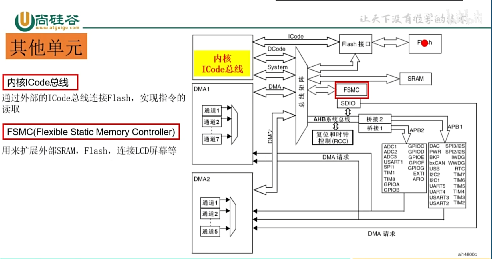

## 5.2 时钟系统

### 5.2.1 时钟树

在STM32中有3种不同的时钟源用来驱动系统时钟(SYSCLK)：

​	（1）HSI振荡器时钟（High Speed Internal oscillator，高速内部时钟）

​	（2）HSE振荡器时钟（High Speed External（Oscillator / Clock），高速外部时钟）

​	（3）PLL时钟（Phase Locked Loop 锁相环/倍频器）

还有2种2级时钟：

​	（4）LSI时钟（Low Speed Internal，低速内部时钟）

​	（5）LSE时钟（Low Speed External oscillator，低速外部时钟）。

为什么提供这么多的时钟？节能！高速设备接高速时钟，低速设备接低速时钟，可以最大程度的达到节能效果。详见下图时钟树。


**OSC：**振荡器

**OSC_OUT**  和 **OSC_IN**用来接外部晶振的

**OSC32_OUT**  和 **OSC32_IN**用来接外部晶振的

**MCO**：主时钟，可以直接做输出

**PLL**：Phase Locked Loop锁相环，作用：倍频

### 5.2.2 各个时钟介绍

#### 1）HSE时钟

​	高速外部时钟是由外部时钟源提供，目前几乎所有的STM32单片机的设计都是在外部接一个**8MHz**的晶振，经过**PLL倍频（9倍频）**后得到一个**72MHz**的系统时钟。我们系统默认就是这个时钟。这个在启动文件可以看到。

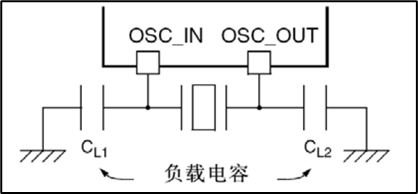


#### 2）HSI时钟

​	HSI时钟信号由内部**8MHz的RC振荡器**产生，可直接作为系统时钟或在2分频后作为PLL输入。HSI RC振荡器能够在不需要任何外部器件的条件下提供系统时钟。它的启动时间比HSE晶体振荡器短。然而，即使在校准之后它的时钟频率**精度仍较差**。


#### 3）PLL

​	内部PLL用来倍频**HSI RC**的输出时钟或**HSE**晶体输出时钟。**PLL的设置必须在其被激活前完成。一旦PLL被激活，这些参数就不能被改动。**如果PLL中断在时钟中断寄存器里被允许，当PLL准备就绪时，可产生中断申请。

​	PLL时钟一般都是对外部的**8MHz的时钟信号经过9倍频后**，得到**72MHz的时钟频率**，这是STM32F1系列允许的最高时钟频率。


#### 4）LSE时钟

​	LSE晶体是一个32.768kHz的低速外部晶体或陶瓷谐振器。它为**实时时钟RTC**或者其他定时功能提供一个低功耗且精确的时钟源。

​	LSE是**不能驱动系统时钟**的。


#### 5）LSI时钟

​	**LSI RC**担当一个低功耗时钟源的角色，**它可以在停机和待机模式下保持运行**，**为独立看门狗和自动唤醒单元提供时钟。**LSI时钟频率大约40kHz（在30kHz和60kHz之间）。

​	LSI也是**不能驱动系统时钟**的。


# 六：HAL库开发入门

# 6.1 HAL介绍

### 1）为什么要学习HAL库开发

​	寄存器开发效率比较低，在工作中如果想**快速开发**还是要会用到HAL库开发。

​	HAL库是目前ST主力推广的开发方式，所以你如果还**要用ST的芯片**，会使用HAL库开发是势在必行的。而且最最关键的是，使用HAL开发有诸多的好处。

​	目前，HAL库已经支持STM32全线产品。

### 2）什么是HAL库

​	HAL库的全称是Hardware Abstraction Layer，翻译成**硬件抽象层**。HAL库是ST为STM32最新推出的抽象层嵌入式软件，可以更好的确保跨STM32产品的最大可移植性。该库提供了一整套一致的中间件组件，如RTOS，USB，TCP/IP和图形等。

​	HAL库是基于一个非限制性的BSD许可协议（Berkeley Software Distribution）而发布的开源代码。 ST制作的中间件堆栈（USB主机和设备库，STemWin）带有允许轻松重用的许可模式，只要是在ST公司的MCU 芯片上使用，库中的中间件(USB 主机/设备库，STemWin)协议栈即被允许随便修改，并可以反复使用。至于基于其它著名的开源解决方案商的中间件（FreeRTOS，FatFs，LwIP和PolarSSL）也都具有友好的用户许可条款。

### 3）CMSIS和HAL库的关系

​	CMSIS（Cortex Microcontroller Software Interface Standard）是 Cortex-M 处理器系列的与供应商无关的硬件抽象层。它是ARM公司制定的一个标准。它可以为处理器和外设实现一致且简单的软件接口，从而简化软件的重用、缩短微控制器新开发人员的学习过程，并缩短新设备的上市时间。简单来说，就是ARM公司制定标准，芯片厂商按照此标准编写相应的程序，实现统一的接口，方便开发人员的使用。

## 6.2 HAL库开发环境搭建

## 6.3 LED流水灯案例（HAL库）

### 6.3.1 需求描述

​	实现LED流水灯。用的GPIOA的 0、1、8口。

### 6.3.2  硬件电路设计


### 6.3.3 软件设计

#### 6.3.3.1 创建HAL库工程

# 七：STM32的中断系统

## 7.1 中断概述

### 7.1.1 中断的概念

​	在主程序运行过程中，出现了特定事件，使得CPU暂停当前正在运行的程序，转而去处理这个事件，等这个事件处理完成之后，CPU再回到刚才被打断的位置继续处理，这就是中断。

​	那个打断CPU执行的特定事件，我们一般称之为**中断源**。被中断源打断的位置我们称为**断点**。处理特定事件的过程，我们称为执行**中断处理程序**。


​	正在执行中断程序的时候，这个时候有可能被另外一个中断源给中断，CPU转而去执行另外一个中断源的中断处理程序，这叫**中断嵌套**。

​	中断B能否打断中断A，要看他们的优先级，优先级高的可以打断优先级低的，优先级低的无法打断优先级高的。

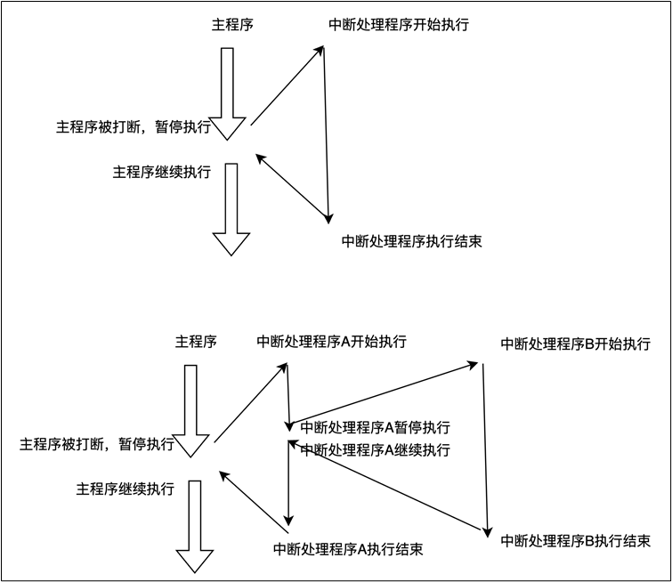

​	中断源可以是外部的，也可以是内部的。外部的叫**外部中断源**，内部的叫**内部中断源（内部的中断有时候也叫异常）**。

### 7.1.2 为什么需要中断

​	对单片机系统来说，**中断至关重要**。

​	比如我们要检测按键是否按下，**如果没有中断，则需要循环的方式不断的去检测按键对应的IO口的电平，这是比较耗费CPU的时间的（轮询）**。如果要检测的更多的话，CPU有可能会导致阻塞。

​	有了中断事情就变的简单了，主程序不需要循环不断的去检测按键，当有按键按下的时候，CPU执行被打断，去执行按键处理程序就行了。当没有按键按下的时候，CPU完全可以正常执行代码，丝毫不受任何的影响。

### 7.1.3 STM32的中断

​	Cortex-M3内核支持**256个**中断，其中包含了16个内核中断和240个外部中断，并且具有256级的可编程中断设置。

​	一般情况下，芯片厂商会对**Cortex-M3**的中断进行裁剪。

​	**STM32有84个中断**，包括16个内核中断和68个可屏蔽中断，具有16级可编程的中断优先级。

​	**STM32F103**系列**70**个中断，有10个内核中断和60个可编程的外部中断。

​	下面的列表中，灰色背景的是内部中断（或者异常），其他的为外部中断。

下图地址里存放的是**对应中断服务程序的入口地址**。


### 7.1.4 STM32的中断体系架构

所有的中断请求都要发给内核，打断内核当前正在处理的程序。

​											->内核其他控件

NVIC嵌套向量中断控制器：**管理中断优先级**		->片上外设

​											->外部中断  

EXTI接20根线，处理20个不同的外部中断来源。


### 7.1.5 NVIC嵌套向量中断控制器

#### 1）NVIC的介绍

​	NVIC（Nested vectored interrupt controller嵌套向量中断控制器）和处理器核的接口紧密相连，可以实现低延迟的中断处理和高效地处理中断。嵌套向量中断控制器管理着包括内核异常，外部中断等**所有中断**。由NVIC决定哪个中断的处理程序交给CPU来执行。

​	**每一个外部中断**都可以**被使能**或者**禁止**，并且可以被设置为**挂起状态（产生中断，但由于优先级较低，在等待）**或者清除状态。处理器的中断可以是**电平形式的**，也可以是**脉冲形式的**，这样中断控制器就可以处理任何中断源。

​	16个IO的中断与PVD(电源电压检测)，RTC(实时时钟)，USB，以太网检测这20个外部中断会通过EXTI来控制，然后交给NVIC。其他中断都是直接交给NVIC来处理。

#### 2）中断优先级

​	NVIC为了方便管理中断，可以通过软件给每个中断设置优先级。NVIC用4个位来控制优先级，值小的优先级高。把优先级分为两种：**抢占优先级（谁能打断谁）**和**响应优先级（同时等待的时候，先去相应谁）**。

​	规则：

​	Ø 优先级值越小，优先级越高。

​	Ø 如果不设置优先级，则默认优先级为0。

​	Ø 先比较抢占优先级。抢占优先级高的可以打断抢占优先级低的。

​	Ø 若抢占优先级一样，再比较响应优先级。但是响应优先级不会导致中断嵌套。

​	Ø 若抢占优先级一样的同时挂起，则优先处理**响应抢占优先级高**的。

​	Ø 若挂起的优先级（抢占和响应）都一样，则查找中断向量表，值小的先响应。

​	NVIC对优先级分了5组，在程序中先对中断进行分组，而且分组只能分一次，若多次分，只有最后一次生效。

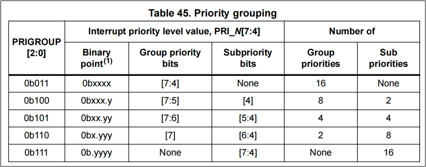

| **分组** |   **抢占优先级**   |   **响应优先级**   |
| :------: | :----------------: | :----------------: |
|  **0**   |  0位 取值范围：0   | 4位 取值范围：0-15 |
|  **1**   | 1位 取值范围：0-1  | 3位 取值范围：0-7  |
|  **2**   | 2位 取值范围：0-3  | 2位 取值范围：0-3  |
|  **3**   | 3位 取值范围：0-7  | 1位 取值范围：0-1  |
|  **4**   | 4位 取值范围：0-15 |  0位 取值范围：0   |

### 7.1.6 外部中断控制器EXTI

底层电路：


具体流程：

输入线来输入信号->产生中断请求（下降沿触发 或者 上升沿触发）-> 请求挂起寄存器置1 -> 如果没有屏蔽 -> 给到NVIC -> 交给内核处理（调用中断服务程序）-> 处理完请求后，将请求挂起寄存器置0


某个中断在使用之前，需要**配置上升沿触发还是下降沿触发**，**配置中断屏蔽寄存器**。当中断程序执行完成之后，程序还需要**对请求挂起寄存器置0**。

## 7.2 中断案例：检测按键按下

### 7.2.1 需求描述

​	利用外部中断检测按键KEY3，当按键按下，翻转LED1显示。

### 7.2.2 硬件电路设计

#### 7.2.2.1 LED1的硬件电路


#### 7.2.2.2 KEY的硬件电路


​	说明：

​	（1）PF10对应的是KEY_3(SW5),我们可以设置PF10的模式为**下拉输入**，则当按键没有按下的时候是低电平，当按键按下的时候是高电平。

​	（2）由于按键没有设置硬件防抖，则我们需要软件设计防抖。一般延时10-15ms即可实现软件防抖。

### 7.2.3 软件设计（寄存器）

#### 7.2.3.1 中断检测按键按下案例用到的寄存器详解

##### 7.2.3.1.1 时钟使能

###### 1.1 代码

```c
    /* 1 开启时钟 (EXTI和NVIC时钟始终开启，无需手动开启)*/
    /* 1.1 开启 GPIOF 时钟 */
    RCC->APB2ENR |= RCC_APB2ENR_IOPFEN;
    /* 1.2 开启AFIO时钟 */
    RCC->APB2ENR |= RCC_APB2ENR_AFIOEN;

```

###### 1.2 寄存器


##### 7.2.3.1.2 GPIO模式配置

###### 2.1 代码

```c
    /* 2 配置GPIO  设置为输入 下拉(cnf: 10 mode: 00) 。另外还需要把ODR寄存器对应的位设为0  (1=上拉)*/
    GPIOF->CRH &= ~GPIO_CRH_MODE10;
    GPIOF->CRH |= GPIO_CRH_CNF10_1;
    GPIOF->CRH &= ~GPIO_CRH_CNF10_0;
    GPIOF->ODR &= ~GPIO_ODR_ODR10;

```

###### 2.2 寄存器


##### 7.2.3.1.3 配置AFIO引脚复用

###### 3.1 代码

```c
    /* 3  配置 AFIO, 用于引脚复用为外部中断  PF10 */
	AFIO->EXTICR[2] |= AFIO_EXTICR3_EXTI10_PF;
```

###### 3.2 寄存器


7.2.3.1.4 配置EXTI

###### 4.1 代码

```c
    /* 4. 配置 EXTI */
    /* 4.1 PG0的上升沿触发中断   */
    EXTI->RTSR |= EXTI_RTSR_TR10;
    /* 4.2 开启 EXTI10 线 */
    EXTI->IMR |= EXTI_IMR_MR10;
```

###### 4.2 寄存器

RTSR：rising trigger selection register

FTSR：falling trigger selection register（下降沿触发选择寄存器）


IMR：interrupt masked（带个面具，屏蔽起来） register


##### 7.2.3.1.5 清除中断标志位

###### 5.1 代码

```c
    /* 清除中断标志. 写1清除中断 */
    EXTI->PR |= EXTI_PR_PR10;
```

###### 5.2 寄存器

PR：pending（悬而未决，待定） register：对应位写1清零。

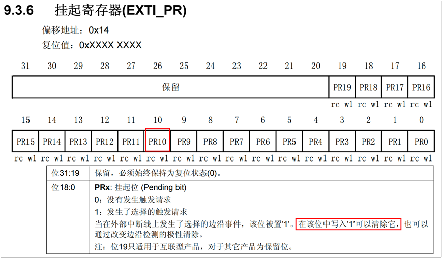

### 7.2.4 软件设计（寄存器）

key.h:

```c
#ifndef __KEY_H
#define __KEY_H

#include "stm32f10x.h"
#include "delay.h"
#include "led.h"

void Key_Init(void);


#endif

```

key.c:

```c
#include "key.h"

void Key_Init(void)
{
    // 1.配置时钟
    // 1.1 使能GPIOF时钟
    RCC->APB2ENR |= RCC_APB2ENR_IOPFEN;
    // 1.2 使能AFIO时钟
    RCC->APB1ENR |= RCC_APB2ENR_AFIOEN;

    // 2.配置GPIOF PF10:    CNF-10,MODE-00
    // 2. 配置PF10为下拉输入
    GPIOF->CRH &= ~(GPIO_CRH_MODE10);  
    GPIOF->CRH |= GPIO_CRH_CNF10_1;
    GPIOF->CRH &= ~GPIO_CRH_CNF10_0;
    GPIOF->ODR &= ~GPIO_ODR_ODR10;  // 下拉输入

    // 3. 配置AFIO引脚复用
    // 3. 配置 AFIO，用于引脚复用外部中断 PF10
    AFIO->EXTICR[2] |= AFIO_EXTICR3_EXTI10_PF;  // PF10作为外部中断线10
    
    // 4 配置EXTI
    // 4.1 配置中断线10为上升沿触发
    EXTI->RTSR |= EXTI_RTSR_TR10;
    // 4.2 开启EXTI10中断线
    EXTI->IMR |= EXTI_IMR_MR10;

    // 5. NVIC配置
    NVIC_SetPriorityGrouping(3);  // 设置中断分组,全部都是抢占优先级
    NVIC_SetPriority(EXTI15_10_IRQn, 3);  // 设置EXTI10中断优先级为3
    NVIC_EnableIRQ(EXTI15_10_IRQn);  // 使能EXTI10中断
}

//  外部中断服务程序
void EXTI15_10_IRQHandler(void)
{
    // 清除中断挂起标志
    EXTI->PR |= EXTI_PR_PR10;  // 清除EXTI10中断挂起标志

    // 防抖延时
    Delay_ms(10);  // 延时10ms，防止抖动

    // 判断如果依然保持高电平，就翻转LED
    if ((GPIOF->IDR & GPIO_IDR_IDR10) != 0)  // 检查PF10是否为高电平
    {
        LED_Toggle(LED1);  // 翻转LED
    }
}

```

led.h:

```c
#ifndef __LED_H
#define __LED_H

#include "stm32f10x.h"

// 宏定义
#define LED1 GPIO_ODR_ODR0 // LED1对应的GPIO口
#define LED2 GPIO_ODR_ODR1 // LED2对应的GPIO口
#define LED3 GPIO_ODR_ODR8 // LED3对应的GPIO口

// 初始化
void LED_Init(void); // 初始化LED灯

// 控制某一个LED的开关
void LED_On(uint16_t led); // 点亮LED
void LED_Off(uint16_t led); // 熄灭LED

// 根据当前状态进行反转
void LED_Toggle(uint16_t led); // 反转LED状态

// 对一组LED灯，全开全关
void LED_OnAll(uint16_t leds[], uint8_t size); // 点亮所有LED
void LED_OffAll(uint16_t leds[], uint8_t size); // 关闭所有LED

#endif

```

led.c:

```c
#include "led.h"

// 初始化
void LED_Init(void) // 初始化LED灯
{
    // 1. 时钟配置
    RCC->APB2ENR |= RCC_APB2ENR_IOPAEN; // 使能GPIOA时钟

    // 2. GPIO工作模式配置：推挽输出模式
    GPIOA->CRL &= ~GPIO_CRL_CNF0; 
    GPIOA->CRL &= ~GPIO_CRL_MODE0; 

    GPIOA->CRL &= ~GPIO_CRL_CNF1; 
    GPIOA->CRL &= ~GPIO_CRL_MODE1; 

    GPIOA->CRH &= ~GPIO_CRH_CNF8; 
    GPIOA->CRH &= ~GPIO_CRH_MODE8; 

    // 3. PA0,PA1,PA8输出高电平，默认关灯
    LED_Off(LED1); // PA0输出高电平
    LED_Off(LED2); // PA1输出高电平
    LED_Off(LED3); // PA8输出高电平
}

// 控制某一个LED的开关
void LED_On(uint16_t led) // 点亮LED
{
    GPIOA->ODR &= ~led;
}
void LED_Off(uint16_t led) // 熄灭LED
{
    GPIOA->ODR |= led;
}

// 根据当前状态进行反转
void LED_Toggle(uint16_t led) // 反转LED状态
{
    // 判断LED的状态
    if ((GPIOA->IDR & led) == 0) // 如果LED是亮的
    {
        LED_Off(led); // 熄灭LED
    }
    else // 如果LED是灭的
    {
        LED_On(led); // 点亮LED
    }
}

// 对一组LED灯，全开全关
void LED_OnAll(uint16_t leds[], uint8_t size) // 点亮所有LED
{
    uint8_t i = 0;
    for (; i < size; i++)
    {
        LED_On(leds[i]);
    }
}
void LED_OffAll(uint16_t leds[], uint8_t size) // 关闭所有LED
{
    uint8_t i = 0;
    for (; i < size; i++)
    {
        LED_Off(leds[i]);
    }
}

```

main.c:

```c
#include "key.h"


int main(void)
{
    // 1.LED初始化
    LED_Init(); 
    // 2.按键初始化
    Key_Init();
    
    while(1)
    {}
}


```

### 7.2.5 软件设计（HAL）

7. #### 2.5.1 STM32CubeMX配置 

​	配置LED1的PA0引脚。

​	配置外部中断

### 7.2.6 exercise


八：USART串口通讯

## 8.1 通讯基础知识

### 8.1.1 并行通讯和串行通讯

并行通信和串行通讯，**是按照数据传送的方式进行划分的**。

**串行通讯：一次传输一位。**

**并行通讯：一般是多位同时传输。**比如8位16位32位等。

**串行：**


**并行：**


**对比：**


**趋势：**


### 8.1.2 单工，半双工，全双工通讯

从信息的传递方向划分。

**单工（数据只能由A传到B）：**


**半双工：**


**全双工：**


### 8.1.3 同步，异步

按数据同步的方式区分：有时终、无时钟


**同步：**


**异步：**


### 8.1.4 串口介绍

​	串口通讯（Serial Communication）**是一种**设备间非常常用的**串行通讯方式**，因为它简单便捷，因此大部分电子设备都支持该通讯方式，电子工程师在调试设备时也经常使用该通讯方式输出**调试**信息。


### 8.1.5 串口通信协议

**串口通讯协议先从低位发送。**LSB：最低位有效数据。


#### 1）波特率

​	“波特率”（Baudrate），它表示每秒钟传输了多少个码元。在二进制的世界码元和位是等价的。用每秒传输的比特数表示波特率。

​	STM32提供了串口异步通讯，异步通讯中由于没有时钟信号，所以两个通讯设备之间需要**约定好波特率**，即每个码元的长度，以便对信号进行解码。常见的波特率为 4800、9600、115200等。

#### 2）空闲位

​	串口协议规定，当总线处于空闲状态时信号线的状态为‘1’即高电平，表示当前线路上没有数据。

#### 3）通讯的起始位

​	每开始一次通信时发送方先发出一个逻辑”0”的信号（低电平），表示传输字符的开始。因为总线空闲时为高电平所以开始一次通信时先发送一个明显区别于空闲状态的信号即低电平。

#### 4）通讯的停止位

​	停止信号可由 0.5、1、1.5 或 2个逻辑1的数据位表示，只要双方约定一致即可。

#### 5）有效数据位

​	在数据包的起始位之后紧接着的就是要传输的主体数据内容，也称为有效数据，有效数据的长度常被约定为 5、6、7 或8位长。构成一个字符（一般都是8位）。**先发送最低位**，最后发送最高位，使用低电平表示‘0’高电平表示‘1’完成数据位的传输。

#### 6）校验位

​	**数据位加上这一位后**，使得“1”的位数应为偶数（偶校验）或奇数（奇校验），以此来校验数据传送的正确性。串口校验分几种方式：

（1）无校验（no parity）。

（2）奇校验（odd parity）：如果数据位中“1”的数目是偶数，则校验位为“1”，如果“1”的数目是奇数，校验位为“0”。

（3）偶校验（even parity）：如果数据为中“1”的数目是偶数，则校验位为“0”，如果为奇数，校验位为“1”。

## 8.2 USART外设

​	STM32提供了USART（Universal Synchronous Asynchronous Receiver and Transmitter）通用同步异步收发器。是一个串行通信设备，可以灵活地与外部设备进行全双工数据交换。

​	还有UART相比USART去掉了同步通讯功能。

​	一共提供5个串口供开发者选择。


**UART：通讯协议。**

**RS-232、RS-485：都是电气协议**

​	STM32的USART功能框图如下：


### 1）功能引脚说明

TX：发送数据输出引脚。Transmit

RX：接收数据输入引脚。Receive

SW_RX：数据接收引脚，只用于单线和智能卡模式，属于内部引脚，没有具体外部引脚。

IRDA_OUT：利用红外方式进行数据的串行发送。

IRDA_IN：利用红外方式进行数据的串行接收。

nRTS：请求以发送（Request To Send），n 表示低电平有效。如果使能RTS流控制，当 USART接收器准备好接收新数据时就会将nRTS变成低电平；当接收寄存器已满时，nRTS 将被设置为高电平。该引脚只适用于硬件流控制。

nCTS：清除以发送（Clear To Send），n 表示低电平有效。如果使能CTS流控制，发送器在发送下一帧数据之前会检测nCTS引脚，如果为低电平，表示可以发送数据，如果为高电平则在发送完当前数据帧之后停止发送。该引脚只适用于硬件流控制。

SCLK：发送器时钟输出引脚。这个引脚仅适用于同步模式。


**在使用寄存器编程，对TDR和RDR进行操作时，因为只能对RDR进行读操作，对TDR进行写操作。所以在操作寄存器时，规定只操作一个名为DR的寄存器。这样的话，在对DR进行读操作时，自动读取RDR寄存器，对DR写的时候，自动对TDR写。**

CR：Control Regiser控制寄存器


SR：State Register状态寄存器

TXE：Transmit data register empty（检测TDR是否为空）

RXNE：(Read data register not empty（检测RDR是否为满）

IDLE：空闲状态（检测到空闲帧为1）


USART_BRR：波特率寄存器。设置波特率

### 2）波特率的产生

​	发送器和接收器的波特率是一致的，都是通过设置BRR寄存器来得到。


​	这里的fck是给外设的时钟（usart1在APB2上一般是72MHz，usart2，3，4，5在APB1上一般为36MHz）。


​	假设我们需要的波特率是115200，则对应的分频值应该是：39.0625，把这个值写入到BRR寄存器中。39.0625的小数部分：0.0625 * 16 = 1, 整数部分是：39(0x27)。


​	所以写入到BRR寄存器的值是：**0x0271**。

## 8.3 串口案例1：计算机和串口通讯

### 8.3.1 需求描述

​	电脑通过串口向STM32发送数据，STM32原封不动的再发送过来。电脑可以借助串口助手来发送或接受数据。

### 8.3.2 硬件电路设计

​	目前很多电脑已经没有串口接口了，为了使用串口，我们自制的下载器STLink2.1拥有USB转串口的功能。

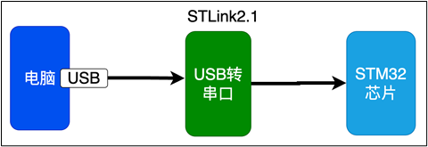


### 8.3.3 软件设计：轮询的方式接收

##### 1）波特率设置

###### 1.1 代码

```c
    USART1->BRR = 0x271;
```

###### 1.2 寄存器


##### 2）收发使能和串口使能

###### 2.1 代码

```c
    /* 4 使能usart1的发送和接收 */
    USART1->CR1 |= (USART_CR1_TE | USART_CR1_RE);
    
    /* 5 使能usart1 */
    USART1->CR1 |= USART_CR1_UE;

```


###### 2.2 寄存器


##### 3）发送接收数据

###### 3.1 代码

```c
uint8_t receive_char(void)
{
    /* 等待接收缓冲区 非空 */
    while ((USART1->SR & USART_SR_RXNE) == 0)
    {
    }
    return USART1->DR;
}

/*
    向串口1发送一个字符
*/
void send_char(uint8_t c)
{
    /* 等待发送缓冲区为空。SR_TXE为1表示已经移到移位寄存器， 0表示还没有 */
    while ((USART1->SR & USART_SR_TXE) == 0)
    {
    }
    /* 把要发送的数据写入到数据寄存器 */
    USART1->DR = c;
}

```


###### 3.2 寄存器


##### 4） 接收中断使能

###### 4.1 代码

```c
    /* 5 使能usart1接收中断  */
    USART1->CR1 |= USART_CR1_RXNEIE;

```


###### 4.2 寄存器


#### 8.3.3.1 轮询代码实现

usart.h：

```c
#ifndef __USART_H
#define __USART_H

#include "stm32f10x.h"

// 初始化
void USART_Init(void);

// 发送一个字符
void USART_SendChar(uint8_t ch);

// 接收一个字符
uint8_t USART_ReceiveChar(void);

// 发送字符串
void USART_SendString(const uint8_t *str);

// 接收字符串
// char *USART_ReceiveString(void);
void USART_ReceiveString(uint8_t *str, uint8_t *size);

#endif

```

usart.c：

```c
#include "usart.h"
// 初始化
void USART_Init(void)
{
    // 1.配置时钟
    // 1.1 GPIOA的时钟使能
    RCC->APB2ENR |= RCC_APB2ENR_IOPAEN; // 使能GPIOA时钟
    // 1.2 USART1的时钟使能
    RCC->APB2ENR |= RCC_APB2ENR_USART1EN; // 使能USART1时钟

    // 2.配置GPIO工作模式
    // PA9：复用推挽输出，CNF-10，NODE-11
    // PA10：浮空输入，CNF-01，NODE-00
    GPIOA->CRH |= GPIO_CRH_MODE9;
    GPIOA->CRH |= GPIO_CRH_CNF9_1;
    GPIOA->CRH &= ~GPIO_CRH_CNF9_0;

    GPIOA->CRH &= ~GPIO_CRH_MODE10;
    GPIOA->CRH &= ~GPIO_CRH_CNF10_1;
    GPIOA->CRH |= GPIO_CRH_CNF10_0;

    // 3.配置USART1
    // 3.1 波特率设置
    USART1->BRR = 0x271; // 设置波特率为115200

    // 3.2 收发使能及模块使能
    USART1->CR1 |= USART_CR1_TE | USART_CR1_RE; // 使能发送和接收
    USART1->CR1 |= USART_CR1_UE; // 使能USART1

    // 其他配置，设置数据帧模式
    USART1->CR1 &= ~USART_CR1_M; // 8位数据位
    USART1->CR1 &= ~USART_CR1_PCE; // 无奇偶校验
    USART1->CR2 &= ~USART_CR2_STOP; //配置停止位
}                           

// 发送一个字符
void USART_SendChar(uint8_t ch)
{
    /* 等待发送缓冲区为空。SR_TXE为1表示已经转移到移位寄存器，0表示还没有*/
    while((USART1->SR & USART_SR_TXE) == 0)
    {}
    USART1->DR = ch;
}

// 接收一个字符
uint8_t USART_ReceiveChar(void)
{
    while((USART1->SR & USART_SR_RXNE) == 0)
    {}
    return USART1->DR;
}
// 发送字符串
void USART_SendString(const uint8_t *str)
{
    uint8_t i = 0;
    while( str[i] != '\0' ) // 直到遇到字符串结束符
    {
        USART_SendChar(str[i]); // 发送字符
        i++;
    }
    USART_SendChar('\0'); // 发送字符串结束符
}

// 接收字符串
// void USART_ReceiveString(uint8_t *str, uint8_t *size)
// {
//     uint8_t i = 0;
//     while((USART1->SR & USART_SR_IDLE) == 0) // 等待接收完成
//     {
//         str[i] = USART_ReceiveChar(); // 接收字符
//         i++;
//     }

//     *size = i;
// }
void USART_ReceiveString(uint8_t *str, uint8_t *size)
{
    uint8_t i = 0;
    while(1)
    {
        while((USART1->SR & USART_SR_RXNE) == 0)
        {
            if (USART1->SR & USART_SR_IDLE) // 检测到空闲状态，表示接收完成
            {
                *size = i;
                return; // 跳出循环，结束接收
            }
        }
        str[i] = USART1->DR; // 接收字符
        i++;
    } 
}

```

usart.c：

```c
#include "usart.h"
// 初始化
void USART_Init(void)
{
    // 1.配置时钟
    // 1.1 GPIOA的时钟使能
    RCC->APB2ENR |= RCC_APB2ENR_IOPAEN; // 使能GPIOA时钟
    // 1.2 USART1的时钟使能
    RCC->APB2ENR |= RCC_APB2ENR_USART1EN; // 使能USART1时钟

    // 2.配置GPIO工作模式
    // PA9：复用推挽输出，CNF-10，NODE-11
    // PA10：浮空输入，CNF-01，NODE-00
    GPIOA->CRH |= GPIO_CRH_MODE9;
    GPIOA->CRH |= GPIO_CRH_CNF9_1;
    GPIOA->CRH &= ~GPIO_CRH_CNF9_0;

    GPIOA->CRH &= ~GPIO_CRH_MODE10;
    GPIOA->CRH &= ~GPIO_CRH_CNF10_1;
    GPIOA->CRH |= GPIO_CRH_CNF10_0;

    // 3.配置USART1
    // 3.1 波特率设置
    USART1->BRR = 0x271; // 设置波特率为115200

    // 3.2 收发使能及模块使能
    USART1->CR1 |= USART_CR1_TE | USART_CR1_RE; // 使能发送和接收
    USART1->CR1 |= USART_CR1_UE; // 使能USART1

    // 其他配置，设置数据帧模式
    USART1->CR1 &= ~USART_CR1_M; // 8位数据位
    USART1->CR1 &= ~USART_CR1_PCE; // 无奇偶校验
    USART1->CR2 &= ~USART_CR2_STOP; //配置停止位
}                           

// 发送一个字符
void USART_SendChar(uint8_t ch)
{
    /* 等待发送缓冲区为空。SR_TXE为1表示已经转移到移位寄存器，0表示还没有*/
    while((USART1->SR & USART_SR_TXE) == 0)
    {}
    USART1->DR = ch; // 对USART_DR进行写操作，会将USART_SR_TXE清零
}

// 接收一个字符
uint8_t USART_ReceiveChar(void)
{
    while((USART1->SR & USART_SR_RXNE) == 0)
    {
        if (USART1->SR & USART_SR_IDLE) // 检测到空闲状态，表示接收完成
        {
            break;
        }
    }
    return USART1->DR; // 对USART_DR进行读操作，会将USART_SR_RXNE清零
}
// 发送字符串
void USART_SendString(const uint8_t *str)
{
    uint8_t i = 0;
    while( str[i] != '\0' ) // 直到遇到字符串结束符
    {
        USART_SendChar(str[i]); // 发送字符
        i++;
    }
    USART_SendChar('\0'); // 发送字符串结束符
}

// 接收字符串
void USART_ReceiveString(uint8_t *str, uint8_t *size)
{
    uint8_t i = 0;
    while((USART1->SR & USART_SR_IDLE) == 0) // 等待接收完成
    {
        str[i] = USART_ReceiveChar(); // 接收字符
        i++;
    }
    *size = --i;
}
// void USART_ReceiveString(uint8_t *str, uint8_t *size)
// {
//     uint8_t i = 0;
//     while(1)
//     {
//         while((USART1->SR & USART_SR_RXNE) == 0)
//         {
//             if (USART1->SR & USART_SR_IDLE) // 检测到空闲状态，表示接收完成
//             {
//                 *size = i;
//                 return; // 跳出循环，结束接收
//             }
//         }
//         str[i] = USART1->DR; // 接收字符
//         i++;
//     } 
// }

```

main.c：

```c
#include "usart.h"
#include "delay.h"

int main(void)
{
    // 初始化
    USART_Init();

    // 发送单个字符
    USART_SendChar('a');
    USART_SendChar('t');
    USART_SendChar('\n');
    
    while(1)
    {
        // 不停的发送字符
        // USART_SendChar('X');
        // USART_SendChar('\n');
        // Delay_ms(1000); // 延时1秒

        // 发送字符串
        uint8_t *str = "Hello, World!\n";
        USART_SendString(str); // 发送字符串，长度为14

        // 接收字符，并发送这个字符
        // uint8_t ch = USART_ReceiveChar(); // 接收一个字符
        // USART_SendChar(ch - 32); // 发送接收到的字符
        // USART_SendChar('\n'); // 发送换行符
        // 接收字符串, 然后返回字符串
        uint8_t buffer[100]; // 接收缓冲区
        uint8_t size = 0; // 接收的字符串长度
        USART_ReceiveString(buffer, &size); // 接收字符串
        USART_SendString(buffer); // 发送接收到的字符串
        USART_SendChar('\n'); // 发送换行符
    }
}

```

##### SR寄存器解读


上电时，复位值为0x00C0及[7-0]：1100 0000 ，复位时TXE为1，发送寄存器为空✔。复位时TC为1，发送移位寄存器为空✔。

复位时IDLE为0，是因为IDLE是判断接收结束的标志位，当有数据让32接收之后，才会用IDLE去判断是否达到空闲。空闲时，IDLE为


### 8.3.4 软件设计：中断的方式接收（寄存器）

​	USART提供了多个中断事件。


usart.h：

```c
#ifndef __USART_H
#define __USART_H

#include "stm32f10x.h"

extern uint8_t buffer[100]; // 接收缓冲区
extern uint8_t size; // 接收的字符串长度
extern uint8_t usart_receive_isOver_flag; // 串口接收标志位
// 初始化
void USART_Init(void);

// 发送一个字符
void USART_SendChar(uint8_t ch);

// 接收一个字符
// uint8_t USART_ReceiveChar(void);

// 发送字符串
void USART_SendString(const uint8_t *str);

// 接收字符串
// void USART_ReceiveString(uint8_t *str, uint8_t *size);

#endif

```

usart.c：

```c
#include "usart.h"
// 初始化
void USART_Init(void)
{
    // 1.配置时钟
    // 1.1 GPIOA的时钟使能
    RCC->APB2ENR |= RCC_APB2ENR_IOPAEN; // 使能GPIOA时钟
    // 1.2 USART1的时钟使能
    RCC->APB2ENR |= RCC_APB2ENR_USART1EN; // 使能USART1时钟

    // 2.配置GPIO工作模式
    // PA9：复用推挽输出，CNF-10，NODE-11
    // PA10：浮空输入，CNF-01，NODE-00
    GPIOA->CRH |= GPIO_CRH_MODE9;
    GPIOA->CRH |= GPIO_CRH_CNF9_1;
    GPIOA->CRH &= ~GPIO_CRH_CNF9_0;

    GPIOA->CRH &= ~GPIO_CRH_MODE10;
    GPIOA->CRH &= ~GPIO_CRH_CNF10_1;
    GPIOA->CRH |= GPIO_CRH_CNF10_0;

    // 3.配置USART1
    // 3.1 波特率设置
    USART1->BRR = 0x271; // 设置波特率为115200

    // 3.2 收发使能及模块使能
    USART1->CR1 |= USART_CR1_TE | USART_CR1_RE; // 使能发送和接收
    USART1->CR1 |= USART_CR1_UE; // 使能USART1

    // 3.3 其他配置，设置数据帧模式
    USART1->CR1 &= ~USART_CR1_M; // 8位数据位
    USART1->CR1 &= ~USART_CR1_PCE; // 无奇偶校验
    USART1->CR2 &= ~USART_CR2_STOP; //配置停止位

    // 3.4 中断配置
    USART1->CR1 |= USART_CR1_IDLEIE; // 使能空闲中断
    USART1->CR1 |= USART_CR1_RXNEIE; // 使能接收数据寄存器非空中断

    // 3.5 NVIC配置
    NVIC_SetPriorityGrouping(3); // 设置中断分组为抢占优先级
    NVIC_SetPriority(USART1_IRQn, 3); // 设置USART1中断优先级为3
    NVIC_EnableIRQ(USART1_IRQn); // 使能USART1中断
}                           

// 发送一个字符
void USART_SendChar(uint8_t ch)
{
    /* 等待发送缓冲区为空。SR_TXE为1表示已经转移到移位寄存器，0表示还没有*/
    while((USART1->SR & USART_SR_TXE) == 0)
    {}
    USART1->DR = ch; // 对USART_DR进行写操作，会将USART_SR_TXE清零
}


// 发送字符串
void USART_SendString(const uint8_t *str)
{
    uint8_t i = 0;
    while( str[i] != '\0' ) // 直到遇到字符串结束符
    {
        USART_SendChar(str[i]); // 发送字符
        i++;
    }
    USART_SendChar('\0'); // 发送字符串结束符
}

// 中断服务程序
void USART1_IRQHandler(void)
{
    // 首先判断中断类型
    if (USART1->SR & USART_SR_RXNE) // 接收数据寄存器非空中断
    {
        // 接收完成一个字符
        buffer[size] = USART1->DR; // 从数据寄存器读取接收到的字符
        size++; // 增加接收的字符计数
    }
    else if (USART1->SR & USART_SR_IDLE) // 空闲中断
    {
        // 空闲中断处理，字符串整体接收完成
        // 清除IDLE标志位
        USART1->DR; // 读取DR寄存器以清除IDLE标志位
        usart_receive_isOver_flag = 1; // 设置接收标志位
    }
}

```

main.c

```c
#include "usart.h"
#include "delay.h"

uint8_t buffer[100]; // 接收缓冲区
uint8_t size = 0; // 接收的字符串长度

// 定义串口接收标志位
uint8_t usart_receive_isOver_flag = 0;

int main(void)
{
    // 初始化
    USART_Init();

    // 发送单个字符
    USART_SendChar('a');
    USART_SendChar('t');
    USART_SendChar('\n');
    
    while(1)
    {
        if (usart_receive_isOver_flag)
        {
            // 直接发送回去
            USART_SendString(buffer); // 发送接收到的字符串
            size = 0; // 重置接收长度
            usart_receive_isOver_flag = 0;
        }
    }
}

```

### 8.3.5 软件设计（HAL库）

## 8.4 串口案例2：重定向printf

### 8.4.1 需求描述

​	C语言中经常使用printf来输出调试信息，打印到屏幕。由于在单片机中没有屏幕，但是我们可以重定向printf，把数据**打印到串口**，从而在电脑端接收调试信息。这是除了debug外，另外一个非常有效的调试手段。

### 8.4.2 软件设计（寄存器）

#### 8.4.2.1 usart.c添加fputc函数

**只需重写`fputc`即可完成`printf`重定向的根本原因**在于：

1. C标准库的I/O分层设计，将格式化与字符输出分离。

2. `fputc`是`printf`最终调用的底层接口。

3. 不同编译器和库的差异可通过统一替换fputc适配。

   这一机制既保证了代码的简洁性，又提供了高度灵活性，使得嵌入式开发者能以最小代价实现调试信息的多样化输出。

usart.c：

```c
#include "usart.h"
#include <stdio.h>
// 初始化
void USART_Init(void)
{
    // 1.配置时钟
    // 1.1 GPIOA的时钟使能
    RCC->APB2ENR |= RCC_APB2ENR_IOPAEN; // 使能GPIOA时钟
    // 1.2 USART1的时钟使能
    RCC->APB2ENR |= RCC_APB2ENR_USART1EN; // 使能USART1时钟

    // 2.配置GPIO工作模式
    // PA9：复用推挽输出，CNF-10，NODE-11
    // PA10：浮空输入，CNF-01，NODE-00
    GPIOA->CRH |= GPIO_CRH_MODE9;
    GPIOA->CRH |= GPIO_CRH_CNF9_1;
    GPIOA->CRH &= ~GPIO_CRH_CNF9_0;

    GPIOA->CRH &= ~GPIO_CRH_MODE10;
    GPIOA->CRH &= ~GPIO_CRH_CNF10_1;
    GPIOA->CRH |= GPIO_CRH_CNF10_0;

    // 3.配置USART1
    // 3.1 波特率设置
    USART1->BRR = 0x271; // 设置波特率为115200

    // 3.2 收发使能及模块使能
    USART1->CR1 |= USART_CR1_TE | USART_CR1_RE; // 使能发送和接收
    USART1->CR1 |= USART_CR1_UE; // 使能USART1

    // 其他配置，设置数据帧模式
    USART1->CR1 &= ~USART_CR1_M; // 8位数据位
    USART1->CR1 &= ~USART_CR1_PCE; // 无奇偶校验
    USART1->CR2 &= ~USART_CR2_STOP; //配置停止位
}                           

// 发送一个字符
void USART_SendChar(uint8_t ch)
{
    /* 等待发送缓冲区为空。SR_TXE为1表示已经转移到移位寄存器，0表示还没有*/
    while((USART1->SR & USART_SR_TXE) == 0)
    {}
    USART1->DR = ch; // 对USART_DR进行写操作，会将USART_SR_TXE清零
}

// 接收一个字符
uint8_t USART_ReceiveChar(void)
{
    while((USART1->SR & USART_SR_RXNE) == 0)
    {
        if (USART1->SR & USART_SR_IDLE) // 检测到空闲状态，表示接收完成
        {
            break;
        }
    }
    return USART1->DR; // 对USART_DR进行读操作，会将USART_SR_RXNE清零
}
// 发送字符串
void USART_SendString(const uint8_t *str)
{
    uint8_t i = 0;
    while( str[i] != '\0' ) // 直到遇到字符串结束符
    {
        USART_SendChar(str[i]); // 发送字符
        i++;
    }
    USART_SendChar('\0'); // 发送字符串结束符
}

// 接收字符串
void USART_ReceiveString(uint8_t *str, uint8_t *size)
{
    uint8_t i = 0;
    while((USART1->SR & USART_SR_IDLE) == 0) // 等待接收完成
    {
        str[i] = USART_ReceiveChar(); // 接收字符
        i++;
    }
    *size = --i;
}

// 重写fputc函数
int fputc(int ch, FILE *f)
{
    USART_SendChar((uint8_t)ch); // 发送字符
    return ch; // 返回发送的字符
}

```

main.c：

```c
#include "usart.h"
#include "delay.h"

int main(void)
{
    // 初始化
    USART_Init();

    
    printf("Hello, USART!\n");
    while(1)
    {

    }
}

```

### 8.4.3 软件设计（HAL库）

## 8.5 课堂测试


1）：32的编程方式，一开始上来总是先开启一个时钟，把GPIOA的时钟打开就行。
	**因为在32里不同的模块，由不同的时钟来控制，用到哪个模块就开启哪个模块的时钟，这样的话就更加节能，高速的模块使用高速的时钟，低速的模块使用低速的时钟，这样分配也更加合理。**

2）我们用到了通用的输入输出端口，那就要设置GPIO的输入输出模式。

​	**只要是用到这种常规的，需要做0或者1的输出，而且也不需要由外接上拉电阻之类的东西，外边连接也不存在总线的这种连接方式，基本上都设置为通用推挽输出。**

​	**开漏的话，需要接上拉电阻，开漏模式下是可以正常输出0的，但不能正常输出1。除了0之外，就是高阻态，想输出1的话，就必须要接上拉电阻。如果我们要做电压转换的话，用开漏。**

​	**或者这个引脚在外边还接在了一根总线上，这跟总线被很多引脚连接，这时候也用开漏输出，这些引脚在没有占用总线的时候，都以高阻态的方式与总线相连，如果有某一个引脚，想使用总线，就向总线发送一个0，然后就可以传输信息。**

3）向ODR写值。


**由NVIC决定哪个中断的处理程序交给CPU来执行。**


抢占优先级：优先级组

响应优先级：子优先级


1）我们即使用了通用输入输出引脚和相应的功能，又使用了AFIO，参与处理了7对1的转换。所以要打开这两个时钟。

2）配置工作模式：上拉输入或者下拉输入（10 00：CNF MODE）。

3）

4）

5）


# 九：I2C通讯

## 9.1 I2C基础知识

​	I2C 通讯协议（Inter-Integrated Circuit：内部集成电路）是由Phiilps公司开发的，由于它引脚少，硬件实现简单，可扩展性强，不需要 USART、CAN等通讯协议的外部收发设备，现在被广泛地使用在系统内多个集成电路（IC）间的通讯。

​	是一种简单的**双向两线制**总线协议标准，支持**同步串行半双工**通讯。


UART也是按位进行传输，不过是**低位先行。**


Transmitter发送数据完成之后结束占用，由Receiver占用总线，发送一个响应信号（低电平），表示接收到数据。


## 9.2 I2C案例1：软件模拟I2C

​	EEPROM芯片最常用的通讯方式就是I2C协议。我们使用的芯片是M24C02。

​	**Electrically Erasable Programmable Read-Only Memory**中文翻译为**电可擦除可编程只读存储器**。


​	**软件模拟I2C，不使用32里已经有的I2C硬件模块，按照I2C协议控制引脚完成I2C通讯。**

### 9.2.1 需求描述

​	我们向E2PROM写入一段数据，再读取出来，最后发送到串口，核对是否读写正确。

#### 9.2.1.1 硬件原理图


**E1、E2、E3是M24C02芯片使用I2C协议时的地址配置位**，高四位地址已经定死为：1010，后三位可以通过E1、E2和E3去配置。

WC#：Write Control（写控制）低电平有效， 给高电平就相当于把当前这个芯片锁定，不允许写入了。给低电平，就允许写入。

或者为           WP：Write Protect（写保护）


SCL（连接时钟总线）   和   SDA（连接数据总线）   进行I2C通讯的核心引脚，这**两个引脚还得接上拉电阻。**


#### 9.2.2.2 M24C02简介

​	M24C02的SCL及SDA 引脚连接到了STM32对应的I2C引脚中，结合上拉电阻，构成了I2C通讯总线，它们通过I2C总线交互。

​	E2PROM芯片的设备地址一共有7位，其中高4位固定为：1010，低3位则由E3/E2/E1信号线的电平决定E2PROM设备地址。

​	R/W是读写方向控制位，与地址无关。

​	在我们电路图中由于E1/E2/E3均是接的低电平，所以它的地址是1010000即0x50。


​	由于I2C通讯时常常是地址跟读写方向连在一起构成一个8位数，且当R/W位为0 时，表示写方向，所以加上7位地址，其值为“0xA0”，常称该值为I2C设备的“写地址”。

​	当R/W位为1时，表示读方向，加上7位地址，其值为“0xA1”，常称该值为“读地址”。

### 9.2.3 操作时序图整理

1）起始和停止信号


2）数据有效性


3）响应和非响应


4）写入一个字节时序


5）读出一个字节时序

**EEPROM内部有一个地址寄存器，用来存要读取，或者要写入的字节的地址。**

先往地址寄存器里写入要读字节的地址，再读取数据。
**假写真读**。


6）单次写入多个字节时序


​	一次性写入多个字节，也叫页写入（Page Write）。AT24C02每页只有16个字节，每次只能写入单独的一个页中，所以一次性最多只能写入16个字节。

​	**当一次性写入超过16个字节的时候，则超过的部分会重新从这页的首地址重新写入。**

7）单次读出多个字节时序


​	**读出多个字节的时候没有限制，可以读出任意多个。**

### 9.2.4 软件设计（寄存器）

I2C.h：

```c
#ifndef __I2C_H
#define __I2C_H

#include "stm32f10x.h"
#include "delay.h"

// 宏定义
#define ACK 0
#define NACK 1

// 控制时钟的定义
#define SCL_HIGH (GPIOB->ODR |= GPIO_ODR_ODR10)
#define SCL_LOW (GPIOB->ODR &= ~GPIO_ODR_ODR10)
// 控制SDA的定义
#define SDA_HIGH (GPIOB->ODR |= GPIO_ODR_ODR11)
#define SDA_LOW (GPIOB->ODR &= ~GPIO_ODR_ODR11)
// 读取操作的定义
#define READ_SDA ((GPIOB->IDR & GPIO_IDR_IDR11)? 1 : 0)

// 定义操作的基本延迟
#define I2C_DELAY Delay_us(10)

// 函数声明
// 初始化
void I2C_Init(void);

// 发送起始信号
void I2C_Start(void);

// 发送停止信号
void I2C_Stop(void);

// 发送ACK信号
void I2C_ACK(void);

// 接收ACK信号
uint8_t I2C_Wait_ACK(void);

// 发送NACK信号
void I2C_NACK(void);

// 发送一个字节
void I2C_SendByte(uint8_t byte);

// 接收一个字节
uint8_t I2C_ReceiveByte(void);

#endif

```

I2C.c：

```c
#include "I2C.h"

// 初始化
void I2C_Init(void)
{
    // 1.配置时钟 GPIOB
    RCC->APB2ENR |= RCC_APB2ENR_IOPBEN;

    // 2.配置PB10为开漏输出（SCL）、PB11为开漏输出（SDA）CNF-01,MODE-11
    GPIOB->CRH |= GPIO_CRH_MODE10;
    GPIOB->CRH |= GPIO_CRH_CNF10_0; // PB10开漏输出
    GPIOB->CRH &= ~GPIO_CRH_CNF10_1; // PB10开漏输出

    GPIOB->CRH |= GPIO_CRH_MODE11;
    GPIOB->CRH |= GPIO_CRH_CNF11_0; // PB11开漏输出
    GPIOB->CRH &= ~GPIO_CRH_CNF11_1; // PB11开漏输出
}

// 发送起始信号
void I2C_Start(void)
{
    // 1.SCL线拉高,SDA线拉高
    SCL_HIGH;
    SDA_HIGH;
    // 2.保持一段时间
    I2C_DELAY;
    // 3.SDA线拉低
    SDA_LOW;
    // 4.保持一段时间
    I2C_DELAY;
}

// 发送停止信号
void I2C_Stop(void)
{
    // 1.SCL线拉高,SDA线拉低
    SCL_HIGH;
    SDA_LOW;
    // 2.保持一段时间
    I2C_DELAY;
    // 3.SDA线拉高
    SDA_HIGH;
    // 4.保持一段时间
    I2C_DELAY;
}

// 发送ACK信号
void I2C_ACK(void)
{
    // 1.SCL线拉低，SDA拉高，准备发送ACK信号
    SCL_LOW;
    SDA_HIGH;
    I2C_DELAY;

    // 2.SCL保持不变，SDA线拉低，输出低应答信号
    SDA_LOW;
    I2C_DELAY;

    // 3.SCL线拉高，SDA线保持低状态，开始采样
    SCL_HIGH;
    I2C_DELAY;

    // 4.SCL线拉低，准备下一次操作
    SCL_LOW;
    I2C_DELAY;

    // 5.SDA线拉高，释放数据总线
    SDA_HIGH;
    I2C_DELAY;
}

// 接收ACK信号
uint8_t I2C_Wait_ACK(void)
{
    uint8_t signal = 1;
    // 1. SCL拉低，SDA拉高，释放数据总线
    SCL_LOW;
    SDA_HIGH;
    I2C_DELAY;

    // 2. SCL拉高，等待从机发送ACK信号
    SCL_HIGH;
    I2C_DELAY;

    // 3. 接收ACK信号
    signal = (READ_SDA ? NACK : ACK); // 读取SDA线状态

    // 4. SCL拉低，准备下一次操作
    SCL_LOW;
    I2C_DELAY;

    return signal;
}

// 发送NACK信号
void I2C_NACK(void)
{
    // 1.SCL线拉低，SDA拉高，准备发送ACK信号
    SCL_LOW;
    SDA_HIGH;
    I2C_DELAY;

    // 2.SCL线拉高，SDA线保持低状态，开始采样
    SCL_HIGH;
    I2C_DELAY;

    // 3.SCL线拉低，准备下一次操作
    SCL_LOW;
    I2C_DELAY;
}

// 发送一个字节
void I2C_SendByte(uint8_t byte)
{
    
    for (uint8_t i = 0; i < 8; i++)
    {
        // 1. SCL线拉低，SDA都拉低，准备发送数据
        SCL_LOW;
        SDA_LOW;
        I2C_DELAY;
        // 2.发送数据
        if (byte & (0x80))
            SDA_HIGH;
        else
            SDA_LOW;
        I2C_DELAY;
        // 3. SCL线拉高，SDA线保持高状态，开始采样
        SCL_HIGH;
        I2C_DELAY;
        // 4. SCL线拉低，采样结束
        SCL_LOW;
        I2C_DELAY;
        // 5. 将byte左移一位，准备发送下一个位
        byte <<= 1;
    }
}

// 接收一个字节
uint8_t I2C_ReceiveByte(void)
{
    uint8_t byte = 0;
    for (uint8_t i = 0; i < 8; i++)
    {
        // 1. SCL线拉低，SDA都拉高，等待数据发送
        SCL_LOW;
        SDA_HIGH;
        I2C_DELAY;

        // 2. SCL线拉高，SDA线保持高状态，开始采样
        SCL_HIGH;
        I2C_DELAY;

        // 3. 读取SDA线状态
        byte <<= 1; // 左移一位
        if (READ_SDA)
            byte |= 0x01; // 先存入最低位，然后每次都左移1位

        // 4. SCL线拉低，采样结束
        SCL_LOW;
        I2C_DELAY;
    }
    return byte;
}

```

M24C02.h：

```c
#ifndef __M24C02_H
#define __M24C02_H

#include "I2C.h"

// 宏定义
#define W_ADDR 0xA0 // M24C02的写地址
#define R_ADDR 0xA1 // M24C02的读地址

// 初始化
void M24C02_Init(void);

// 写入一个字节
void M24C02_WriteByte(uint8_t innerAddr, uint8_t byte);

// 读取一个字节
uint8_t M24C02_ReadByte(uint8_t innerAddr);

// 连续写入多个字节
void M24C02_WriteBytes(uint8_t innerAddr, uint8_t *bytes, uint8_t size);

// 连续读取多个字节
void M24C02_ReadBytes(uint8_t innerAddr, uint8_t *buffer, uint8_t size);

#endif

```

M24C02.c：

```c
#include "m24c02.h"
// 初始化
void M24C02_Init(void)
{
    I2C_Init();
}

// 写入一个字节
void M24C02_WriteByte(uint8_t innerAddr, uint8_t byte)
{
    // 1. 发送起始信号
    I2C_Start();

    // 2. 发送写地址
    I2C_SendByte(W_ADDR);

    // 3. 等待EEPROM应答
    if (I2C_Wait_ACK() == NACK) {
        I2C_Stop();
        return; // 如果没有应答，停止操作
    }

    // 4. 发送内部地址
    I2C_SendByte(innerAddr);

    // 5. 等待EEPROM应答
    if (I2C_Wait_ACK() == NACK) {
        I2C_Stop();
        return; // 如果没有应答，停止操作
    }

    // 6. 发送数据字节
    I2C_SendByte(byte);

    // 7. 等待EEPROM应答
    I2C_Wait_ACK();

    // 8. 发送停止信号
    I2C_Stop();

    // 延迟等待写入周期结束
    Delay_ms(5);
}

// 读取一个字节
uint8_t M24C02_ReadByte(uint8_t innerAddr)
{
    uint8_t byte = 0;

    // 1. 发送起始信号
    I2C_Start();

    // 2. 发送写地址
    I2C_SendByte(W_ADDR);

    // 3. 等待EEPROM应答
    if (I2C_Wait_ACK() == NACK) {
        I2C_Stop();
        return 0; // 如果没有应答，停止操作
    }

    // 4. 发送内部地址
    I2C_SendByte(innerAddr);

    // 5. 等待EEPROM应答
    if (I2C_Wait_ACK() == NACK) {
        I2C_Stop();
        return 0; // 如果没有应答，停止操作
    }

    // 6. 发送起始信号
    I2C_Start();

    // 7. 发送读地址
    I2C_SendByte(R_ADDR);

    // 8. 等待EEPROM应答
    if (I2C_Wait_ACK() == NACK) {
        I2C_Stop();
        return 0; // 如果没有应答，停止操作
    }
    // 9. 接收数据字节
    byte = I2C_ReceiveByte();

    // 10. 发送NACK信号，表示不再接收更多数据
    I2C_NACK(); 

    // 11. 发送停止信号
    I2C_Stop(); 
 
    return byte;
}
    

 

// 连续写入多个字节
void M24C02_WriteBytes(uint8_t innerAddr, uint8_t *bytes, uint8_t size)
{
    // 1. 发送起始信号
    I2C_Start();

    // 2. 发送写地址
    I2C_SendByte(W_ADDR);

    // 3. 等待EEPROM应答
    if (I2C_Wait_ACK() == NACK) {
        I2C_Stop();
        return; // 如果没有应答，停止操作
    }

    // 4. 发送内部地址
    I2C_SendByte(innerAddr);

    // 5. 等待EEPROM应答
    if (I2C_Wait_ACK() == NACK) {
        I2C_Stop();
        return; // 如果没有应答，停止操作
    }

    for (uint8_t i = 0; i < size; i++)
    {
        // 6. 发送数据字节
        I2C_SendByte(bytes[i]);

        // 7. 等待EEPROM应答
        if (I2C_Wait_ACK() == NACK) {
            I2C_Stop();
            return; // 如果没有应答，停止操作
        }
    }

    // 8. 发送停止信号
    I2C_Stop();

    // 延迟等待写入周期结束
    Delay_ms(5);
}

// 连续读取多个字节
void M24C02_ReadBytes(uint8_t innerAddr, uint8_t *buffer, uint8_t size)
{
    // 1. 发送起始信号
    I2C_Start();

    // 2. 发送写地址
    I2C_SendByte(W_ADDR);

    // 3. 等待EEPROM应答
    if (I2C_Wait_ACK() == NACK) {
        I2C_Stop();
        return; // 如果没有应答，停止操作
    }

    // 4. 发送内部地址
    I2C_SendByte(innerAddr);

    // 5. 等待EEPROM应答
    if (I2C_Wait_ACK() == NACK) {
        I2C_Stop();
        return; // 如果没有应答，停止操作
    }

    // 6. 发送起始信号
    I2C_Start();

    // 7. 发送读地址
    I2C_SendByte(R_ADDR);

    // 8. 等待EEPROM应答
    if (I2C_Wait_ACK() == NACK) {
        I2C_Stop();
        return; // 如果没有应答，停止操作
    }

    for (uint8_t i = 0; i < size; i++)
    {
        // 9. 接收数据字节
        buffer[i] = I2C_ReceiveByte();   

        if (i < size - 1) {
            // 10. 发送ACK信号，表示继续接收数据
            I2C_ACK();
        }
        else {
            // 10. 发送NACK信号，表示接收数据结束
            I2C_NACK();
        }
    }

    // 11. 发送停止信号
    I2C_Stop(); 
}

```

main.c：

```c
#include "usart.h"
#include "delay.h"
#include "m24c02.h"
#include "stdio.h"

int main(void)
{
    // 初始化
    USART_Init();
    M24C02_Init();

    
    printf("Hello, USART!\n");
    // 2. 向EEPROM写入单个字符
    M24C02_WriteByte(0x00, 'A');
    M24C02_WriteByte(0x01, 'B');
    M24C02_WriteByte(0x02, 'C');

    // 3. 从EEPROM读取单个字符
    uint8_t byte1 = M24C02_ReadByte(0x00);
    uint8_t byte2 = M24C02_ReadByte(0x01);
    uint8_t byte3 = M24C02_ReadByte(0x02);

    // 4. 串口输出
    printf("Read from EEPROM: %c, %c, %c\n", byte1, byte2, byte3);

    // 5. 写入多个字符
    M24C02_WriteBytes(0x03, "123456", 6);

    // 6. 从EEPROM读取多个字符
    uint8_t buffer[100] = {0};
    M24C02_ReadBytes(0x03, buffer, 6);

    // 7. 串口输出
    printf("buffer = %s\n", buffer);

    // 8. 测试超出16个字节的写入
    M24C02_ReadBytes(0x00, "1234567891123456789", 19);
    M24C02_ReadBytes(0x00, buffer, 19);

    // 9. 串口输出
    printf("buffer = %s\n", buffer);
    while(1)
    {

    }
}

```

## 9.3 I2C 案例2：硬件实现I2C

### 9.3.1 需求描述

​	使用STM32的I2C外设读写E2PROM，基于寄存器操作。不需要手动控制引脚电平的输入输出，只需要操作I2C外设对应的寄存器即可。

### 9.3.2 硬件电路设计

#### 9.3.2.1 I2C 外设简介

​	其实STM32有专门负责协议的I2C外设，只要配置好该外设，它就会自动根据协议要求产生通讯信号，收发数据并缓存起来，CPU只要检测该外设的状态和访问数据寄存器，就能完成数据收发。

​	这种由硬件外设处理 I2C 协议的方式减轻了CPU的工作，且使软件设计更加简单。

​	STM32的 I2C 外设可用作通讯的主机及从机，支持100Kbit/s和400Kbit/s的速率，支持7位、10位设备地址，支持DMA数据传输，并具有数据校验功能。

​	它的I2C外设还支持 SMBus（系统管理总线协议）2.0协议，SMBus协议与I2C类似。

#### 9.3.2.2 STM32的I2C外设的功能框图


​	I2C的所有硬件架构都是根据图中左侧SCL线和SDA线展开的（其中的SMBA线用于SMBUS的警告信号，I2C通讯没有使用）。STM32芯片有多个I2C外设，咱们现在用的这款有2个I2C外设，它们的I2C通讯信号引出到不同的GPIO引脚上，使用时必须配置到这些指定的引脚。


### 9.3.3 软件设计（寄存器）

#### 1 I2C模式设置

##### 1.1 代码

```c
    /* 3. 配置 I2C 外设 */
    /* 3.0 选择I2C模式 i2c:0  smbus:1*/
    I2C2->CR1 &= ~I2C_CR1_SMBUS;
    /* 3.1 设置 I2C的时钟频率 ： 36MHz （范围2-36）*/
    I2C2->CR2 |= 36;
    /* 3.2 设置I2C主模式：标准模式(0)或快速模式(1)  */
    I2C2->CCR &= ~I2C_CCR_FS; // 设置为标准模式
/* 3.3 设置I2C的通讯速率为100KHz 通过计算为 180=5/(1/36)
	    Thigh = CCR ×TPCLK1
		Thight = 5us
	     Tpclk1 = 1/36us
		ccr = 5 * 36 = 180
*/
    I2C2->CCR |= 180;
    /* 3.4 允许的 SCL 最大上升沿时间
            100KHz的时候要求最大上升沿不超过1us(手册)。
            时钟频率是36MHz则 写入：1 /（1/36） + 1 = 37
		   其实就是计算的 最大上升沿时间/时钟周期 + 1
     */
    I2C2->TRISE = 37;

```


##### 1.2 寄存器


#### 2 I2C使能

##### 2.1 代码

```c
    /* 3.5 使能 I2C 外设 */
	I2C2->CR1 |= I2C_CR1_PE;

```


##### 2.2 寄存器


#### 3 产生起始和终止条件

##### 3.1 代码

```c
uint8_t I2C_Start(void)
{
    /* 产生起始条件 */
    I2C2->CR1 |= I2C_CR1_START;

    uint16_t timeout = 0xFFFF;
    while (!(I2C2->SR1 & I2C_SR1_SB) && timeout)
    {
        timeout--;
    }

    return timeout ? 1 : 0;
}

/* 终止条件 */
void I2C_Stop(void)
{
    /* 产生终止条件 */
    I2C2->CR1 |= I2C_CR1_STOP;
}

```


##### 3.2 寄存器


#### 4 产生应答信号和非应答信号

##### 4.1 代码

```c
/* 产生应答信号 */
void I2c_Ack(void)
{
    I2C2->CR1 |= I2C_CR1_ACK;
}

/* 产生非应答信号 */
void I2c_NAck(void)
{
    I2C2->CR1 &= ~I2C_CR1_ACK;
}

```


##### 4.2 寄存器


#### 5 收发数据

##### 5.1 代码


```c
    /* 发送数据前等待数据寄存器空 */
    while (!(I2C2->SR1 & I2C_SR1_TXE) && timeout)
    {
        timeout--;
    }
    /* 把数据写入到数据寄存器中 */
    I2C2->DR = byte;

    /* 等待数据发送完成。 I2C_SR1_BTF: 1发送结束 0发送未结束  */
    timeout = 0xFFFF;
    while (!(I2C2->SR1 & I2C_SR1_BTF) && timeout)
    {
        timeout--;
}

```

##### 5.2 寄存器


位2：BTF：Bit Transfer Finished


