# 一：定时器

## 1.1 系统定时器

### 1.1.1 系统定时器简介

​	系统定时器（SysTick系统）是属于CM3内核，内嵌在NVIC中。

​	系统定时器是一个24bit的向下**递减**的计数器，计数器每计数一次的时间为1 / SYSCLK，一般我们设置系统时钟SYSCLK（与AHB相同）等于72M。当重装载数值寄存器的值递减到0的时候，系统定时器就产生一次中断，以此循环往复。

​	SysTick定时器能产生中断，CM3为它专门开出一个异常类型，并且在向量表中有它的一席之地。它使操作系统和其它系统软件在CM3器件间的移植变得简单多了，因为在所有CM3产品间SysTick的处理方式都是相同的。

​	系统定时器一般用于操作系统，用于产生时基（时间基准），**维持操作系统的心跳**。SysTick定时器除了能服务于操作系统之外，还能用于其它目的：如作为一个闹铃，用于测量时间等。


### 1.1.2 与SysTick相关的寄存器

​	有4个寄存器与SysTick有关。在core_cm3.h中可以看到有个类型定义的就是SysTick。

```c
typedef struct
{
  __IO uint32_t CTRL;                         /*!< Offset: 0x00  SysTick Control and Status Register */
  __IO uint32_t LOAD;                         /*!< Offset: 0x04  SysTick Reload Value Register       */
  __IO uint32_t VAL;                          /*!< Offset: 0x08  SysTick Current Value Register      */
  __I  uint32_t CALIB;                        /*!< Offset: 0x0C  SysTick Calibration Register        */
} SysTick_Type;

```

#### 1）CTRL

​	SysTick控制和状态寄存器。


​	说明:关于**CLKSOURCE**位,当0时,时钟频率是AHB/8, 当1时,时钟频率是AHB

#### 2）LOAD

​	SysTick重装载寄存器。


#### 3）VAL

​	SysTick当前数值寄存器。


#### 4）CALIB

​	SysTick 校准数值寄存器。很少用到。（Calibration 校准，在32出厂的时候就设置好了）

### 1.1.3 系统中断案例：LED灯闪烁

#### 1.1.3.1 需求描述（使用中断）

​	利用**系统定时器的中断**，每隔1s 让LED1灯闪烁一次。

#### 1.1.3.2 硬件电路设计


#### 1.1.3.3 软件设计（寄存器）

15_led_twinkle_systick_register

##### 1.配置内核时钟源

###### 1.1 代码

```c
    /* 1. 配置时钟源为内核时钟 CLIKSOURCE=1*/
    SysTick->CTRL |= SysTick_CTRL_CLKSOURCE;

```


###### 1.2 寄存器

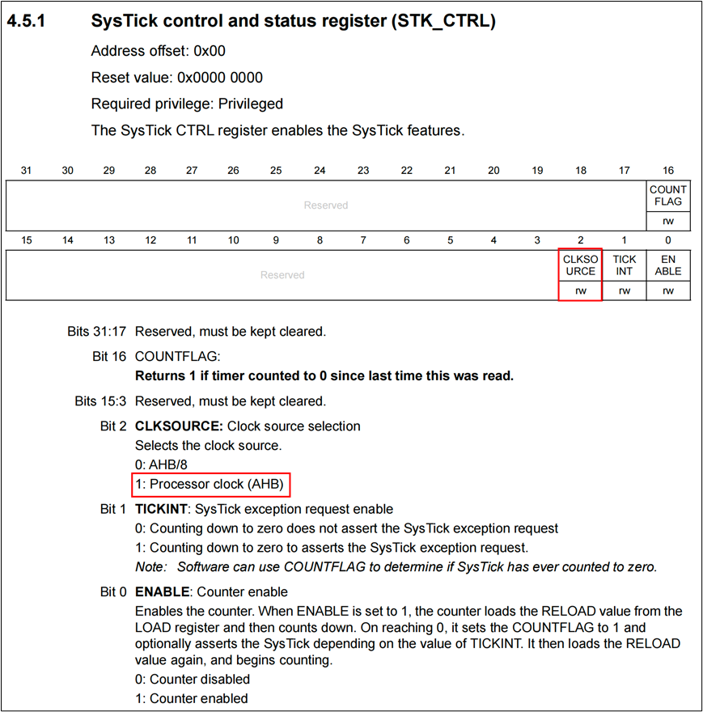

##### 2.中断使能

###### 2.1 代码

```c
    /* 2. 使能中断 1:使能中断*/
    SysTick->CTRL |= SysTick_CTRL_TICKINT;

```


###### 2.2 寄存器


##### 3.计数器重装载值

###### 3.1 代码

```c
    /*
       3. 计数器的重装载值
            需求：1ms产生一次中断
            72MHz的频率下，72000次计数正好是1ms
		   则需要把重装载值设置为72000 - 1
    */
    SysTick->LOAD = 72000 - 1;

```


###### 3.2 寄存器


##### 4.计数器使能

###### 4.1 代码

```c
    /* 4. 使能计数器  1：开启定时器  0：关闭定时器*/
    SysTick->CTRL |= SysTick_CTRL_ENABLE;

```


###### 4.2 寄存器


#### 1.1.3.4 软件设计（hal库）

16_led_twinkle_systick_hal

### 1.1.4 延时函数工具类（寄存器）

#### 1.1.4.1 delay.h

```c
#ifndef __delay_h
#define __delay_h
#include "stm32f10x.h"                  // Device header

void Delay_us(uint16_t us);
void Delay_ms(uint16_t ms);
void Delay_s(uint16_t s);

#endif

```

#### 1.1.4.2 delay.c

```c
#include "delay.h" // Device header

void Delay_us(uint16_t us)
{
    /* 设计定时器重装值 */
    SysTick->LOAD = 72 * us;
    /* 清除当前计数值 */
    SysTick->VAL = 0;
    /*设置内部时钟源（2位->1）,不需要中断（1位->0），并启动定时器(0位->1)*/
    SysTick->CTRL = 0x5;
    /*等待计数到0， 如果计数到0则16位会置为1*/
    while (!(SysTick->CTRL & SysTick_CTRL_COUNTFLAG));
    /* 关闭定时器 */
    SysTick->CTRL &= ~SysTick_CTRL_ENABLE; 
}

void Delay_ms(uint16_t ms)
{
    while (ms--)
    {
        Delay_us(1000);
    }
}

void Delay_s(uint16_t s)
{
    while (s--)
    {
        Delay_ms(1000);
    }
}

```

## 1.2 基本定时器

​	定时器是STM32中一个非常强大的外设，功能强大，用途很广。STM32F103系列提供了8个定时器：2个基本定时器(TIM6,7)，4个通用定时器(TIM2-5)，2个高级定时器(TIM1和TIM8)。


TIM6和TIM7是基本定时器。

TM2-TIM5是通用定时器。

TM1和TM8是高级定时器。

### 1.2.1 基本定时器介绍

​	基本定时器**TIM6和TIM7**各包含一个**16位**自动装载计数器，由各自的可编程预分频器驱动。

​	这2个定时器是互相独立的，不共享任何资源。

​	这个2个基本定时器只能**向上计数**，由于没有外部IO，所以只能计时，不能对外部脉冲进行计数。

​	功能：**定时中断，主模式，触发DAC**。


 


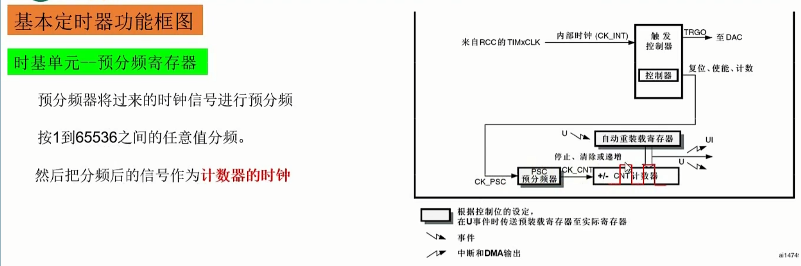


自动重装寄存器，实际上有两个寄存器，**预加载寄存器和影子寄存器**，


**定时器**有一个**基本规定**：**初始状态下，就默认定时器已经产生了一次溢出，分别加载PSC预分频器影子寄存器的值和自动重装载影子寄存器的值。**

PSC 和 ARR   都有影子寄存器


ARR有ARPE控制位，可以控制ARR里的值，是否直接刷到影子寄存器。默认为0，一旦缓冲区中有值，直接刷到影子寄存器。


但PSC没有控制位，只能通过更新事件，只有在更新事件到来的时候，他的值才能从缓冲区刷到影子寄存器。


没有预加载时的情况：


有预加载的时的情况：


计算定时时间：

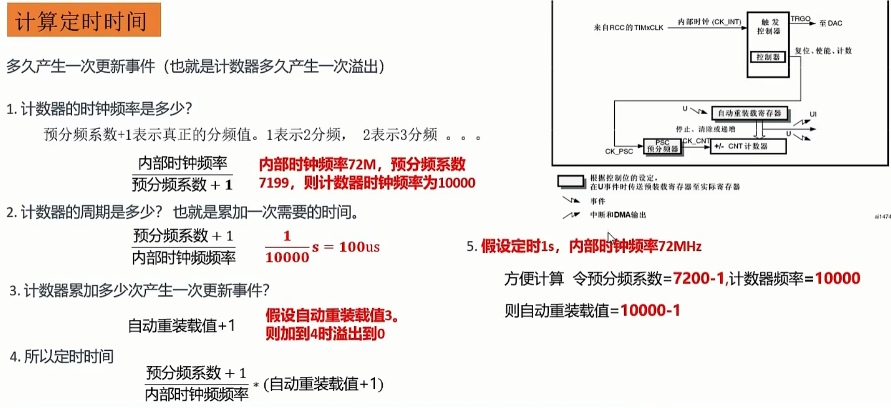

### 1.2.2 基本定时器案例：LED灯闪烁

#### 1.2.2.1 需求描述

​	利用基本定时器定时功能，实现LED_2亮->1s->LED_2灭 ->1s …。

#### 1.2.2.2 硬件电路设计


#### 1.2.2.3 软件设计（寄存器）

##### 1） 开启时钟

###### 1.1 代码

```c
    /* 1. 开启时钟 */
    RCC->APB1ENR |= RCC_APB1ENR_TIM6EN;

```


###### 1.2 寄存器


##### 2） 计数器频率预分频

###### 2.1 代码

```c
    /* 2. 设置预分频值: 分频值7199表示7200分频。分频后频率10K，周期100us */
    TIM6->PSC = 7200 - 1;

```


###### 2.2 寄存器


##### 3） 计数器自动重装载值

###### 3.1 代码

```c
    /*
        3. 设置自动重转载寄存器的值，决定中断发生的频率。
            假设设置为9999，表示计数器计数10000次发生一次中断。
            计数一次100us，10000次1000000us，正好1s
     */
    TIM6->ARR = 9999;


```


###### 3.2 寄存器


##### 4.使能定时器更新中断

###### 4.1 代码

```c
    /* 4. 使能定时器的更新中断（计数器溢出时产生中断） */
    TIM6->DIER |= TIM_DIER_UIE;

```


###### 4.2 寄存器


##### 5） 定时器使能

###### 5.1 代码

```c
    /* 8. 使能计数器 */
    TIM6->CR1 |= TIM_CR1_CEN;

```


###### 5.2 寄存器


##### 6） 定时器更新中断标志位

###### 6.1 代码

```
    /* 务必清除中断标志位，否则会一直进入中断 */
    TIM6->SR &= ~TIM_SR_UIF;

```


###### 6.2 寄存器


##### 17_led_twinkle_tim_register

#### 1.2.2.4 软件设计（hal库）

##### 18_led_twinkle_tim_hal

## 1.3 通用定时器

### 1.3.1 通用定时器介绍

​	通用定时器有4个分别是：TIM2、TIM3、TIM4、TIM5。它们拥有基本定时器所有功能。并增加如下功能：

​	（1）多种时钟源。

​	（2）向上计数（加），向下计数（减），向上/向下（先加后减）。当然我们使用的时候更喜欢**向上计数**。

​	（3）输入捕获。

​	（4）输出比较。

​	（5）PWM生成。

​	（6）支持针对定位的增量（正交）编码器和霍尔传感器电路。


#### 1）通用定时器时钟源


**定时器时钟选择：**


**外部时钟源一般用于定时器级联**


#### 2）计数器3种模式


**向上计数模式：**


**向下计数模式：**


**中央对齐模式：**


**配置计数方向：**


### 1.3.2 通用定时器案例1：LED呼吸灯——PWM脉冲

​	使用通用定时器的**输出比较**功能。

#### 1.3.2.1 需求描述

​	输出占空比可调的PWM波形，作用到二极管，使二极管（LED2）呈现呼吸灯的效果。


​	**PA1**复用的是TIM5_CH2和TIM2_ CH2，我们选择TIM5_CH2。

#### 1.3.2.2 如何生成PWM

##### 1） PWM介绍

pwm（脉冲宽度调制 Pulse-wide modulation）


**PWM重要的三个参数：**


**PWM的使用：**


##### 2）定时器的输出比较功能


产生方波的原理：


**比较输出的8种模式：**

2、3模式：CNT和CCR比较之后再强制输出。


4模式：可以调整方波的相位。


5、6模式：直接强制输出


7模式：PWM1


8模式：PWM2


#### 1.3.2.3 硬件电路设计


#### 1.3.2.4 软件设计（寄存器）

##### 1）计数器计数方向

###### 1.1  代码

```c
    /* 5. 计数器计数方向: 0:向上计数 1:向下计数 */
    TIM5->CR1 &= ~TIM_CR1_DIR;

```


###### 1.2 寄存器


##### 2） 配置通道方向

###### 2.1  代码

CCMR：Capture Compare Mode Register

```c
    /* 6. CH2通道配置为输出 00表示输出 */
    TIM5->CCMR1 &= ~TIM_CCMR1_CC2S;

```

###### 2.2 寄存器

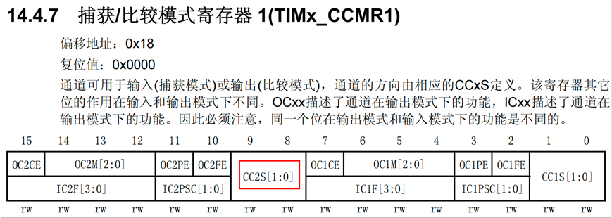


##### 3） 配置输出比较模式

###### 3.1  代码

```c
    /* 7. 配置CH2的输出比较模式（8种模式，选择PWM1模式）110 */
    TIM5->CCMR1 |= TIM_CCMR1_OC2M_2;
    TIM5->CCMR1 |= TIM_CCMR1_OC2M_1;
    TIM5->CCMR1 &= ~TIM_CCMR1_OC2M_0;

```


###### 3.2 寄存器


##### 4） 比较输出模式下的比较值

###### 4.1 代码

```c
    /* 8. 给CH2的CCR2寄存器设置比较值。比如设置为50，重装载计数器的值是100，占空比就是50% */
    TIM5->CCR2 = 50;

```


###### 4.2 寄存器


##### 5） 配置通道极性和使能

###### 5.1 代码

```c
    /* 9. 设置CH2通道的极性： 0高电平有效 or 1低电平有效 */
	TIM5->CCER &= ~TIM_CCER_CC2P;
    /* 10. 使能CH2通道 0: 关闭 1：开启*/
    TIM5->CCER |= TIM_CCER_CC2E;

```


###### 5.2 寄存器


#### 1.3.2.5 课后练习——呼吸灯练习


##### ex08_led_breathe_register


##### ex09_lcd_bg_register

### 1.3.3  通用定时器实验2：测量PWM的频率/周期

#### 1.3.3.1 需求描述

​	这个案例我们使用**输入捕获**功能，来测试PWM波的频率/周期。

​	把测到的结果通过串口发送到电脑，检查测试的结果。

#### 1.3.3.2 如何测量PWM周期/频率


##### 输入捕获框图：

输入捕获包含3个部分：**输入部分、计数器部分、捕获寄存器部分（也是比较寄存器）**


##### 输入捕获原理：


2.选择是否滤波需要配置ICF寄存器

3.选择边沿检测上升沿或者下降沿，需要配置CCER寄存器里的CCP位


6.开启或关闭捕获比较中断，需要配置DIER寄存器的CCIE（Capture/Compare interrupt enable）位

##### 测量PWM周期原理

​	**假设下图条件成立**


​	**测量PWM周期的原理**


**当要测的PWM频率太高：需要采用测量多个周期的时间**


#### 1.3.3.3 硬件电路设计

​	TIM5的CH2输出PWM波。


​	使用TIM4的CH1来捕获PWM信号。


​	使用杜邦线把PA1连接到PB6，就可以完成我们的测量任务。

#### 1.3.3.4 软件设计

##### 1）输入通道滤波器设置

###### 1.1  代码

```c
    /* 3. 配置CH1的输入滤波器，可以过滤掉一些干扰信号。我们不滤波IC1F=0000 */
    TIM4->CCMR1 &= ~TIM_CCMR1_IC1F;

```


###### 1.2 寄存器


##### 2） 通道输入信号边缘检测和捕获使能

###### 2.1  代码

CCMR：Capture Compare Mode Register

```c
    /* 4. 设置边沿检测器 0上升沿  1下降沿*/
	TIM4->CCER &= ~TIM_CCER_CC1P;
    /* 10. 使能CH1通道捕获使能 0: 关闭 1：开启*/
    TIM4->CCER |= TIM_CCER_CC1E;

```

###### 2.2 寄存器


##### 3） 捕获比较中断

###### 3.1  代码

```c
    /* 11. 开启TIM4的捕获比较中断，在中断服务函数中对捕获到的上升沿进行处理 */
    TIM4->DIER |= TIM_DIER_CC1IE;

```


###### 3.2 寄存器


##### 4) 输入模式配置


##### 21_pwm_cycle_register

**输入捕获事件会产生事件和中断（如果开启中断的话）**

**事件：将CNT里的值记录到CCR1**

**中断：对CNT清零。**

**由于事件是由硬件电路实现的，它的执行效率很快，所以CCR1里记录的是CNT清零之前的值，就是产生事件和中断时的值。**

### 1.3.4 通用定时器实验3：同时测量PWM的频率/周期和占空比

#### 1.3.4.1 需求描述

​	用一个定时器的2个通道**同时测量频率和占空比**。

​	测试频率好理解，连续的两个上升沿就可以了。测试占空比就需要**连续的一个上升沿和一个下降沿**，用前面的知识是无法实现了，因为需要在这个通道即要检测上升沿，也要检测下降沿，是无法实现的。

​	所以，要测量占空比，需要用到新的知识：定时器的**从模式**和PWM输入模式。

#### 1.3.4.2 触发输入和从模式

##### **主从模式：**

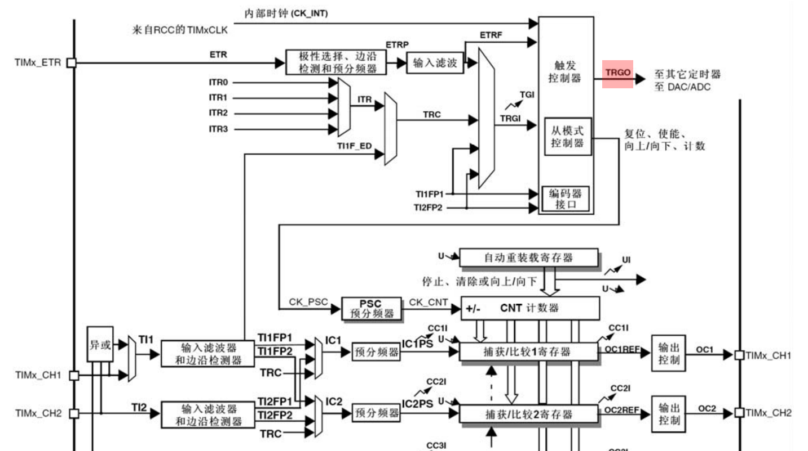


##### **触发输入信号配置：**

**TIM_SMCR_TS：**配置触发输入信号


第一类：


第二类：


第三类：


第四类：


使用**第四类触发输入信号**用来完成对PWM周期和占空比的测量


##### 定时器从模式

**TIM_SMCR_SMS：**配置定时器从模式


**只有111外部时钟模式下，使用的是外部时钟。**


#### 1.3.4.3 PWM输入模式


##### **测量占空比的原理：**


1.3.4.4 课后练习——测量不同频率的PWM波


##### ex10_pwm_cycle_register

#### 1.3.4.4 软件设计（寄存器）

通用定时器同时测量PWM周期频率和占空比用到的寄存器详解

##### 1）配置通道为输入并映射正确通道

###### 1.1  代码

CCMR：Capture Compare Mode Register

```c
    /* 4. CH1通道配置为输入，并IC1映射到TI1上：CCMR1_CC1S=01 */
    TIM4->CCMR1 &= ~TIM_CCMR1_CC1S_1;
    TIM4->CCMR1 |= TIM_CCMR1_CC1S_0;

    /* 4.1 把IC2映射到TI1上： CCMR1_CC2S=10*/
    TIM4->CCMR1 |= TIM_CCMR1_CC2S_1;
    TIM4->CCMR1 &= ~TIM_CCMR1_CC2S_0;

```


###### 1.2 寄存器


##### 2） 配置从模式控制器

###### 2.1  代码


```c
    /* 11. 必须配置从模式控制器为复位模式 SMS=100， 触发输入信号为：TI1FP1 TS=101*/
    TIM4->SMCR |= TIM_SMCR_TS_2;
    TIM4->SMCR &= ~TIM_SMCR_TS_1;
    TIM4->SMCR |= TIM_SMCR_TS_0;

    TIM4->SMCR |= TIM_SMCR_SMS_2;
    TIM4->SMCR &= ~(TIM_SMCR_SMS_1 | TIM_SMCR_SMS_0);

```

###### 2.2 寄存器


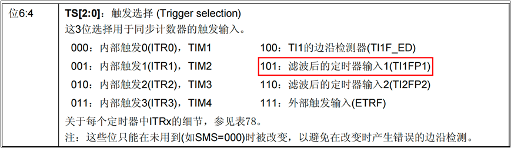


## 1.4 高级定时器

### 1.4.1 高级定时器介绍

高级定时器有2个分别是：**TIM1** **、TIM8**。

高级定时器除了拥有通用定时器的所有功能外，还具有以下功能：

（1）死区时间可编程的互补输出。

（2）断路输入信号（刹车输入信号）。

（3）重复计数器。


#### 重复计数器：


**重复计数的原理：**  REP = 2时，CNT计数器产生三次溢出，才会触发一次更新事件。


#### 互补输出：


由于上述关断慢，导通快的问题，加入一段延时时间，这段时间就叫死区时间。

#### 死区时间：


#### 刹车输入信号：

**TIMx_BKIN**


### 1.4.2 高级定时器实验：输出有限个周期的PWM波

#### 1.4.2.1 需求描述

​	用寄存器实现。输出5个周期的PWM波，频率2Hz，观察发光二极管闪烁5次，或者用示波器观察波形。

​	**需求实现思路：**使用高级定时器的重复计数器，当计数器溢出时，在溢出中断中停止定时器工作。重复计数器寄存器的值设置为4，即可输出5个周期的PWM波，发光二极管会闪烁5次。

#### 1.4.2.2 硬件电路设计

​	设置高级定时器TIM1的CH1。


#### 1.4.2.3 软件设计（寄存器）

##### 1）设置重复计数器

###### 1.1  代码

```c
    /* 12. 设置重复计数器, 溢出5次 */
    TIM1->RCR = 4;

```


###### 1.2 寄存器


##### 2） 主输出使能

###### 2.1  代码

```c
    /* 13. 主输出使能：MOE=1 否则OC和OCN不输出 */
    TIM1->BDTR |= TIM_BDTR_MOE;

```

###### 2.2 寄存器


##### 25_pwm_n_register

##### 定时器复习138

# 二：DMA直接存储访问

## 2.1 DMA介绍

​	直接存储器存取（direct memory access，DMA）用来提供在外设和存储器之间或者存储器和存储器之间的高速数据传输。无须CPU干预，数据可以通过DMA快速地移动，这就节省了CPU的资源来做其他操作。

​	2个DMA控制器有12个通道（DMA1有7个通道，DMA2有5个通道），每个通道专门用来管理来自于一个或多个外设对存储器访问的请求。还有一个仲裁器来协调各个DMA请求的优先权。

​	DMA控制器和Cortex™-M3核心共享系统数据总线，执行直接存储器数据传输。当CPU和DMA同时访问相同的目标（RAM或外设）时，DMA请求会暂停CPU访问系统总线达若干个周期，总线仲裁器执行循环调度，以保证CPU至少可以得到一半的系统总线（存储器或外设）带宽。

​	要注意的是DMA2只存在于大容量产品和互联型产品中。

## 2.2 DMA框图


### 1）DMA请求

​	如果外设要想通过DMA来传输数据，必须先给DMA控制器发送DMA请求，DMA控制器收到请求信号之后，控制器会给外设一个应答信号，当外设得到控制器的应答信号后，外设会立即释放它的请求（释放请求=不再请求）。

​	DMA有DMA1和DMA2两个控制器，DMA1有7个通道，DMA2有5个通道，不同DMA控制器的通道对应着不同的外设请求，这决定了我们在软件编程上该怎么设置。


### 2）通道

​	DMA具有12个独立可编程的通道，其中 DMA1有7个通道，DMA2有5个通道，每个通道对应不同的外设的DMA请求。虽然每个通道可以接收多个外设的请求，但是**同一时间只能接收一个**，不能同时接收多个。

### 3）仲裁器

​	当发生多个DMA通道请求时，就意味着有先后响应处理的顺序问题，这个就由仲裁器管理。仲裁器管理DMA通道请求分为两个阶段。

​	第一阶段属于软件阶段，可以在DMA_CCRx寄存器中设置，有4个等级：非常高、高、中和低四个优先级。

​	第二阶段属于硬件阶段，如果两个或以上的DMA通道请求设置的优先级一样，则他们优先级取决于通道编号，编号越低优先权越高，比如通道 1 高于通道 2。

​	在大容量产品和互联型产品中，DMA1控制器拥有高于DMA2控制器的优先级。

### 4）传输方向

​	存储器到外设，外设到存储器，存储器（ROM）到存储器（RAM 或 flash）。这里的存储器指的是ROM和RAM。注意DMA没有办法把数据从RAM传输到ROM（flash）。

## 2.3 DMA案例1：ROM到RAM

### 2.3.1 需求描述

​	使用寄存器操作把ROM中的数据通过DMA传输到RAM，然后把数据通过printf发送到串口验证是否正确。

​	DMA传输不涉及外设，所以通道随便选。我们选DMA1的1通道。

### 2.3.2 软件设计（寄存器）

##### 1）时钟使能

###### 1.1  代码

```c
    /* 1. 初始化DMA1时钟。DMA是挂在AHB总线上 */
    RCC->AHBENR |= RCC_AHBENR_DMA1EN;

```


###### 1.2 寄存器


##### 2） 设置存储器方向

###### 2.1  代码

CCR：Channel Configuration Register

```c
    /* 2. 设置传输方向和存储器到存储器模式  0：从外设读 1：从内存读*/
    DMA1_Channel1->CCR &= ~DMA_CCR1_DIR;
    DMA1_Channel1->CCR |= DMA_CCR1_MEM2MEM;

```

###### 2.2 寄存器


##### 3） 设置外设和存储器宽度

###### 3.1  代码

```c
    /* 4. 设置外设和存储器数据宽度 00：8位  01：16位  10：32位*/
    DMA1_Channel1->CCR &= ~DMA_CCR1_MSIZE;
    DMA1_Channel1->CCR &= ~DMA_CCR1_PSIZE;

```


###### 3.2 寄存器


##### 4） 设置外设和存储器地址自增

###### 4.1 代码

```c
    /* 5. 外设和存储器地址自增 0:不自增 1：自增*/
    DMA1_Channel1->CCR |= DMA_CCR1_MINC;
    DMA1_Channel1->CCR |= DMA_CCR1_PINC;

```


###### 4.2 寄存器


##### 5）传输中断使能


###### 5.1  代码

```c
    /* 6. 开启传输完成中断使能 */
    DMA1_Channel1->CCR |= DMA_CCR1_TCIE;

```


###### 5.2 寄存器


##### 6） 配置源和目的地地址

###### 6.1  代码

CCMR：Capture Compare Mode Register

```c
    /* 配置外设地址 */
    DMA1_Channel1->CPAR = srcAddr;

    /* 配置内存地址 */
    DMA1_Channel1->CMAR = desAddr;

```

###### 6.2 寄存器


##### 7） 数据传输长度

###### 7.1  代码

C NDT R：Channel Number of Data Transfer Register

```c
    /* 配置要传输的数据长度 */
    DMA1_Channel1->CNDTR = dataLength;

```


###### 7.2 寄存器


##### 8） 通道传输使能

###### 8.1 代码

```c
    /* 开启数据传输 */
    DMA1_Channel1->CCR |= DMA_CCR1_EN;

```


###### 8.2 寄存器


#### 27_M2M_DMA_register

### 2.3.3 软件设计（HAL库）

#### 28_M2M_DMA_hal

## 2.4 DMA实验2：RAM到外设（串口）

### 2.4.1 需求描述

​	使用寄存器实现把RAM中的数据直接传输到usart1的Tx引脚，然后数据被发送到电脑端。


​	由于不同的通道对应着不同的外设，根据上表知道，我们应该选择DMA1的通道4。

### 2.4.2 软件设计（寄存器）

#### 1）串口1使能DMA传输

##### 1.1 代码

```c
    /* 10. 串口1使能 DMA传输 */
    USART1->CR3 |= USART_CR3_DMAT;
    USART1->CR3 |= USART_CR3_DMAR;

```


##### 1.2 寄存器


#### 29_mem2uart_DMA_register

### 2.4.3 软件设计（HAL）

#### 30_mem2uart_DMA_hal

## 2.5 DMA复习 - p145

​	DMA与中断模块有些类似，可以把它当成一个单独的模块进行配置，但具体在使用的时候一般都离不开跟其他模块的结合。

​	比如：I2C，USART，

​	着两个模块里都有对DMA通道的相应的配置。

​	中断主用来做：主程序在正常执行的时候，有一些突发事件出现，就提交一个中断请求去打断一下正常执行的主程序，使CPU转而执行中断处理相应的程序，处理完之后再回到主程序继续执行。

​	EXTI管理所有的外部中断请求，做7合一。

​	DMA作用：外设和存储器之间高速的数据传送和处理。节省CPU资源开支

# 三：ADC（模数转换）

## 3.1 ADC概述

Analog to Digital Converter

### 3.1.1 ADC介绍


**香农采样定理**：采样频率（FS）>= 2 * 你所有频域分量里边最大的那个（fimax）


**ADC主要参数**：


### 3.1.2 STM32的ADC

​	STM32F103系列提供了3个ADC，精度为12位，每个ADC最多有16个通道和2个内部信号源（可以有共18个信号源）。

​	STM32F103的ADC是一种**逐次逼近型**模拟数字转换器。各通道的A/D转换可以单次、连续、扫描或间断模式执行。

​	ADC的结果可以左对齐或右对齐方式存储在16位数据寄存器中。

​	**模拟看门狗**特性允许应用程序**检测输入电压**是否超出用户定义的高/低阈值。

​	ADC的输入时钟不得超过**14MHz**，它是由PCLK2经分频产生。

### 3.1.3  逐次逼近型ADC工作原理

**ADC常见类型：**


**逐次逼近的工作原理：**


**逐次逼近的例子**：


### 3.1.4 STM32 ADC外设


VCC：通常指正电源电压

VDD：指器件的正电源电压

VEE：指负电源电压

VSS：指负地线或零点点位点

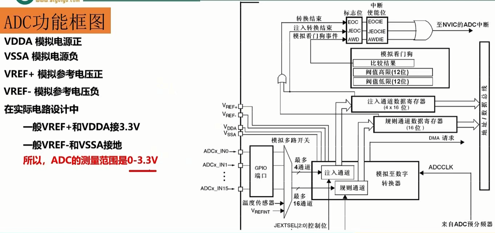


**两个通道**：


**规则通道和注入通道**：


**触发源**：什么时候做AD转换


**ADC转换方式**：


#### 1）中断

（1）转换结束中断

​	数据转换结束后，可以产生中断，中断分为三种：规则通道转换结束中断，注入转换通道转换结束中断，模拟看门狗中断。其中转换结束中断很好理解，跟我们平时接触的中断一样，有相应的中断标志位和中断使能位，我们还可以根据中断类型写相应配套的中断服务程序。

（2）模拟看门狗中断

​	当被 ADC 转换的模拟电压低于低阈值或者高于高阈值时，就会产生中断，前提是我们开启了模拟看门狗中断，其中低阈值和高阈值由 ADC_LTR 和 ADC_HTR 设置。例如我们设置高阈值是2.5V，那么模拟电压超过 2.5V 的时候，就会产生模拟看门狗中断，反之低阈值也一样。

#### **2）DMA 请求**

​	规则和注入通道转换结束后，除了产生中断外，还可以产生DMA请求，把转换好的数据直接存储在内存里面。要注意的是只有**ADC1** **和ADC3** **可以产生DMA** **请求**。

#### 3）数据对齐

​	16位的寄存器只用到了其中的12位。

​	可以使用高12位，数据就是左对齐。

​	也可以使用低12位，数据就是右对齐。

**右对齐：**高4位补零，读取的值就是实际值。

                      

**左对齐：**低4位补零，读取的值是实际值的16倍。


​	实际使用中，最好使用**低16位**，这样就得到数据可以直接使用。

#### 4）转换时间

​	ADC使用若干个ADC_CLK周期对输入电压采样。总转换时间如下计算：

​	TCONV = 采样时间 + 12.5个ADC周期。

​	当ADCCLK=14MHz，假设采样时间为1.5周期。

​	TCONV = 1.5 + 12.5 = 14周期 = 1μs。

#### 5）电压转换

​	模拟电压经过ADC转换后，是一个12位的数字值，如果通过串口以16进制打印出来的话，可读性比较差，那么有时候我们就需要把数字电压转换成模拟电压，也可以跟实际的模拟电压（用万用表测）对比，看看转换是否准确。

​	我们一般在设计原理图的时候会把ADC的输入电压范围设定在：0~3.3v，因为ADC是12位的，那么12位满量程对应的就是 3.3V，12位满量程（全部是1）对应的数字值是：2^12-1。数值 0 对应的就是0V。

​	如果转换后的数值为X ，X对应的模拟电压为 Y，那么会有这么一个等式成立：（2^12 -1）/ 3.3 = X / Y，所以Y =（3.3 * X ）/（2^12 – 1）= 3.3 * X / 4095。

## 3.2 ADC案例1：独立模式单通道采集

### 3.2.1 需求描述

​	基于寄存器操作，采集可变电阻器的电压，并通过串口把电压数据发送到电脑端。

### 3.2.2 硬件电路设计


​	PC0口为ADC的10通道，范围是0-3.3V。只需要一个ADC，使用独立模式即可。


### 3.2.3 软件设计（寄存器）

##### 1）扫描模式

###### 1.1  代码

```c
    /* 3. 禁用扫描模式（只有一个通道，不需要扫描） */
    ADC1->CR1 &= ~ADC_CR1_SCAN;

```


###### 1.2 寄存器


##### 2） 连续转换

###### 2.1  代码

```c
    /* 4. 启用连续转换（转换不会停止） */
    ADC1->CR2 |= ADC_CR2_CONT;

```

###### 2.2 寄存器


##### 3） 转换结果数据对齐方式

###### 3.1  代码

```c
    /* 5. 转换结果右对齐 0:右对齐 1: 左对齐*/
    ADC1->CR2 &= ~ADC_CR2_ALIGN;

```


###### 3.2 寄存器


##### 4） 规则通道外部触发转换模式

###### 4.1 代码

```c
    /* 6. 禁用规则通道外部触发 */
    ADC1->CR2 &= ~ADC_CR2_EXTTRIG;

```


###### 4.2 寄存器


##### 5）配置启动规则转换的外部事件

###### 5.1  代码

```c
    /* 7. 使用软件启动转换  111=软件启动*/
    ADC1->CR2 |= ADC_CR2_EXTSEL;

```


###### 5.2 寄存器


##### 6） 规则组长度

###### 6.1  代码

```c
    /* 8. 规则转换序列长度（有几个通道需要转换）000:1个 001：2个 ... */
    ADC1->SQR1 &= ~ADC_SQR1_L;

```

###### 6.2 寄存器


##### 7） 给规则组设置转换序列

###### 7.1  代码

```c
    /* 9. 规则转换序列中的第一个转换  通道10, 就是SQR3[4:0]=01010   */
    ADC1->SQR3 &= ~ADC_SQR3_SQ1; /* [4:0]位置为0 */
    ADC1->SQR3 |= (10 << 0);     /* 设置最后5位 */
```


###### 7.2 寄存器


##### 8） 设置采样时间

sample 采样

###### 8.1 代码

```c
    /* 10. 通道10采样时间 设置7.5个周期=001*/
    ADC1->SMPR1 &= ~ADC_SMPR1_SMP10_2;
    ADC1->SMPR1 &= ~ADC_SMPR1_SMP10_1;
    ADC1->SMPR1 |= ADC_SMPR1_SMP10;

```


###### 8.2 寄存器


##### 9） 启动ADC

###### 9.1  代码

```c
    /* 1. 启动 ADC1 ADON：0->1 是从断电模式下唤醒*/
	ADC1->CR2 |= ADC_CR2_ADON;

```

###### 9.2 寄存器

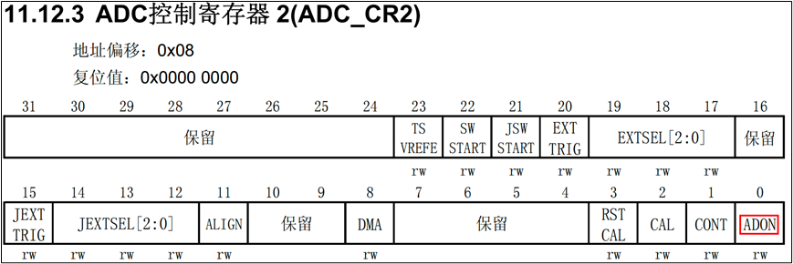


##### 10） 启动AD校准

###### 10.1  代码

```c
    /* 2. 启用AD校准, 校准完成之后该位会自动清0*/
    ADC1->CR2 |= ADC_CR2_CAL;

```


###### 10.2 寄存器


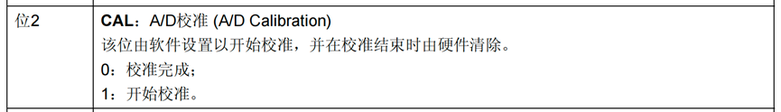

##### 11） 启动转换

###### 11.1 代码

```c
    /* 5. 开始转换 规则通道 */
	ADC1->CR2 |= ADC_CR2_SWSTART;

```


###### 11.2 寄存器


#### ADC存储器映像


#### 31_adc_single_register

### 3.2.4 软件设计（HAL库）

#### 32_adc_single_hal

## 3.3 ADC案例2：独立模式多通道采集

### P153——ADC补充说明

### 3.3.1 需求描述

​	基于寄存器操作，用一个ADC同时采集多个通道模拟电压。

​	PC0是10通道，采集的是可变电阻器的电压。PC2对应的是12通道，使用杜邦线连接到电源或地，测试他们的电压。

​	当多个通道同时采集时，一般就需要使用DMA来传输数据，否则数据如果来不及取出，则会导致数据被覆盖。


### 3.3.2 软件设计（寄存器）

#### 33_adc_double_register

### 3.3.3 软件设计（HAL）

#### 34_adc_double_hal

# 四：SPI通讯

## 4.1 SPI通讯介绍


**SPI的物理形式：**


**SPI的协议：**

首先移位寄存器读取发送缓冲区的值

上升沿来的时候，主机和从机都将移位寄存器里的高位移除，通过对应的MO和SO发送出去。

当下降沿来的时候，主机和从机都将MI和SI上的信号**读到移位寄存器的低位**。

经过八个周期就完成了一个字节的交换。


**SPI的四种工作模式：**


 

## 4.2 W25Q32介绍

​	W25Q32是一种使用SPI通讯协议的**NOR FLASH**存储器，它的CLK/DI/DO引脚分别连接到了STM32对应的SPI引脚SCK/MOSI/MISO上，其中STM32的NSS引脚虽然是其片上SPI外设的硬件引脚，但实际上后面的程序只是把它当成一个普通的GPIO，使用软件的方式控制NSS信号，所以在SPI的硬件设计中，NSS可以随便选择普通的GPIO，不必纠结于选择硬件NSS信号。

​	FLASH 芯片中还有WP和HOLD引脚。WP引脚可控制写保护功能，当该引脚为低电平时，禁止写入数据。我们直接接电源，不使用写保护功能。HOLD引脚可用于暂停通讯，该引脚为低电平时，通讯暂停，数据输出引脚输出高阻抗状态，时钟和数据输入引脚无效。我们直接接电源，不使用通讯暂停功能。


注意：

（1）这个flash芯片只支持，**模式0和模式3**。

（2）写的时候必须是先擦除，擦除后再写入。

（3）移位是高位优先。


### 4.2.1 W25Q32 框图

4M 

-> 64 * 64KB（块ffff） 

-> 64 * [16 * 4KB(段fff) ] 

-> 64 * { 16 * [16 * 256B(页ff)]}

⬜⬜      ⬜       ⬜          ⬜⬜

[块号]    [段号]     [页号]


### 4.2.2 写入操作注意事项

（1）写入操作前，必须先进行写使能。

（2）每个数据位只能由1改写为0，不能由0改写为1。

（3）写入数据前必须先檫除，檫除后，所有数据位变为1。擦除必须按最小擦除单元进行。

（4）连续写入多字节时，最多写入一页的数据，超过页尾位置的数据，会回到页首覆盖写入。

（5）写入操作结束后，芯片进入忙状态，不响应新的读写操作。

### 4.2.3 读取操作注意事项

（1）直接调用读取时序，无需读使能，无需额外操作，没有页的限制。

（2）读取操作结束后不会进入忙状态，但不能在忙状态时读取。

### 4.2.4 读写指令


### 4.2.5 交换数据时序

​	我们一般使用SPI的模式0（**CPOL=0，CPHA=0**），下面是模式0的数据交换时序图。


## 4.3 SPI案例1：软件模拟SPI读写FLASH

### 4.3.1 需求描述

​	基于寄存器操作，使用软件模拟SPI协议，完成读写FLASH。

### 4.3.2 硬件电路设计

### 4.3.3 软件设计（寄存器）

#### 35_SPI_software_register

## 4.4 SPI外设

​	与I2C外设一样，STM32芯片也集成了专门用于SPI协议通讯的外设。

**1）SPI外设简介**

​	STM32 的 SPI 外设可用作通讯的主机及从机，支持最高的 SCK 时钟频率为 fpclk/2 （STM32F103 型号的芯片默认fpclk1为36MHz，fpclk2为72MHz。），完全支持 SPI 协议的 4 种模式，数据帧长度可设置为 8 位或 16 位，可设置数据 MSB 先行或 LSB 先行。它还支持双线全双工、单线双向以及单线模式。

​	STM32F103系列提供了3个SPI，SPI1挂在APB2总线，SPI2/3挂在APB1总线。

​	用的比较多还是**双线全双工模式**。

**2）SPI外设框图**

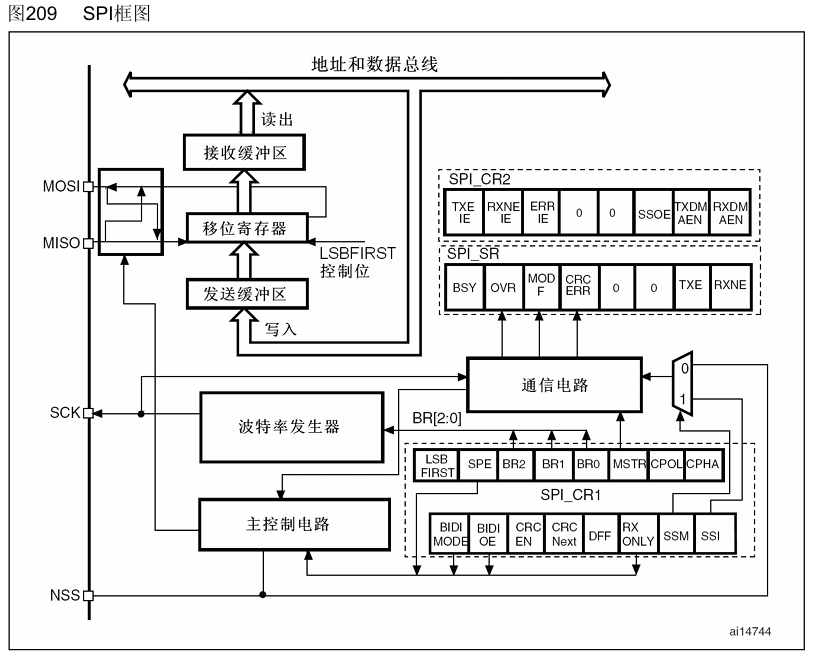


## 4.5 SPI案例2：SPI外设读写Flash

### 4.5.1 需求描述

​	基于寄存器操作，使用SPI功能，完成Flash的读写。

### 4.5.2 硬件电路设计


### 4.5.3 软件设计（寄存器）

##### 1）配置SPI模式

###### 1.1  代码

```c
    /* 3.1 配置主模式 0=从设备 1=主设备*/
    SPI1->CR1 |= SPI_CR1_MSTR;

```


###### 1.2 寄存器


##### 2） SPI波特率控制

**32里SPI波特率不能超过18MHz**。

###### 2.1  代码

```c
    /* 3.2 选择分频系数 000=fpclk/2, 001=fpclk/4 ....,我们选择4分频  */
    SPI1->CR1 &= ~SPI_CR1_BR;
    SPI1->CR1 |= SPI_CR1_BR_0;

```

###### 2.2 寄存器


##### 3） 时钟的极性和相位

###### 3.1  代码

```c
    /* 3.3 时钟极性 0： 空闲状态时，SCK保持低电平；1： 空闲状态时，SCK保持高电平。 */
    SPI1->CR1 &= ~SPI_CR1_CPOL;
    /* 3.4 时钟相位  0： 数据采样从第一个时钟边沿开始；1： 数据采样从第二个时钟边沿开始。*/
    SPI1->CR1 &= ~SPI_CR1_CPHA;

```


###### 3.2 寄存器

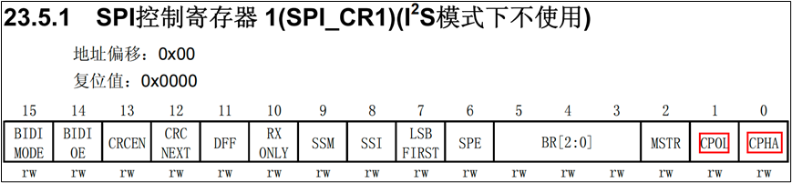


##### 4） 数据帧格式和传输顺序

###### 4.1 代码

```c
    /* 3.5 数据帧格式 0：8位数据帧；1：16位数据帧 */
    SPI1->CR1 &= ~SPI_CR1_DFF;
    /* 3.6 数据传输顺序 0：先发送MSB；1：先发送LSB。 */
    SPI1->CR1 &= ~SPI_CR1_LSBFIRST; /* 高位先行 */

```


###### 4.2 寄存器


##### 5）配置片选方式

###### 5.1  代码

```c
    /* 3.7 使用软件实现片选（我们自己控制CS）0：禁止软件从设备管理；1：启用软件从设备管理。 */
    SPI1->CR1 |= SPI_CR1_SSM;
    /* 3.8 当SSM=0时，这个时候对SSI的操作无效，必须设置为1 */
    SPI1->CR1 |= SPI_CR1_SSI;

```


###### 5.2 寄存器


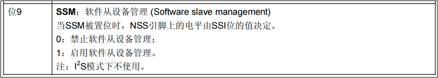


##### 6）启动SPI

###### 6.1  代码

```c
    /* 4 启动SPI1 0：禁止SPI设备；1：开启SPI设备。*/
    SPI1->CR1 |= SPI_CR1_SPE;

```

###### 6.2 寄存器


##### 7） SPI读写数据

###### 7.1  代码

```c
uint8_t SPI_SwapByte(uint8_t byte_sended)
{
    /* 1. 等待发送缓冲区为空 */
    while (!(SPI1->SR & SPI_SR_TXE))
        ;
    /* 2. 把数据写入到数据寄存器 */
    SPI1->DR = byte_sended;
    /* 3. 等待接收缓冲区非空 */
    while (!(SPI1->SR & SPI_SR_RXNE))
        ;
    /* 4. 返回读到的字节数据 */
    return SPI1->DR;
}

```

**这里DR跟串口一样，往里边写入的时候，实际是往TDR里写入的。往外边读取的时候，实际是从RDR里读取的。**


###### 7.2 寄存器


#### 36_SPI_hardware_register

### 4.5.4 软件设计（HAL库）

#### 37_SPI_hardware_hal

# 五：存储器和寄存器

## 5.1 存储器

### 5.1.1 常见的存储器介绍

​	存储器是计算机结构的重要组成部分。存储器是用来存储程序代码和数据的部件，有了存储器计算机才具有记忆功能。


#### 5.1.1.1 RAM

**1）SRAM**

​	Static Random-Access Memory，静态随机存取存储器。是RAM的一种，所谓的“静态”，是指这种存储器只要保持通电，里面储存的数据就可以恒常保持。

​	是用电路存储数据，基本结构就是前面大家学习过的那种触发器结构（比如D触发器）。容量一般较低，用于**高速缓存**。比如芯片内部的寄存器就可以看成一种SRAM。


**2）DRAM**

​	动态随机存储器DRAM的存储单元以**电容的电荷**来表示数据，有电荷代表1，无电荷代表0。

​	但时间一长，代表1的电容会放电，代表0的电容会吸收电荷，因此它需要定期刷新操作，这就是“动态（Dynamic）”一词所形容的特性。

​	刷新操作会对电容进行检查，若电量大于满电量的1 / 2，则认为其代表1，并把电容充满电；若电量小于1 / 2，则认为其代表 0，并把电容放电，藉此来保证数据的正确性。


#### 5.1.1.2 ROM

​	ROM 是“Read Only Memory”的缩写，意为只能读的存储器。由于技术的发展，后来设计出了可以方便写入数据的ROM，而这个“Read Only Memory”的名称被沿用下来了，现在一般用于指代非易失性半导体存储器，包括后面介绍的 FLASH 存储器，有些人也把它归到 ROM 类里边。

**1）MASK ROM**

​	MASK（掩膜）ROM 就是正宗的“**Read Only Memory**”，存储在它内部的数据是在出厂时使用特殊工艺固化的，生产后就不可修改，其主要优势是大批量生产时成本低。当前在生产量大，数据不需要修改的场合，还有应用。

**2）PROM**

​	PROM（**Programable** ROM）为可编程ROM。但是只供用户写入一次。

**3）EPROM**

​	EPROM（Erasable Programmable ROM）是可重复擦写的存储器，它解决了PROM芯片只能写入一次的问题。这种存储器使用紫外线照射（30分钟）芯片内部擦除数据，擦除和写入都要专用的设备。现在这种存储器基本淘汰，被EEPROM取代。


**4）EEPROM**

  	**EEPROM**（Electrically Erasable Programmable ROM）是电可擦除存储器。EEPROM可以重复擦写，它的擦除和写入都是直接使用电路控制，不需要再使用外部设备来擦写。而且可以按字节为单位修改数据，无需整个芯片擦除。现在主要使用的ROM芯片都是EEPROM。

**5）Flash**

​     FLASH存储器又称为闪存，它也是可重复擦写的存储器，部分书籍会把FLASH存储器称为 FLASH ROM，但它的容量一般比EEPROM大得多，且在擦除时，一般以多个字节为单位。

​	**存储数据时，也是需要先擦除再写入的。写入比RAM慢。**

**6）硬盘（磁盘）**

​	又称磁盘，是靠磁性来存储数据的。

### 5.1.2 STM32的存储器

​	STM32包含片内SRAM（64K）：它可以以字节、半字（16位）或全字（32位）访问。SRAM的起始地址是0x2000 0000。

​	片内Flash（最大可达2M）。

### 5.1.3 存储器映射

​	什么叫存储器映射呢？存储器本身并不具备地址信息，那么CPU要准确找到存储某个信息的存储单元，就必须为这些单元分配一个相互可区分的标识，这个标识就是常说的**地址编码**。

​	STM32中集成多种存储器（各种外设也需要分配地址），同一类型的存储器当作一组block，为每一个block分配一个数值连续，存储单元数相等，以16进制表示的自然数集合作为存储器Block的地址编码。这种**自然数集合与存储器Block的对应关系**就是**存储器映射**。

​	**存储器映射其实就是将芯片理论上的地址分配给各个存储器。**

​	**需要注意的是：**存储器映射并不是只针对SRAM和片内Flash做地址映射，其实所有的片内外设（比如IO口）都需要地址，也都需要做映射。

### 5.1.4 STM32具体存储器映射图

​	芯片能访问的存储空间有多大，是由谁定的？这个是由芯片的**地址总线的数量**决来定的，STM32芯片内部的地址总线为32根。所以STM32有**4G**的地址空间。（这个4GB的是STM32理论分配的地址空间。也就是说实际上并不是有这么大的存储单元，很多地址都是预留地址，空着还没用呢）。

​	程序存储器、数据存储器、寄存器和输入输出端口被组织在这个4GB的线性地址空间内。数据字节以**小端格式**（先存低位再存高位）存放在存储器中。

​	ARM把可访问的存储器空间分成8个主要块，每个块为512MB。这个容量是非常大的，因此芯片厂商就在每块容量范围内设计各自特色的外设。但是每块区域容量占用越大，芯片成本就越高，所以说我们使用的 STM32 芯片都是只用了其中一部分。ARM 在对这 4GB 容量分块的时候是按照其功能划分，每块都有它特殊的用途。


​	在这8个Block里面，要特别注意**Block0、Block1和Block2**这3个块。因为其中包含了STM32芯片的内部 Flash、RAM和片上外设。下面还是根据存储器映射图内信息来简单的介绍下这3个Block里面的具体区域功能划分。

**1）Block0**


​	0x0000 0000-0x0007 FFFF：取决于BOOT引脚，可以是 Flash 的别名，也可以是系统存储器的别名。（512K）

​	0x0008 0000-0x07FF FFFF：预留。（1M）

​	0x0800 0000-0x0807 FFFF：片内 FLASH，我们编写的程序就放在这一区域（512K）

​	0x0808 0000-0x1FFF EFFF：预留。（383M）

​	0x1FFF F000-0x1FFF F7FF：系统存储器，里面存放的是 ST 出厂时烧写好的ISP自举程序，用户无法改动。使用串口下载的时候需要用到这部分程序。（2K）

​	0x1FFF F800-0x1FFF F80F：可选字节，用于配置读写保护、BOR级别、软件/硬件看门狗以及器件处于待机或停止模式下的复位。当芯片不小心被锁住之后，我们可以从RAM里面启动来修改这部分相应的寄存器位。

​	0x1FFF F810-0x1FFF FFFF：预留。

**2）Block1**


​	Block1用于设计片内的SRAM，例如STM32F103ZET6的SRAM是64KB。从存储器映射图中可以看到Block1内部又划分了几个功能块，我们按地址从低到高顺序依次介绍。

​	0x2000 0000-0x2000 FFFF：SRAM，容量为 64KB。

​	0x2001 0000-0x3FFF FFFF：预留。

**3）Block2**

Block2用于设计片内外设，根据外设总线速度的不同，Block2被划分为AHB和APB 两部分，APB又被分成APB1和APB2。这些都可以在上面存储器映射图中可看到。


​	0x4000 0000-0x4000 77FF：APB1总线外设。

​	0x4001 0000-0x4001 57FF：APB2总线外设。

​	0x4001 8000-0x4002 33FF：AHB总线外设。

**4）Block3,4,5**

​	在Block3、Block4、Block5中包含了FSMC扩展区域，可用于扩展如 SRAM，NORFLASH 和NANDFLASH等的外部存储器。

## 5.2 寄存器

### 5.2.1 什么是寄存器

​	前面我们学习了存储器ROM和RAM，还包括我们所有的片上外设我们都可以称为存储器，STM32通过存储器映射，就可以找到这些存储器。

​	我们编程的时候用的最多的还是**寄存器，**那么什么叫寄存器呢？

​	在存储器 Block2 这块区域，设计的是**片上外设**，它们以4个字节为1个单元，共 32bit，每一个单元对应不同的功能，当我们控制这些单元时就可以驱动外设工作。我们可以找到每个单元的起始地址，然后通过 C 语言指针的操作方式来访问这些单元，如果每次都是通过这种地址的方式来访问，不仅不好记忆还容易出错，这时我们可以根据每个单元功能的不同，以功能为名给这个内存单元取一个别名。

​	这个**别名**就是我们经常说的**寄存器。**

​	**寄存器里的每一位0或者1，就可以看作一个锁存器或者是触发器。**

​	一句话总结：寄存器是单片机内部一种特殊的存储器，可以实现对单片机各个功能的控制。

### 5.2.2 寄存器映射

​	这个给已经分配好地址的有特定功能的存储器单元**取别名的过程**就叫**寄存器映射**。

​	寄存器映射在ST提供的头文件stm32f10x.h中已经通过预编译的形式完全映射好了，以后如果再操作某个特定外设的时候，就不用直接操作地址，直接操作对应的寄存器名就可以了。

​	比如PA这组IO端口的映射：

```c
// 外设基址
#define PERIPH_BASE           ((uint32_t)0x40000000) 
// APB2外设的基址 
#define APB2PERIPH_BASE       (PERIPH_BASE + 0x10000) 
// GPIOA 外设的基址
#define GPIOA_BASE            (APB2PERIPH_BASE + d)
// 做了类型转换，地址仍然是GPIOA 外设的基址
#define GPIOA               ((GPIO_TypeDef *) GPIOA_BASE)

```

## 5.3 向Nor Flash写入大量字符


#### ex11_flash_multiply_write_register

# 六：FSMC控制器

## 6.1 FSMC概述

​	MCU自带的FLASH和SRAM资源是十分有限的，相比于PC机的存储空间而言要小的可怜。一般情况对于嵌入式应用来说这点存储空间一般也就够用了，但避免不了一些大量消耗内存的应用， 比如说图像处理。对于这类对内存要求较高的应用，我们往往需要扩展一个FLASH或者SRAM。STM32提供的FSMC就是用来完成这项功能的。

​	**FSMC（Flexible static memory controller，灵活的静态存储器控制器）**，STM32可以通过FSMC与SRAM、ROM、PSRAM、Nor Flash和NandFlash存储器的引脚相连，从而进行数据的交换。要注意的是，FSMC只能扩展静态的内存（S:static），不能是动态的内存，比如 SDRAM **就不能扩展。**

​	FSMC把AHB总线上的数据转换为对应外设的通信协议，控制外设的访问时序，以至于我们可以直接在程序中寻址访问。

## 6.2 FSMC组成

### 6.2.1 功能框图

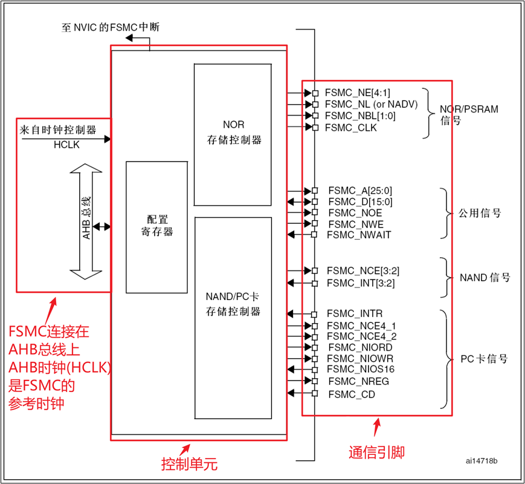

​	FSMC主要由4部分组成：AHB总线接口（包括FSMC的配置寄存器）、NOR闪存（或非门原理构建的flash）/SRAM控制器、NAND闪存（基于与非门构建的flash）/PC卡控制器、外设接口四个部分构成。

​	本次实验需要用到的引脚如下：

​	（1）FSMC_A[25:0]：地址总线

​	（2）FSMC_D[15:0]：双向数据总线

​	（3）FSMC_NE[4:1]：片选引脚，低电平有效

​	（4）FSMC_NOE：读使能，低电平有效

​	（5）FSMC_NWE：写使能，低电平有效

### 6.2.2 AHB总线接口

​	AHB总线接口是CPU、DMA等AHB总线主设备访问FSMC的通道，它负责把AHB总线事务转换成为外设通信的协议。

​	AHB总线事务的请求可以是8、16或者32位的，但外设器件的数据线位宽是恒定的。如果两者宽度相同就不存在什么问题，如果总线事务的位宽大于外设的位宽，那么总线接口将把总线事务拆分为多个连续的8位或16位形式访问外设。我们应当尽量避免总线事务宽度小于外设宽度的情况出现，因为这将可能导致数据的不一致，具体与外设类型有关系。

​	配置寄存器则描述了扩展外设的具体形式、通信协议和接口形式。用于总线接口将AHB总线事务转换为外设通信协议， 驱动NOR闪存/SRAM控制器和NAND闪存/PC卡控制器，进而控制外设。

### 6.2.3 NOR 闪存/PSRAM 控制器（Pseudo Static Random Access Memory）

​	**（Pseudo Static Random Access Memory）伪静态随机存储器**

​	NOR/PSRAM内存控制器支持各种同步和异步的内存。所谓同步内存就是在读写内存的时候需要一个同步时钟来指导数据的发送和接收， 与我们在串口通信中提到的同步/异步通信是一个道理。对于同步内存，FSMC只会在读写操作的时候产生驱动时钟，而且其频率是系统总线时钟HCLK的分频。

​	NOR/PSRAM控制器用于生成适当的时序，以驱动8位、16位、32位的异步SRAM和ROM、异步或者突发模式的PSRAM和NOR闪存。我们通过配置寄存器描述外设的特征和时序后，控制器就可以为我们生成对应的驱动时序。

### 6.2.4 NAND闪存/PC卡控制器

​	NAND/PC卡控制器用于驱动8位或者16位的NAND闪存以及16位的PC卡兼容设备。

### 6.2.5 外设接口

​	用于与要扩展外设联通用的。在接线时必须根据每个外设的特点，来进行合适的接线。

## 6.3 外部设备地址映射

​	从FSMC的角度看，可以把外部存储器划分为固定大小为4个256M字节的存储块。


​	存储块1用于访问最多4个NOR闪存或PSRAM存储设备。这个存储区被划分为4个NOR/PSRAM区并有4个专用的片选。存储块2和3用于访问NAND闪存设备，每个存储块连接一个NAND闪存。存储块4用于访问PC卡设备。

​	每一个存储块上的存储器类型是由用户在配置寄存器中定义的。

## 6.4 FSMC控制NOR闪存或PSRAM的时序

**时序  本质上就是通信协议**

​	FSMC 外设支持输出多种不同的时序以便于控制不同的存储器，它具有6种模式：1，A，2/B，C，D，复用模式（地址线和数据线复用）。

​	所有信号由内部时钟HCLK保持同步，但该时钟不会输出到外部扩展的存储器。FSMC始终在片选信号NE失效前对数据线采样，这样能够保证符合存储器的数据保持时序。

​	所有的控制器输出信号在内部时钟（HCLK）的上升沿变化，在同步写模式（PSRAM）下，读写的数据在存储器时钟（CLK）的下降沿变化。

​	我们以读写SRAM的模式A为例来介绍。


​	当内核发出访问某个指向外部存储器的地址时，FSMC外设会根据**配置**控制信号线产生时序访问存储器（硬件自动生成对应的时序），上图中的是访问外部 SRAM 时 FSMC 外设的读写时序。

​	在读时序中，一个存储器操作周期由1个地址建立周期（ADDSET），1个数据建立周期（DATASET）和2个HCLK周期组成。在地址建立周期中，地址线发出要访问的地址，数据掩码信号线指示出要读取地址的高、低字节部分，片选信号使能存储器芯片；地址建立周期结束后读使能信号线发出读使能信号，接着存储器通过数据信号线把目标数据传输给 FSMC，FSMC 把它交给内核。

​	写时序类似，区别是它的一个存储器操作周期仅由1个地址建立周期（ADDSET）和1个数据建立周期（DATAST）组成，且在数据建立周期期间写使能信号线发出写信号，接着 FSMC 把数据通过数据线传输到存储器中。

## 6.5 FSMC应用案例：扩展外部SRAM

### 6.5.1 需求描述

​	使用FSMC扩展**外部SRAM**。然后把内存数据存储到外部SRAM中。

​	STM32F1 系列的芯片不支持扩展SDRAM（STM32F429 系列支持），它仅支持使用 FSMC 外设扩展 SRAM。由于引脚数量的限制，只有 STM32F103ZE 或以上型号的芯片才可以扩展外部 SRAM。

### 6.5.2 SRAM芯片IS62WV51216


**1）SRAM介绍**

​	开发板用的SRAM型号是**IS62WV51216**，就以这个为例来介绍SRAM。


**2）功能框图**


**3）信号线**

| **信号线**     | **类型** | **说明**                                            |
| -------------- | -------- | --------------------------------------------------- |
| **A0-A18**     | I        | 地址输入                                            |
| **I/O0-I/O7**  | I/O      | 低8位字节的数据输入输出信号                         |
| **I/O8-I/O15** | I/O      | 高8位字节的数据输入输出信号                         |
| **/CS1和CS2**  | I        | 片选信号CS2高电平有效, C(___)S(___)1(___)低电平有效 |
| **/OE**        | I        | 输出使能信号，低电平有效。                          |
| **/WE**        | I        | 写使能信号，低电平有效                              |
| **/UB**        | O        | 数据掩码信号，高位字节允许访问，低电平有效          |
| **/LB**        | O        | 数据掩码信号，低位字节允许访问，低电平有效          |

​	SRAM 的控制比较简单，只要控制信号线使能了访问，从地址线输入要访问的地址，即可从 I/O 数据线写入或读出数据。

**4）几个重要的时间参数**

​	这几个时间参数比较重要，设置FSMC参数的要用。


### 6.5.3 硬件电路设计

**1）原理图中的芯片连接**


**2）芯片的CS1使能引脚对应着PG10**

​	（1）芯片引脚连接情况


​	（2）STM32F103ZET6引脚连接情况


​	（3）数据手册中的复用引脚说明


**3）地址映射范围**

64MB:FSMC_Bank1_NORSRAM1:0X6000 0000 ~ 0X63FF FFFF

64MB:FSMC_Bank1_NORSRAM2:0X6400 0000 ~ 0X67FF FFFF

**64MB:FSMC_Bank1_NORSRAM3:0X6800 0000 ~ 0X6BFF FFFF**

64MB:FSMC_Bank1_NORSRAM4:0X6C00 0000 ~ 0X6FFF FFFF

​	NE3对应的地址范围就是0x6800 0000 ~ 0x6BFF FFFF

### 6.5.4 软件设计（寄存器）

##### 1）存储块使能

###### 1.1  代码

```c
     /* 4.1 存储器块使能 */
    FSMC_Bank1->BTCR[4] |= FSMC_BCR3_MBKEN;

```


###### 1.2 寄存器


##### 2） 存储器类型

###### 2.1  代码

```c
    /* 4.2 设置存储器类型 00: SRAM ROM 01:PSRAM 10:NOR闪存*/
    FSMC_Bank1->BTCR[4] &= ~FSMC_BCR3_MTYP;

```

###### 2.2 寄存器


##### 3） 内存访问使能

###### 3.1  代码

```c
    /* 4.3 闪存访问使能： 禁止访问闪存 */
    FSMC_Bank1->BTCR[4] &= ~FSMC_BCR3_FACCEN;

```


###### 3.2 寄存器

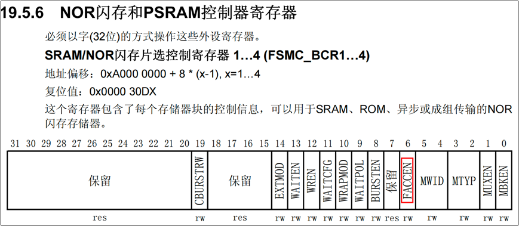


##### 4）地址数据总线复用

###### 4.1 代码

```c
    /* 4.4 地址和数据总线复用： 不复用 */
    FSMC_Bank1->BTCR[4] &= ~FSMC_BCR3_MUXEN;

```


###### 4.2 寄存器


##### 5）数据总线宽度

###### 5.1  代码

```c
    /* 4.5 数据总线宽度 00：8位 01：16位*/
    FSMC_Bank1->BTCR[4] &= ~FSMC_BCR3_MWID_1;
    FSMC_Bank1->BTCR[4] |= FSMC_BCR3_MWID_0;

```


###### 5.2 寄存器


##### 6）写使能

###### 6.1  代码

```c
    /* 4.6 写使能 */
    FSMC_Bank1->BTCR[4] |= FSMC_BCR3_WREN;

```

###### 6.2 寄存器


##### 7） 实现产生

###### 7.1  代码

```c
    /* 5. 配置SRAM的时序参数 BTCR[5] 访问bank1 3区对应的BTR寄存器 */
    /* 5.1 地址建立时间（时钟周期） 0：表示一个时钟周期。 对同步读写来说无效，永远是1个时钟周期*/
    FSMC_Bank1->BTCR[5] &= ~FSMC_BTR3_ADDSET;
    /* 5.2 地址保持时间（时钟周期） 对同步读写来说无效，永远是1个时钟周期*/
    FSMC_Bank1->BTCR[5] &= ~FSMC_BTR3_ADDHLD;
    /* 5.3 数据保持时间（时钟周期）数据在总线上的停留时间 SRAM要求不能低于50ns */
    FSMC_Bank1->BTCR[5] &= ~FSMC_BTR3_DATAST; /* 对应的位置位0 */
    FSMC_Bank1->BTCR[5] |= (71 << 8); /* 设置为1个us. 72个时钟周期 */

```


###### 7.2 寄存器


**P177总结FSMC**

#### 38_fsmc_sram_register

### 6.5.5 软件设计（hal库）

#### 39_fsmc_sram_hal

# 七：LCD显示

## 7.1 使用的液晶显示模块介绍

### 7.1.1 嵌入式LCD显示模块接口类型

​	LCD的接口有多种，分类很细。主要看LCD的驱动方式和控制方式，目前彩色LCD的连接方式一般有这么几种：MCU模式，RGB模式，SPI模式，VSYNC模式，MDDI模式，DSI模式。

​	但应用比较多的就是**MCU模式**和**RGB模式。**

​	**LCD每一个像素点都对应一个三原色数组，一块大的LCD就对应一个大的三原色矩阵。需要一块内存来存储这个矩阵，这个内存就叫显存（GRAM）。**

**1）MCU模式**

​	因为主要针对单片机的领域在使用，因此得名，其主要特点是价格便宜。MCU-LCD接口的标准术语是Intel提出的8080总线标准，因此在很多文档中用 I80 来指MCU-LCD屏。

​	对于MCU接口的LCM（LCD Module），其内部的芯片就叫**LCD驱动器，**都带GRAM（显存）。**主要功能是对主机发过的数据/命令，进行变换，变成每个像素的RGB数据，使之在屏上显示出来。**

**2）RGB模式**

​	RGB模式是**大屏**采用较多的模式，比如我们电脑显示器。

​	对于RGB接口的LCM，主机输出的直接是每个像素的RGB数据，不需要进行变换（GAMMA校正等除外），对于这种接口，需要在**主机部分有个LCD控制器(平常所说的显卡)**，以产生RGB数据和点、行、帧同步信号。

### 7.1.2 液晶模块Z350IT002

​	下图可以看到显存集成在液晶模块里，属于MUC模式。


​	我们使用的液晶显示模块是Z350IT002。这是一款 **TFT LCD（薄膜晶体管液晶显示器）**模块。TFT LCD 以其优秀的显示性能和低功耗特性而广泛应用于各种电子设备。

**（1）分辨率**

​	模块的分辨率为 320RGB × 480 点阵。这意味着屏幕横向有 320 个像素点，每个像素点由红、绿、蓝三种颜色组成，纵向有 480 个像素点。这种分辨率适合于显示清晰的图像和文字。

**（2）构造**

​	它由 960 个源（source **源极** ）和 480 个门（gate **栅极**）构成。源用于横向的像素点驱动，门用于纵向的像素点驱动。这种结构有助于精确地控制每个像素点，从而提供清晰的图像显示。

（3）**微控制器接口**

​	Z350IT002 设计了易于通过微控制器访问和控制的接口。这使得它非常适合于嵌入式系统或其他需要直接由微控制器控制显示屏的应用。

**（4）应用领域****

​	考虑到其尺寸和分辨率，Z350IT002 特别适用于中小尺寸的显示需求，如便携式设备、工业控制面板、小型嵌入式系统等。

**（5）显示效果****

​	作为一款 TFT LCD，Z350IT002 可以提供良好的颜色对比度和亮度，适合于需要中等分辨率和高色彩质量的应用。

​	总体而言，Z350IT002 是一款适用于多种中小型电子设备的TFT LCD显示模块，其易于微控制器集成的特点使其成为许多嵌入式应用和工业产品的理想选择。

### 7.1.3 控制器芯片IL19486

​	液晶模块Z350IT002内部使用的控制芯片是：ILI9486。

​	ILI9486 是一款流行的 LCD 控制器芯片，由 Ilitek 公司生产，通常用于驱动中小尺寸的 TFT（薄膜晶体管）LCD 显示屏。

​	具有320RGBx480点的分辨率。它包括960通道的源驱动器和480通道的门驱动器，以及用于320RGBx480点图形数据的345600字节GRAM和电源供应电路。

​	另外ILI9486**支持多种接口类型**，包括：

​	（1）并行CPU数据总线接口，支持8位、9位、16位和18位。

​	（2）3线和4线串行外设接口（SPI）。

​	（3）符合RGB（16位/18位）数据总线，用于视频图像显示。

​	（4）高速串行接口，提供一个数据和时钟通道，支持最高达500Mbps的MIPI DSI链路。

​	（5）支持MDDI接口。

​	咱们用的已经固定为使用16位的并行8080接口。


### 7.1.4 使用STM32的FSMC来实现8080时序

​	8080 通讯接口时序可以由 STM32 使用普通 I/O 接口进行模拟，但这样效率太低，STM32 提供了一种特别的控制方法——使用 FSMC 接口实现 8080 时序。我们在前面使用CubeMX扩展SRAM时候已经可以看到了这点。


​	时序的控制FSMC可以完成，但是如何向GRAM写数据，写什么格式的数据呢？

​	GRAM，作用可以理解为显存， GRAM 中每个存储单元都对应着液晶面板的一个像素点。使像素点呈现特定的颜色，而多个像素点组合起来就成为一个你想表达的东西，一段文字或者一副图。

​	按照标准的格式，16 位的像素点的三原色描述的位数为R:G:B=5：6：5， 描述绿色的位数比较多是因为人眼对绿色更为敏感。


## 7.2 LCD实验：使用FSMC控制LCD显示

### 7.2.1 需求描述

​	使用FSMC控制LCD显示我们想要的字符。

### 7.2.2  硬件电路设计


LED发光二极管作为背光光源，TFT（薄膜晶体管控制每一个像素点的具体颜色）

​	（1）D0-D15是16位数据总线接口。分别接FSMC的D0-D15。

​	（2）RST是LCD复位引脚，低电平复位。接**LCD-RST（PG15）。**

​	（3）RD是读控制引脚，上升沿时读数据。接FSMC-NOE（PD4）。

​	（4）WR是写控制引脚，上升沿时写数据。接FSMC-NWE（PD5）。

​	（5）RS是数据或命令选择引脚RS=1写数据，RS=0写命令。接**FSMC-A10（PG0）。**

​	（6）CS是片选引脚，低电平有效。接FSMC-NE4（PG12）。

​	（7）LEDA是背光电源（3.0V-3.4V）引脚。

​	（8）LEDK是背光亮度控制引脚。通过**LCD-BG（PB0）**来驱动MOS管Q5的导通电流。可以通过给LCD-BG输出PWM波来控制背光的亮度。占空比越大，背光就会越亮。

​	（9）YD，XL，YU，XR是触摸屏控制引脚。

### 7.2.3 软件设计（寄存器）

#### 7.2.3.1 关于FSMC的寻址


​	扩展LCD的时候,使用的是块1的地址，一共4*64MB = 256MB，每部分的地址如下：

64MB:FSMC_Bank1_NORSRAM1:0X6000 0000 ~ 0X63FF FFFF

64MB:FSMC_Bank1_NORSRAM2:0X6400 0000 ~ 0X67FF FFFF

64MB:FSMC_Bank1_NORSRAM3:0X6800 0000 ~ 0X6BFF FFFF

**64MB:FSMC_Bank1_NORSRAM4:0X6C00 0000 ~ 0X6FFF FFFF**

​	我们选择的是NE4， 所以地址范围是：0X6C00 0000 ~ 0X6FFF FFFF，寄存器的基地址是6C000000。


​	**注意：**当使用16位宽的外部存储器时，用HADDR[25:1]表示外部的FSMC_A[24:0]，内部地址相当于左移了1位，所以计算地址的时候要注意。

​	LCD我们选择的是16位宽度的，选择地址线时，我们选择的是A10接LCD的D/CX（数据/命令引脚）。

​	当A10=0时，表示**写命令**，所以地址是：0x6C00 0000。

​	当A10=1时，表示**写数据**，所以地址是：0x6C00 0000 + 1<<11 = 0x6C00 0800

#### 40_fsmc_lcd_register

### 7.2.4 软件设计（HAL）

#### 41_fsmc_lcd_hal