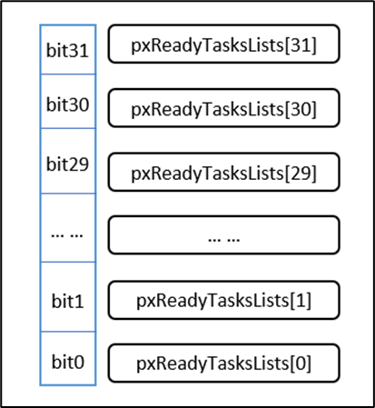
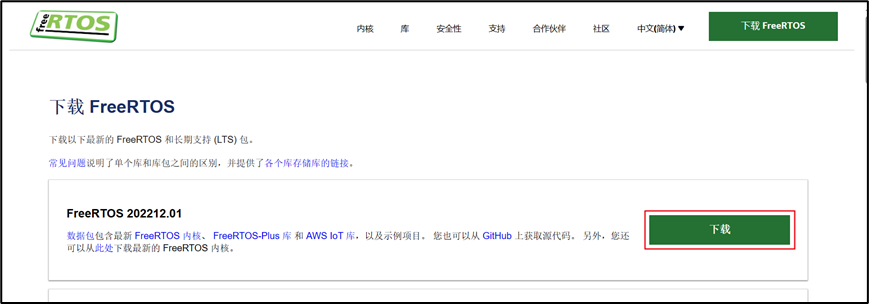

# 一：操作系统介绍

## 1.1 什么是裸机开发

​	裸机开发指的是在没有操作系统（OS）或者其他高级软件支持的情况下，直接在裸机硬件上进行软件开发的过程。在裸机开发中，开发者需要直接面对硬件层面的操作和控制，亲自管理CPU、内存以及I/O资源，而不依赖于任何操作系统提供的抽象层或者服务。

我们前面学习的STM32单片机代码都属于裸机开发。

​	特点：
​	1.要跟硬件打交道，需要比较熟悉硬件。

​	2.需要自己完成一些比较复杂的功能（不同程序之间的调度）。

## 1.2 什么是操作系统

​	一个计算机系统可以大致分为三个部分：硬件（Hardware），操作系统（operating system），应用程序（application programs）。

​	（1）硬件包含了芯片，存储空间，输入输出等设备为整个系统提供了基础的计算资源。

​	（2）操作系统是一个控制程序，作为硬件和应用程序之间的桥梁，主要是和硬件打交道，负责协调分配计算资源和内存资源给不同的应用程序使用，并防止系统出现故障。面对来自不同应用程序的大量且互相竞争的资源请求，操作系统通过一个调度算法和内存管理算法尽可能把资源公平且有效率地分配给不同的程序。

​	（3）应用程序则通过调用操作系统提供的API接口获得相应资源完成指定的任务。

操作系统从整体上分为两大类:**通用操作系统**和**实时操作系统**。

### 1.2.2 通用操作系统

​	**通用操作系统**包括**Linux，Windows，MACOS**等主流的操作系统。这些操作系统大家每天都在使用，**功能也十分强大**，只是它们有时为了保障系统的流畅运行，就不能保证每个程序都能实时响应，在易用性和实时性之间有所取舍。而且单片机有限的片上资源也不足以支撑通用操作系统的运行。

### 1.2.3 实时操作系统

​	**解决多任务调度的问题**、**并发场景**、**专注实时**

​	实时操作系统（RTOS-Real Time Operating System）中实时（Real Time）指的是任务（Task）或者说实现一个功能的线程（Thread）必须在给定的时间(Deadline)内完成。

​	人们总有种误解认为如果能堆砌更多的处理器核心数目，更高的处理器频率，更大的内存，更快的总线速度系统就一定能达到实时性。然而事与愿违强大的计算能力并不能保证系统的实时性。举一个简单的例子比如汽车中的安全气囊，在传感器检测到汽车发生碰撞后，安全气囊需要在30ms内完全打开，不然司机和乘客的人身安全将受到极大的威胁。倘若车载ECU有很强大的计算能力，但是如果因为要执行其他复杂计算任务或者任务调度的问题导致对汽车异常状态的监测和安全气囊的响应时间超过了规定的时间，系统实时性将无法得到保障从而导致系统失效和人员伤亡，这将会是非常严重的问题。

​	为了保障这些实时任务能在给定的时间内完成，需要一个实时系统对这些任务进行调度和管理。一个实时操作系统能尽力保障每个任务的运行时间在规定时间内完成，这包括

​	（1）对中断和内部异常的处理

​	（2）对安全相关的事件的处理

​	（3）任务调度机制等

​	正所谓术业有专攻，在嵌入式领域中，嵌入式实时操作系统(RTOS)可以更合理、更有效地利用CPU的资源，简化应用软件的设计，缩短系统开发时间，从而更好地保证系统的实时性和可靠性。

​	目前比较流行的实时操作系统包括黑莓QNX，**FreeRTOS**，uCOS，RT-Thread等

## 1.3 FreeRTOS简介

​	RTOS(实时操作系统)是指一类系统，如 FreeRTOS，uC/OS，RTX，RT-Thread 等，都是 RTOS 类操作系统。

​	FreeRTOS是所有实时操作系统中最受欢迎的一款.

### 1.3.1 FreeRTOS发展历史

​	FreeRTOS 由美国的 Richard Barry 于 2003 年发布。

​	FreeRTOS 于 2017 年被亚马逊收购，改名为 AWS FreeRTOS。

### 1.3.2 FreeRTOS优势

​	FreeRTOS 是市场领先的面向微控制器和小型微处理器的实时操作系统 (RTOS)，与世界领先的芯片公司合作开发，现在每 170 秒下载一次。

​	FreeRTOS 通过 MIT 开源许可免费分发，包括一个内核和一组不断丰富的 IoT 库，适用于**所有行业领域**。FreeRTOS 的构建突出**可靠性和易用性**。

​	FreeRTOS是一款受欢迎、广泛应用于嵌入式系统的RTOS，其开源、轻量级、可移植的特点使其成为许多嵌入式开发者的首选，主要优势如下：

​	Ø 开源和免费：FreeRTOS是一款开源的RTOS，采用MIT许可证发布，可以免费使用、修改和分发。

​	Ø 轻量级设计：FreeRTOS注重轻量级设计，适用于资源受限的嵌入式系统，不占用过多内存和处理器资源。

​	Ø 广泛应用：FreeRTOS在嵌入式领域得到广泛应用，包括工业自动化、医疗设备、消费电子产品、汽车电子等。

​	Ø 多平台支持：FreeRTOS的设计注重可移植性，可以轻松地移植到不同的硬件平台，支持多种处理器架构。

​	Ø 丰富的功能：提供了多任务调度、任务通信、同步等功能，适用于复杂的嵌入式应用场景。

### 1.3.3 FreeRTOS特点

​	官网：https://freertos.org/，并且支持中文。

​	Ø 任务调度：FreeRTOS通过任务调度器管理多个任务，支持不同优先级的任务，实现任务的有序执行。

​	Ø 任务通信和同步：提供了队列、信号量等机制，支持任务之间的通信和同步，确保数据的安全传递。

​	Ø 内存管理：提供简单的内存管理机制，适用于嵌入式环境，有效利用有限的内存资源。

​	Ø 定时器和中断处理：支持定时器功能，能够处理中断，提供了可靠的实时性能。

​	Ø 开发社区：拥有庞大的用户社区，开发者可以在社区中获取支持、解决问题，并分享经验。

​	Ø 可移植性：设计注重可移植性，可以轻松地移植到不同的硬件平台，提高了代码的重用性。

# 二：FreeRTOS基础知识

## 2.1 多任务处理

​	**内核**是操作系统的核心组件。诸如 Linux 这样的操作系统采用的内核， 看似允许用户同时访问计算机。很明显，**多个用户可以同时执行多个程序** 。

​	每个执行程序都是受操作系统控制的任务（或线程）。如果一个操作系统能够以这种方式执行多个任务， 则可称其为**多任务操作系统**。

​	使用多任务操作系统可以**简化**原本**复杂**的软件应用程序的**设计** ：

​	（1）操作系统的多任务处理和任务间通信功能允许将复杂的应用程序分割成一组更小、更易于管理的任务。

​	（2）通过分割，您可以更轻松地执行软件测试、分解团队内部工作以及复用代码。

​	（3）复杂的时序和排序细节可以从应用程序代码中移除，由操作系统负责。

**并行：**多个线程，在同时执行。

**并发：**多个线程，在执行。

​	即使单核处理器一次只能执行一项任务。 多任务操作系统可以通过任务之间的快速切换制造**并发执行的假象**。下图展示了与时间相关的三项任务的执行模式。 任务名称采用颜色编码，并写在左手边。 时间从左向右移动， 彩色线条显示了在任何特定时间正在执行的任务。 上方展示了所感知的并发执行模式， 下方展示了实际的多任务执行模式。

## 2.2任务调度

​	一个处理器核心在某一时刻只能运行一个任务，如在各个任务之间迅速切换，这样看起来就像多个任务在同时运行。操作系统中**任务调度器**的责任就是决定在某一时刻要执行哪个任务。

​	调度器是内核中负责决定在任何特定时间应执行哪些任务的部分。内核可以在任务生命周期内多次挂起并且稍后恢复一个任务。

​	调度策略是调度器用来决定在任何时间点执行哪个任务的算法。 

​	FreeRTOS 默认使用**固定优先级**的**抢占式调度策略**，对**同等优先级**的任务执行**时间片轮询**调度：

​	Ø 抢占式调度：FreeRTOS采用抢占式调度方式，**允许更高优先级的任务在任何时刻抢占正在执行的低优先级任务**。这确保了高优先级任务能够及时响应，并提高了系统的实时性。

​	Ø 时间片轮询：在相同优先级的任务之间，FreeRTOS采用时间片轮转策略。每个任务执行一个时间片，如果有其他同优先级的任务等待执行，则切换到下一个任务。这有助于公平地分配CPU时间。

​	但是并不是说高优先级的任务会一直执行，导致低优先级的任务无法得到执行。如果高优先级任务**等待某个资源（延时或等待信号量等）**而无法执行，调度器会选择执行其他就绪的高优先级的任务。

**多任务，优先级不一样：**

**多任务，优先级一样：**

## 2.3 任务状态

​	FreeRTOS中任务共存在4种状态：

​	Ø 运行态：当任务实际执行时，它被称为处于运行状态。如果运行 RTOS 的处理器只有一个内核， 那么在任何给定时间内都只能有一个任务处于运行状态。注意在STM32中，同一时间仅一个任务处于运行态。

​	Ø 就绪态：准备就绪任务指那些能够执行（它们不处于阻塞或挂起状态）， 但目前没有执行的任务， 因为同等或更高优先级的不同任务已经处于运行状态。

​	Ø 阻塞态：如果任务当前正在等待延时或外部事件，则该任务被认为处于阻塞状态。

​	Ø 挂起态：类似暂停，调用函数 vTaskSuspend() 进入挂起态，需要调用解挂函数vTaskResume()才可以进入就绪态。

​	**只有就绪态可转变成运行态**，其他状态的任务想运行，必须先转变成就绪态。转换关系如下：

​	这四种状态中，除了运行态，其他三种任务状态的任务都有其对应的任务状态列表：

​	Ø 就绪列表：pxReadyTasksLists[x]，其中x代表任务优先级数值。

​	Ø 阻塞列表：pxDelayedTaskList。

​	Ø 挂起列表：xSuspendedTaskList。

​	列表类似于链表，后面章节会专门介绍。

​	以就绪列表为例。如果在32位的硬件中，会保存一个32位的变量，代表0-31的优先级。当某个位，置一时，代表所对应的优先级就绪列表有任务存在。

​	如果有多个任务优先级相同，会连接在同一个就绪列表上：

​	**调度器总是在所有处于就绪列表的任务中，选择具有最高优先级的任务来执行**。

## 2.4 FreeRTOS的滴答

​	休眠时，RTOS 任务将指定需要“唤醒”的时间。 阻塞时，RTOS 任务可以指定希望等待的最长时间。

​	FreeRTOS 实时内核通过**滴答计数变量**测量时间。定时器中断（RTOS 滴答中断）以严格的时间精度增加滴答数——允许实时内核以所选择的定时器**中断频率**的分辨率来测量时间。

​	每次滴答数增加时，实时内核必须检查是否现在是解除阻塞或唤醒任务的时间。在滴答 ISR 期间唤醒或解除阻塞的任务的优先级可能高于被中断任务的优先级。

## 2.5  上下文切换

**1）什么上下文切换**

​	当一个任务执行时，它会利用处理器/微控制器寄存器，并像其他程序一样访问 RAM 和 ROM。这些资源（处理器寄存器，堆栈等）一起组成了任务执行**上下文**。

​	一个任务是一段有顺序的代码——它不知道什么时候会被内核切换（换出或换入）或恢复（换入或换入）， 甚至不知道什么时候自己被挂起或恢复过。

​	一个任务在即将执行将两个处理器寄存器内包含的数值相加之前被挂起。 当该任务被挂起时，其他任务会执行，还可能会修改处理器寄存器的数值。恢复时， 该任务不会知道处理器寄存器已经被修改过了——如果它使用经修改过的数值， 那么求和会得到一个错误的数值。

​	为了防止这种类型的错误，**任务**在**恢复时**必须有一个与**挂起之前相同的上下文** 。通过在任务挂起时保存任务的上下文，操作系统内核负责确保上下文保持不变。任务恢复时，其保存的上下文在执行之前由操作系统内核恢复。

​	保存被挂起的任务的上下文和恢复被恢复的任务的上下文的过程被称为 **上下文切换**。

​	（1）将 TaskA在相应的**处理器**（CPU）寄存器中的上下文保存到其任务堆栈中。

​	（2）将 TaskB 的上下文从其任务堆栈中恢复到相应的处理器寄存器中

**2）什么时候进行上下文切换**

​	在需要切换任务的时候进行上下文切换，真正执行上下文切换是在**PendSV的ISR中处理的**。**使用PendSV是因为其可以手动触发**，并且**可以在其他更高中断优先级的ISR中来进行设置**，比较灵活。具体触发操作是将中断控制和状态寄存器 ICSR 的 bit28，也就是 PendSV 的挂起位置 1 来触发PendSV 中断。FreeRTOS会将PendSV设置为最低中断优先级，避免任务切换影响到其他正常的ISR。

​	在FreeRTOS中有以下几个情况会触发PendSV异常产生切换：

​	（1）**RTOS** **滴答中断**：会处理就绪列表，判断是否要切换任务（包括抢占式、时间片轮转）。

​	（2）**任务执行完毕**：主动调用任务切换函数进行强制切换。

## 2.6 空闲任务

​	1.确保始终存在一个可以运行的任务

​	2. 空闲任务负责释放被删除的任务的内存

​	3. 低功耗	

​	RTOS 调度器启动时，**自动创建空闲任务**，以确保始终存在一个能够运行的任务。 

​	空闲以最低优先级创建，以确保如果有更高的优先级应用程序任务处于准备就绪状态，空闲任务则不使用任何 CPU 时间。

​	空闲任务负责释放被删除的任务的内存。

# 三： FreeRTOS移植

## 3.1 FreeRTOS源码结构介绍

### 3.1.1 获取源码

**1）官网下载**

​	官网地址：https://www.freertos.org/

**2）Github下载**

​	Github地址：https://github.com/FreeRTOS/FreeRTOS/releases

​	现在FreeRTOS已经将源码迁移到Github上，可以直接下载。

### 3.1.2 源码结构介绍

**1）源码整体结构**

| **名称**                  | **描述**                                     |
| ------------------------- | -------------------------------------------- |
| FreeRTOS                  | FreeRTOS内核                                 |
| FreeRTOS-Plus             | FreeRTOS组件，一般我们会选择使用第三方的组件 |
| tools                     | 工具                                         |
| GitHub-FreeRTOS-Home      | FreeRTOS的GitHub仓库链接                     |
| Quick_Start_Guide         | 快速入门指南官方文档链接                     |
| Upgrading-to-FreeRTOS-xxx | 升级到指定FreeRTOS版本官方文档链接           |
| History.txt               | FreeRTOS历史更新记录                         |
| 其他                      | 其他                                         |

**2）FreeRTOS文件夹结构**

| **名称** | **描述**                                         |
| -------- | ------------------------------------------------ |
| Demo     | FreeRTOS演示例程，支持多种芯片架构、多种型号芯片 |
| License  | FreeRTOS相关许可                                 |
| Source   | FreeRTOS源码，最重要的文件夹                     |
| Test     | 公用以及移植层测试代码                           |

**3）Source文件夹结构如下**

| **名称**        | **描述**                                         |
| --------------- | ------------------------------------------------ |
| include         | 内包含了FreeRTOS的头文件                         |
| portable        | 包含FreeRTOS移植文件：与编译器相关、keil编译环境 |
| croutine.c      | 协程相关文件                                     |
| event_groups.c  | 事件相关文件                                     |
| list.c          | 列表相关文件                                     |
| queue.c         | 队列相关文件                                     |
| stream_buffer.c | 流式缓冲区相关文件                               |
| tasks.c         | 任务相关文件                                     |
| timers.c        | 软件定时器相关文件                               |

​	include文件夹和.c文件是通用的头文件和 C 文件，这两部分的文件适用于各种编译器和处理器，是通用的。标红的是移植必需的，其他.c文件根据需要选取。

​	portable文件夹里根据编译器、内核等实际环境对应选取。

**4）portable文件夹结构**

​	FreeRTOS操作系统归根到底是一个软件层面的东西，需要跟硬件联系在一起，portable文件夹里面的东西就是连接桥梁。由于我们使用MDK开发，因此这里只重点介绍其中的部分移植文件。

| **名称** | **描述**               |
| -------- | ---------------------- |
| Keil     | 指向RVDS文件夹         |
| RVDS     | 不同内核芯片的移植文件 |
| MemMang  | 内存管理相关文件       |

​	Keil文件夹里只有一个See-also-the-RVDS-directory.txt，意思是让我们看RVDS文件夹。

​	（1）RVDS文件夹

​	RVDS 文件夹包含了各种处理器相关的文件夹，FreeRTOS 是一个软件，单片机是一个硬件，FreeRTOS 要想运行在一个单片机上面，它们就必须关联在一起。

​	关联还是得通过写代码来关联，这部分关联的文件叫接口文件，通常由汇编和 C 联合编写。这些接口文件都是跟硬件密切相关的，不同的硬件接口文件是不一样的，但都大同小异。编写这些接口文件的过程我们就叫移植，移植的过程通常由 FreeRTOS 和 mcu 原厂的人来负责，移植好的这些接口文件就放在 RVDS 这个文件夹的目录下。

​	FreeRTOS 为我们提供了 cortex-m0、m3、m4 和 m7 等内核的单片机的接口文件，根据mcu的内核选择对应的接口文件即可。其实准确来说，不能够叫移植，应该叫使用官方的移植， 因为这些跟硬件相关的接口文件，RTOS 官方都已经写好了，我们只是使用而已。

​	以 ARM_CM3 这个文件夹为例，里面只有“port.c”与“portmacro.h” 两个文件，

​	Ø port.c文件：里面的内容是由 FreeRTOS 官方的技术人员为 Cortex-M3 内核的处理器写的接口文件，里面核心的上下文切换代码是由汇编语言编写而成，对技术员的要求比较高，我们只是使用的话只需拷贝过来用即可。

​	Ø portmacro.h文件：port.c文件对应的头文件，主要是一些数据类型和宏定义。

​	（2）MemMang文件夹

​	MemMang 文件夹下存放的是跟内存管理相关的，总共有五个 heap 文件以及一个 readme 说明文件。

​	这五个 heap 文件在移植的时候必须使用一个，因为 FreeRTOS 在创建内核对象的时候使用的是动态分配内存，而这些动态内存分配的函数则在这几个文件里面实现，不同的分配算法会导致不同的效率与结果，后面在内存管理中我们会讲解每个文件的区别，由于现在是初学，所以我们选用 **heap4.c** 即可。

