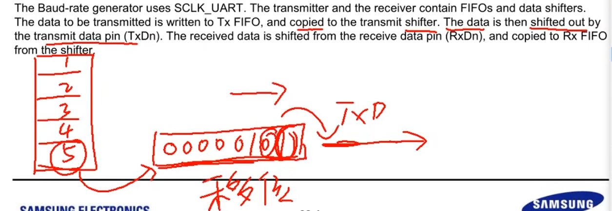
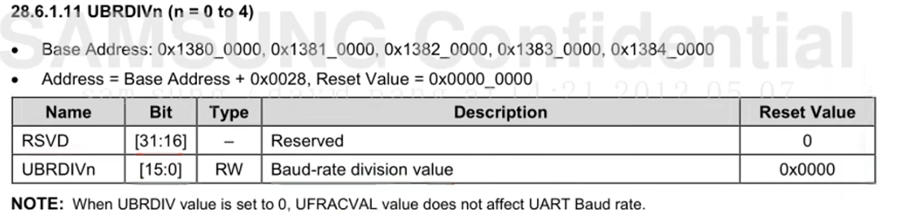
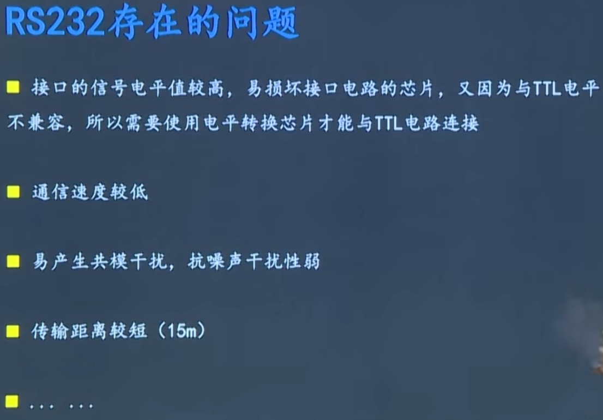
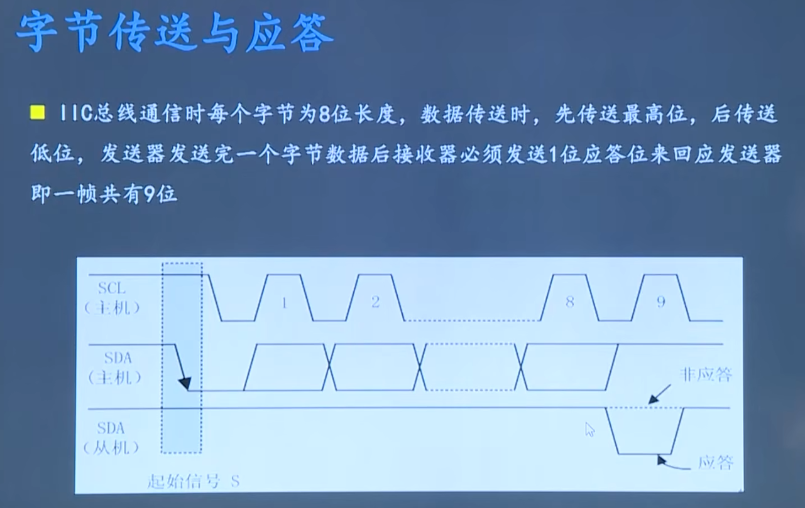

# 通讯协议笔记

## 1.UART（Universal Asynchronous Receiver Transmitter）通用异步收发器

一种通用的串行、异步通信总线。

两条数据线，可以实现全双工的发送和接收。一根线对外发送数据，一根线对外接收数据

异步：发送、接收方的时钟不一样。收发双方时钟不同步

### 1.通信基础

#### 1.1.并行和串行

##### 1.1并行

一次性传递多个数据位。在同等情况下，并行总线确实速度会快，

但是它也存在一些问题：

1. 使用的总线条数较多，会浪费资源，布线难度大。
2. 它不同数据线之间，在进行数据传递的时候，会相互干扰。

##### 1.2.串行通信

只有一根数据线，数据依次传递

1.3总结

在做大多数项目的时候，还是使用串行总线。I2C 、 SPI

#### 1.2.单工和双工

##### 2.1 单工

数据传输是单向的。

##### 2.2双工

数据传输的方向是双向的。

半双工：A->B   和  B->A这两种发送消息的状态是不能同时进行的。只有一根总线。

双工：：A->B   和  B->A这两种发送消息的状态可以同时进行。有两根总线。

#### 1.3.波特率

描述串口的通信速度。每秒钟传送bit的数量。

### 2.UART帧格式

串口协议规定：在不发数据的时候（空闲的时候），数据线上的状态必须是**高电平**。

起始信号：告诉对方我要发送数据了，所有是需要发送一个**低电平**。

数据位：先发底数据位，再发高数据位。

校验位（可有可无）：奇偶校验，发送的数据里有偶数个1，校验位就为1；发送的数据里有奇数个1，校验位就为0。

停止位（1/1.5/2位）：必须是高电平，表示一次通信的结束。

串口通信不允许连续发送，每一次通信最多只能发送一个字节。防止累计误差的出现。

### 3.UART硬件连接

### 4.UART控制器

TTL电平：CPU使用的电平。

SOC：系统级芯片。

### 5.串口的工作逻辑

#### 5.1发送器和接收器的工作逻辑：

**发数据：**

**收数据：**

### 6.UART寄存器详解

  GPAICON[1:0]：将GPA1_0和GPA1_1分别设置为UART2的接收引脚和发送引脚

GPA1.CON = GPA1.CON & (~(0xFF << 0)); // 先对第八位清零

GPA1.CON = GPA1.CON | (0x22 << 0); // 设置第八位，将GPA1_0和GPA1_1分别设置为UART2的接收引脚和发送引脚

以上两步可以直接一个语句：

GPA1.CON = GPA1.CON & (~(0xFF << 0))  | (0x22 << 0); 

**ULCONn：**设置帧格式 / 8位数据位  1位停止位  无校验 普通模式（与之相对应的是红外模式）

UART2.ULCON2 = UART2.ULCON2  & (~(0x7F << 0)) | (0x3 << 0);

**UCONn：**设置UARTn的接收和发送模式[0-3]

UART2.UCON2 = UART2.UCON2 & (~(0xF <<0)) |(0x5 << 0);

[5]回环模式设置：用于调试，自己的txd和rxd短接。

[0-3]设置接收和发送的工作模式。

#### 6.1CPU和外围的硬件（包括串口）它们数据交互的模式：

##### 1.1轮询(polling)：

##### CPU主动的去看串口缓冲区是不是有数据

就串口来讲：数据从外边发送过来，串口接收器替CPU接收，CPU想用这个数据，但又不知道这个数据具体什么时候能发送过来，就会不断的去读接收器缓冲区，直到缓冲区有数据，被CPU把数据读走。

##### 1.2中断(interrupt)：

##### 串口控制器去通知CPU有数据，可以读取数据了。效率更高一些

就串口来讲：数据从外边发送过来，串口接收器替CPU接收，CPU和串口控制器约定一件事：如果串口控制器接到了一个数据，那么串口控制器就给CPU发送一个中断信号。这个时候CPU再去读缓冲区里的数据。

##### 1.3DMA：

##### 不管是轮询还是中断都需要CPU拿到数据之后，CPU再将这个数据放到内存里，DMA是不需要CPU参与，直接将数据放到存储器里。

### 6.UART寄存器详解

 UTRSTAn：

**UTXHn和URXHn：**数据发和收所使用的两个寄存器

**UBRDIVn：**设置波特率

UART2.UBRDIV2 = 53;

UART2.UFRACVAL2 = 4;

**UFRACVALn：**波特率分频的小数部分

计算UBRDIVn和UFRACVALn的方式

### 7.UART编程

**1.GPAICON[1:0]**：将GPA1_0和GPA1_1分别设置为UART2的接收引脚和发送引脚

GPA1.CON = GPA1.CON & (~(0xFF << 0)); // 先对第八位清零

GPA1.CON = GPA1.CON | (0x22 << 0); // 设置第八位，将GPA1_0和GPA1_1分别设置为UART2的接收引脚和发送引脚

以上两步可以直接一个语句：

GPA1.CON = GPA1.CON & (~(0xFF << 0))  | (0x22 << 0); 

**2.** **ULCONn：**设置帧格式 / 8位数据位  1位停止位  无校验 普通模式（与之相对应的是红外模式）

UART2.ULCON2 = UART2.ULCON2  & (~(0x7F << 0)) | (0x3 << 0);

**3.** **UCONn：**设置UARTn的接收和发送模式[0-3]

UART2.UCON2 = UART2.UCON2 & (~(0xF <<0)) |(0x5 << 0);

**4.** **UBRDIVn：**设置波特率

UART2.UBRDIV2 = 53;

UART2.UFRACVAL2 = 4;

while(1)

{

​	while(!(UART2.UTRSTAT2 & (1 << 1))); // 等待发送缓冲区为空

​	UART2.UTXH2 = 'A';

​	while(!(UART2.UTRSTAT2 & (1 << 1)));

​	UART2.UTXH2 = 'B';

​	while(!(UART2.UTRSTAT2 & (1 << 1)));

​	UART2.UTXH2 = 'C';

​	while(!(UART2.UTRSTAT2 & (1 << 1)));

​	UART2.UTXH2 = 'D';

}

### 8.输入输出重定向

## 2.RS232和RS485协议原理及应用

**这两个协议属于电气层或者物理层的通讯协议。**

这两个协议是依赖于串口的，只是在**电气层面做了一些处理**。这么做可以让它的抗干扰能力更强，传输距离更远。

### **1.串口存在的问题：**

**1.电气接口不统一**

**2.抗干扰能力差**

**3.通讯距离极短**

### 2.RS232协议

**数据终端设备（DTE）和数据通信设备（DCE）之间串行二进制数据交换接口技术标准**

逻辑信号1的电平为-5V~-15V，逻辑信号0的电平为+5V~+15V，这样规定是出于一些电气方向上的考虑。

#### 2.1 电平转换

单片机要是想使用RS232协议，本质上还是从串口发出TTL信号，不过需要经过电平转换一下。

#### 2.2 RS232存在的问题

### 3.RS485协议

**485跟232相比，485的传输距离更长(1500m)，抗干扰能力更强。允许连接多个收发器，具备多站能力，可以利用RS485接口建立起一个设备网络(最多连接32个设备)。**

设备网络一般使用拓扑结构，有主机和从机，有一个机制来管理总线，主机和从机不是硬件区分的，是通过咱自己些的代码逻辑来区分的。

#### 3.1 信号

**共模干扰**：指同时作用于信号线及其回线（如地线）的干扰电压，其幅度相同且以附近物体（如大地、机箱）为参考电位，这类干扰通过导线与参考物体构成的回路流动，常见于电磁辐射或地电位差异导致的噪声。

**差分信号**：由两根导线传输的振幅相等、相位相反的信号，接收端通过比较两者的电压差值判断逻辑状态，其设计通过抵消共模干扰和抑制电磁辐射来提升抗干扰能力。**用两根线上的电压去比较，来传输0或者1**。

**RS485电平与TTL电平兼容**。

#### 3.2 接口

**如果只采用两线制的RS485，它就是半双工的。**

#### 3.3电平转换

电平转换芯片：MAX485

#### 3.4RS485的优势

因为：

**原因1：**

**RS232全双工**：虽然收发独立，但其单端传输的带宽利用率低，且高电平信号在长距离传输时衰减严重，实际应用中需牺牲速率以延长距离（如15米内仅支持0.115Mbps）。

**RS485半双工**：通过总线式拓扑和协议优化（如轮询机制），在收发切换时仅需微秒级延迟，结合差分信号的高带宽特性，整体**有效带宽远超RS232**。例如，RS485在1200米距离内仍可维持100Kbps速率。

**原因2：**

**RS232**：驱动芯片需产生高压摆幅，电路设计复杂且功耗高，难以支持高频信号切换。

**RS485**：平衡驱动器和差分接收器的组合降低了接口电路复杂度，芯片可快速响应信号变化，更适合高速场景。

所以：

RS485通信速度更快。

## 3.I2C总线概述

SDA：数据线

SCL：时钟线

### 3.1 I2C总线通信过程（宏观过程）

 **第2步中：**

主机通过发送一个**8位字节**（包含7位从机地址和1位方向位）来明确通信目标和后续数据传输方向，这是I²C地址寻址的核心机制。

字节的结构：**地址与方向位的组合**

**高7位（D7-D1）**：表示从机地址，确保总线上每个从机的唯一性。例如，若从机地址为`0x68`（7位二进制`1101000`），则高7位填充该地址。

**最低位（D0）**：方向位（R/W位），定义后续数据传输方向：

- 0（写模式）：主机向从机发送数据（主机为发送器，从机为接收器）。
- **1**（读模式）：主机从从机接收数据（主机为接收器，从机为发送器）。

### 3.2 I2C总线的寻址方式

**高7位（D7-D1）**：表示从机地址，确保总线上每个从机的唯一性。例如，若从机地址为`0x68`（7位二进制`1101000`），则高7位填充该地址。

**最低位（D0）**：方向位（R/W位），定义后续数据传输方向：

- 0（写模式）：主机向从机发送数据（主机为发送器，从机为接收器）。
- **1**（读模式）：主机从从机接收数据（主机为接收器，从机为发送器）。

总线上所有的从机接收到该字节数据后都将这7位地址与自己的地址进行比较，如果相同，则认为自己被主机寻址，然后再根据第8位将自己定为发送器或接收器

###  3.3 I2C总线的信号

在不使用I2C总线的时候，SCL和SDA都是高电平。

#### 3.3.1 起始信号和停止信号

#### 3.3.2 字节传送与应答信号

I2C发送数据必须是8位。

先是发送器发送8位信号，再由接收器发送1位信号（低电平表示应答，高电平表示没有接收到或者非应答）

#####  同步信号

起始信号：来通知从机要接收或者发送信号。

怎么区分10和1100：通过改变SCL的高低电平，告诉发送器什么时候发数据，和， 接收器什么时候接收数据。

#### 3.3.2 字节传送与应答信号

一个数据的发送和接收要经历9个时钟，包括8个数据位的发送和接收，还有1位应答位的发送和接收。

### 3.4 典型IIC时序

从主机向从机发数据，改为从机向主机发数据。

**注意**中间是没有发送停止信号，这样就能保证这个主机对总线的占用。

### 3.5 IIC控制器

IIC控制器的功能：控制起始和终止信号的产生、怎么发送每一个字节的数据、接收到数据之后是怎么应答的。

**在具体使用过程中只需要对相关寄存器进行配置就好了。**

**IIC控制器的工作逻辑：**

 

**I2CCON（控制寄存器）：**

I²C模块的核心控制单元，负责硬件参数配置和通信流程管理：

- **模块使能**：通过使能位激活I²C模块，例如`I2CEN`位。
- **主从模式选择**：设置为主模式（Master）或从模式（Slave）。
- **时钟分频配置**：通过分频系数设置SCL时钟频率，例如一级分频（PCLK/16或PCLK/512）和二级分频（可调分频系数）。
- **中断管理**：控制数据传输完成中断的使能。
- **ACK应答控制**：使能自动生成ACK信号。
- **总线复位**：通过软件复位位恢复总线状态。

**I2CSTAT（状态寄存器）：**

实时反映I²C总线和模块的运行状态：

- **操作模式标志**：标识当前是主模式还是从模式。
- **总线状态监控**：通过标志位指示总线忙（`BUSY`）、仲裁丢失（`ARLO`）、起始/停止条件完成等。
- **数据收发状态**：如发送寄存器空（`TXE`）、接收寄存器非空（`RXNE`）。
- **地址匹配标志**：在从模式下，当接收地址与自身地址匹配时置位。

**I2CDS（数据寄存器）：**

数据交互的核心通道，直接参与字节级传输：

- **数据缓冲**：发送时写入待传数据，接收时读取接收到的字节。
- **移位控制**：与移位寄存器配合，实现数据位的逐位移出或移入。
- **双缓冲机制**：某些实现中支持接收双缓冲，减少数据溢出风险。

**Address Register（地址寄存器）：**

用于从设备地址配置和地址匹配：

- **从机地址存储**：存储从设备的7位或10位地址。
- **地址扩展模式**：支持10位地址模式的配置。
- **广播地址响应**：可配置是否响应通用广播地址。

**IIC控制器的四种工作模式：主机发送、主机接收、从机发送、从机接收**

#### 3.5.1 主机发送的工作流程：

#### 3.5.2 主机接收的工作流程：

### 3.6 4412的IIC寄存器详解

#### **3.6.1 I2CCONn：**

[7]：acknowledge承认，打招呼。应答信号产生。设置为1，使能。为0，不使能。一般是4412接收外部的时候才有意义。

[6]：时钟源选择。0：fPCLK/16，IIC时钟在时钟源基础上进行16分频。1：fPCLK/512，IIC时钟在时钟源基础上进行512分频。**影响I2C的通信速度。**

 [5]：发送和接收的中断。0：关闭中断。1：开启中断。

 [4]：中断挂起标志位。读到0：**说明中断没有产生，数据还没有接收/发送完成。**读到1：**说明中断已经产生，数据已经接收/发送完成。**

**当处理完中断事件后，需要对第[4]位清零。**

[3:0]：发送时钟的值。**影响时钟频率，影响IIC的通讯速度。**

#### **3.6.2 I2CSTATn：**

[7:6]：模式选择。00：从机接收、01：从机发送、10：主机接收、11：主机发送。

[5]：繁忙信号状态。0：IIC控制器产生停止信号。1：IIC控制器产生起始信号。叫**繁忙是说明总线的状态。**

 [4]：数据 输出使能/不使能（串口输出）。0：不能发送和接收数据。1：可以发送和接收数据。

[3:0]：都是状态位。**read oley**

#### 3.6.3 I2CADDn

#### 3.6.4 I2CDSn

#### 3.6.5 I2CLCn

